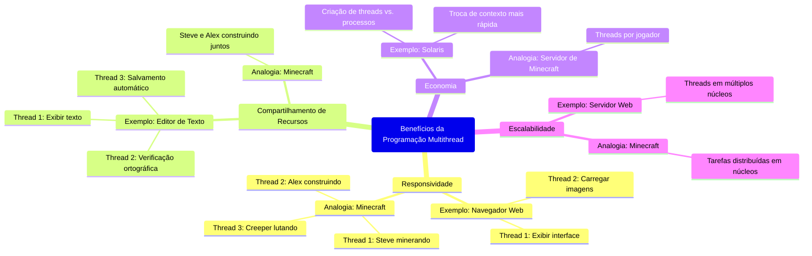

# 4.2 Benefícios da Programação Multithread

A programação multithread oferece vantagens significativas em relação ao uso de processos single-threaded. Esses benefícios podem ser categorizados em quatro áreas principais: **responsividade**, **compartilhamento de recursos**, **economia** e **escalabilidade**. Vamos explorar cada uma delas em detalhes, utilizando exemplos práticos e analogias para facilitar o entendimento.

## 4.2.1 Responsividade

A **responsividade** é um dos benefícios mais perceptíveis da programação multithread. Em aplicações interativas, como navegadores Web ou editores de texto, o uso de múltiplas threads permite que o programa continue funcionando de forma ágil, mesmo que parte dele esteja ocupada com operações demoradas.

### Exemplo Prático: Navegador Web
Imagine um navegador Web que utiliza uma única thread para todas as tarefas. Se você estiver carregando uma página com muitas imagens, a interface do navegador pode travar até que todas as imagens sejam carregadas. Isso resultaria em uma experiência frustrante para o usuário.

Com o uso de múltiplas threads, o navegador pode:
- **Thread 1**: Exibir a interface e responder aos cliques do usuário.
- **Thread 2**: Carregar imagens e outros recursos em segundo plano.

Dessa forma, o usuário pode continuar interagindo com a interface enquanto as imagens são carregadas, aumentando a **responsividade** do sistema.

### Analogia com Minecraft {id="analogia-com-minecraft_1"}
Pense em um jogador de Minecraft que precisa minerar recursos, construir estruturas e lutar contra mobs ao mesmo tempo. Se ele tivesse que fazer tudo de forma sequencial, a experiência seria lenta e frustrante. Com múltiplas threads (ou "personagens"), ele pode:
- **Thread 1 (Steve)**: Minerar recursos.
- **Thread 2 (Alex)**: Construir uma casa.
- **Thread 3 (Creeper)**: Lutar contra mobs.

Isso torna o jogo mais dinâmico e responsivo.

## 4.2.2 Compartilhamento de Recursos

As threads compartilham naturalmente a memória e os recursos do processo ao qual pertencem, o que facilita a comunicação e a coordenação entre elas. Em contraste, os processos precisam usar técnicas como **memória compartilhada** ou **troca de mensagens** para compartilhar recursos, o que exige mais esforço do programador.

### Exemplo Prático: Aplicações Multithreaded
Em um editor de texto multithreaded, várias threads podem acessar o mesmo documento simultaneamente:
- **Thread 1**: Exibe o texto na tela.
- **Thread 2**: Realiza a verificação ortográfica.
- **Thread 3**: Salva o documento automaticamente.

Como as threads compartilham o mesmo espaço de memória, elas podem acessar e modificar o documento sem a necessidade de mecanismos complexos de comunicação.

### Analogia com Minecraft {id="analogia-com-minecraft_2"}
Imagine que Steve e Alex estão construindo uma casa juntos. Como eles compartilham o mesmo mundo (espaço de memória), podem trabalhar em diferentes partes da construção sem precisar se comunicar constantemente. Isso torna o processo mais eficiente.

## 4.2.3 Economia

Criar e gerenciar processos é uma operação custosa em termos de recursos do sistema. Cada processo requer sua própria alocação de memória, espaço de endereçamento e recursos do sistema operacional. Já as threads, por compartilharem os recursos do processo ao qual pertencem, são muito mais leves e econômicas.

### Exemplo Prático: Criação de Threads vs. Processos
No sistema operacional **Solaris**, por exemplo:
- A criação de um processo é cerca de **30 vezes mais lenta** do que a criação de uma thread.
- A troca de contexto entre processos é cerca de **5 vezes mais lenta** do que a troca de contexto entre threads.

Isso significa que, em aplicações que exigem a criação frequente de tarefas (como servidores Web), o uso de threads é muito mais eficiente.

### Analogia com Minecraft {id="analogia-com-minecraft_3"}
Pense em um servidor de Minecraft que precisa atender a vários jogadores. Se cada jogador exigisse a criação de um novo processo, o servidor ficaria sobrecarregado rapidamente. Em vez disso, o servidor cria uma thread para cada jogador, compartilhando recursos como memória e arquivos, o que é muito mais econômico.

## 4.2.4 Escalabilidade

A **escalabilidade** é um benefício crucial em sistemas multithreaded, especialmente em arquiteturas multiprocessadas (com múltiplos núcleos de CPU). Enquanto um processo single-threaded só pode ser executado em um único processador, um processo multithreaded pode distribuir suas threads entre vários processadores, aumentando o paralelismo e o desempenho.

### Exemplo Prático: Aplicações em Máquinas Multiprocessadas
Em um servidor Web multithreaded rodando em uma máquina com 8 núcleos de CPU:
- Cada thread pode ser executada em um núcleo diferente.
- Isso permite que o servidor atenda a múltiplas requisições simultaneamente, aumentando a capacidade de processamento.

Imagine que você está jogando Minecraft em um computador com 8 núcleos de CPU. Com múltiplas threads, o jogo pode distribuir tarefas como renderização, física e IA de mobs entre os núcleos, resultando em um desempenho muito melhor do que se tudo fosse executado em um único núcleo.

## 4.2.5 Resumo dos Benefícios

| **Benefício**          | **Descrição**                                                                 | **Exemplo Prático**                          | **Analogia com Minecraft**                  |
|-------------------------|-------------------------------------------------------------------------------|----------------------------------------------|---------------------------------------------|
| **Responsividade**      | Permite que aplicações continuem funcionando durante operações demoradas.     | Navegador Web carregando imagens em segundo plano. | Steve minerando enquanto Alex constrói.     |
| **Compartilhamento de Recursos** | Threads compartilham memória e recursos, facilitando a comunicação.          | Editor de texto com verificação ortográfica. | Steve e Alex construindo a mesma casa.      |
| **Economia**            | Threads são mais leves e rápidas de criar e gerenciar do que processos.       | Servidor Web atendendo múltiplos clientes.   | Servidor de Minecraft com threads por jogador. |
| **Escalabilidade**      | Aumenta o paralelismo em sistemas multiprocessados.                           | Servidor Web rodando em múltiplos núcleos.   | Minecraft usando todos os núcleos da CPU.   |

## 4.2.6 Conclusão

A programação multithread traz benefícios significativos para o desenvolvimento de aplicações modernas, desde a melhoria da **responsividade** até a **escalabilidade** em sistemas multiprocessados. Ao permitir que tarefas sejam executadas de forma concorrente e paralela, as threads tornam os sistemas mais eficientes, econômicos e capazes de lidar com demandas crescentes. Usar threads é como adicionar **mods ao Minecraft**: cada um traz novas funcionalidades e melhora a experiência geral.