# 4.3 Programação multicore 

Imagine que você está jogando Minecraft em um computador com **um único núcleo** (single-core) e outro com **múltiplos núcleos** (multicore). Vamos usar o jogo para entender como a programação multithreaded funciona em cada cenário.

## 4.3.1 Tipos de Sistemas

###  **Sistema de Único Núcleo (Single-Core)**
Em um computador com apenas um núcleo, todas as tarefas do Minecraft precisam ser executadas de forma **concorrente**, ou seja, uma de cada vez, intercaladas no tempo. Por exemplo:
- **Thread 1**: Renderizar o mundo (gráficos).
- **Thread 2**: Calcular a física (queda de blocos, água, etc.).
- **Thread 3**: Executar a inteligência artificial dos mobs (zumbis, creepers, etc.).

Como há apenas um núcleo, o sistema operacional precisa alternar rapidamente entre essas threads, dando a impressão de que tudo está acontecendo ao mesmo tempo. No entanto, isso pode causar lentidão, especialmente se uma das tarefas for muito pesada.

### **Sistema de Múltiplos Núcleos (Multicore)**
Em um computador com múltiplos núcleos, as threads podem ser executadas em **paralelo**, ou seja, cada núcleo pode processar uma thread simultaneamente. Por exemplo:
- **Núcleo 1**: Renderizar o mundo.
- **Núcleo 2**: Calcular a física.
- **Núcleo 3**: Executar a IA dos mobs.

Isso permite que o jogo funcione de forma muito mais rápida e eficiente, pois as tarefas são distribuídas entre os núcleos, sem precisar alternar entre elas.

---

## 4.3.2 Visualizando 

### 1. **Execução Concorrente em Single-Core**

```mermaid
gantt
    title Execução Concorrente em Single-Core
    dateFormat  HH:mm:ss
    axisFormat  %H:%M:%S
    section Tarefas
    Renderizar Mundo       :a1, 00:00:00, 5s
    Calcular Física        :a2, after a1, 5s
    Executar IA dos Mobs   :a3, after a2, 5s
```

**Explicação**:
- Em um sistema single-core, as tarefas são executadas uma de cada vez, intercaladas no tempo.
- O núcleo alterna entre renderizar o mundo, calcular a física e executar a IA dos mobs.

---

### 2. **Execução Paralela em Multicore**

```mermaid
gantt
    title Execução Paralela em Multicore
    dateFormat  HH:mm:ss
    axisFormat  %H:%M:%S
    section Núcleo 1
    Renderizar Mundo       :a1, 00:00:00, 5s
    section Núcleo 2
    Calcular Física        :a2, 00:00:00, 5s
    section Núcleo 3
    Executar IA dos Mobs   :a3, 00:00:00, 5s
```

**Explicação**:
- Em um sistema multicore, cada núcleo pode executar uma tarefa simultaneamente.
- O Núcleo 1 renderiza o mundo, o Núcleo 2 calcula a física e o Núcleo 3 executa a IA dos mobs ao mesmo tempo.

---

### Desafios da Programação Multicore

1. **Divisão de Atividades**:
   - No Minecraft, você precisa dividir as tarefas do jogo (renderização, física, IA) em threads separadas para aproveitar os múltiplos núcleos.
   - Exemplo: Se você não separar a renderização da física, o jogo pode ficar lento.

2. **Equilíbrio**:
   - As tarefas devem ter um valor igual. Por exemplo, se a renderização for muito mais pesada que a física, um núcleo pode ficar sobrecarregado enquanto outros ficam ociosos.

3. **Separação de Dados**:
   - Os dados do jogo (como a posição dos blocos e mobs) precisam ser divididos entre os núcleos. Se dois núcleos tentarem modificar o mesmo bloco ao mesmo tempo, pode ocorrer um conflito.

4. **Dependência de Dados**:
   - Se a física depende da posição dos mobs (por exemplo, um creeper explodindo um bloco), você precisa garantir que a thread da física espere a thread da IA terminar de calcular a posição.

5. **Teste e Depuração**:
   - Em um jogo multithreaded, bugs podem ser difíceis de reproduzir, pois dependem da ordem de execução das threads. Por exemplo, um creeper pode explodir antes de ser renderizado, causando um bug visual.

---

## 4.3.3 Resumo dos Desafios

| **Desafio**               | **Descrição**                                                                 | **Exemplo no Minecraft**                                                                 |
|---------------------------|-------------------------------------------------------------------------------|-----------------------------------------------------------------------------------------|
| **Divisão de Atividades**  | Dividir o jogo em tarefas concorrentes.                                       | Separar renderização, física e IA em threads distintas.                                  |
| **Equilíbrio**             | Garantir que as tarefas tenham valor igual.                                   | Evitar que a renderização sobrecarregue um núcleo enquanto outros ficam ociosos.         |
| **Separação de Dados**     | Dividir os dados do jogo entre os núcleos.                                    | Garantir que cada núcleo acesse blocos e mobs diferentes.                                |
| **Dependência de Dados**   | Sincronizar tarefas que dependem de dados compartilhados.                     | Garantir que a física espere a IA terminar de calcular a posição dos mobs.               |
| **Teste e Depuração**      | Testar e depurar programas com múltiplos caminhos de execução.                | Reproduzir bugs que ocorrem apenas quando um creeper explode durante a renderização.     |

