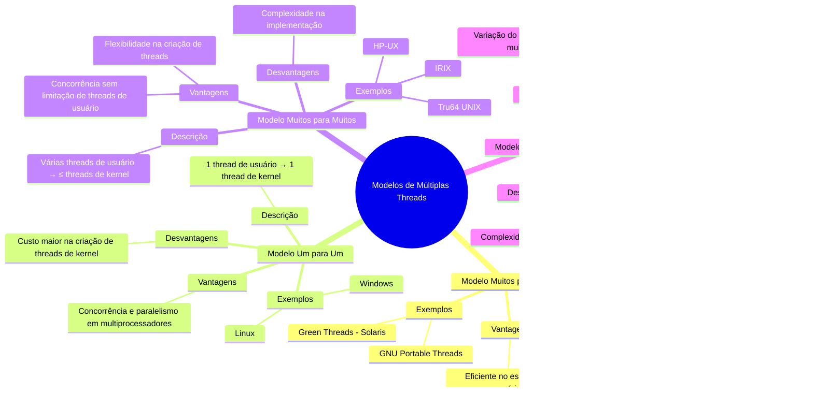

# 4.4 Modelos de múltiplas threads (multithreading)

## 4.4.1 Modelos de Múltiplas Threads

Os sistemas operacionais modernos suportam threads de duas formas: **threads de usuário** (gerenciadas no espaço do usuário) e **threads de kernel** (gerenciadas diretamente pelo sistema operacional). A relação entre essas threads pode ser estabelecida de três maneiras principais: **muitos para um**, **um para um** e **muitos para muitos**.

---

### 1. **Modelo Muitos para Um**
No modelo **muitos para um**, várias threads de usuário são mapeadas para uma única thread de kernel. O gerenciamento das threads é feito por uma biblioteca no espaço do usuário, o que torna o processo eficiente. No entanto, se uma thread fizer uma chamada de sistema bloqueante, todo o processo será bloqueado. Além disso, como apenas uma thread pode acessar o kernel por vez, não é possível executar threads em paralelo em sistemas multiprocessadores.

**Diagrama Mermaid**:

**Exemplo**:
- **Green Threads** (biblioteca do Solaris) e **GNU Portable Threads** usam esse modelo.
- **Vantagem**: Eficiência no gerenciamento de threads no espaço do usuário.
- **Desvantagem**: Bloqueio do processo inteiro em chamadas bloqueantes e falta de paralelismo em multiprocessadores.

---

### 2. **Modelo Um para Um**
No modelo **um para um**, cada thread de usuário é mapeada para uma thread de kernel. Isso permite maior concorrência, pois o kernel pode escalonar threads independentemente. Se uma thread fizer uma chamada bloqueante, outras threads podem continuar executando. Além disso, threads podem ser executadas em paralelo em sistemas multiprocessadores. A principal desvantagem é que a criação de threads de kernel é mais custosa, o que pode limitar o número de threads que uma aplicação pode criar.

**Diagrama Mermaid**:

**Exemplo**:
- Sistemas operacionais como **Linux** e **Windows** usam esse modelo.
- **Vantagem**: Maior concorrência e paralelismo em multiprocessadores.
- **Desvantagem**: Custo maior na criação de threads de kernel.

---

### 3. **Modelo Muitos para Muitos**
No modelo **muitos para muitos**, várias threads de usuário são mapeadas para um número menor ou igual de threads de kernel. Isso permite que os desenvolvedores criem quantas threads de usuário forem necessárias, enquanto o kernel gerencia um número menor de threads de kernel. Esse modelo combina as vantagens dos modelos anteriores: concorrência, paralelismo e eficiência no gerenciamento de threads.

**Diagrama Mermaid**:

**Exemplo**:
- Sistemas como **IRIX**, **HP-UX** e **Tru64 UNIX** usam esse modelo.
- **Vantagem**: Flexibilidade para criar muitas threads de usuário e executar threads de kernel em paralelo.
- **Desvantagem**: Complexidade na implementação.

---

### 4. **Modelo de Dois Níveis (Variação do Muitos para Muitos)**
O modelo de **dois níveis** é uma variação do modelo muitos para muitos, onde algumas threads de usuário são mapeadas diretamente para threads de kernel, enquanto outras são multiplexadas. Isso oferece maior controle sobre o escalonamento de threads.

**Diagrama Mermaid**:

**Exemplo**:
- Sistemas como **IRIX**, **HP-UX** e **Tru64 UNIX** usam esse modelo.
- **Vantagem**: Combina a flexibilidade do modelo muitos para muitos com a eficiência do modelo um para um.
- **Desvantagem**: Complexidade adicional na implementação.

---

## 4.4.2 Comparação dos Modelos

| **Modelo**          | **Descrição**                                                                 | **Vantagens**                                                                 | **Desvantagens**                                                                 |
|----------------------|-------------------------------------------------------------------------------|-------------------------------------------------------------------------------|----------------------------------------------------------------------------------|
| **Muitos para Um**   | Várias threads de usuário mapeadas para uma thread de kernel.                 | Eficiente no espaço do usuário.                                               | Bloqueio do processo em chamadas bloqueantes; sem paralelismo em multiprocessadores. |
| **Um para Um**       | Cada thread de usuário mapeada para uma thread de kernel.                     | Concorrência e paralelismo em multiprocessadores.                             | Custo maior na criação de threads de kernel.                                      |
| **Muitos para Muitos** | Várias threads de usuário mapeadas para um número menor de threads de kernel. | Flexibilidade e concorrência sem limitação no número de threads de usuário.   | Complexidade na implementação.                                                   |
| **Dois Níveis**      | Combina muitos para muitos com mapeamento direto de algumas threads.          | Maior controle sobre o escalonamento de threads.                              | Complexidade adicional.                                                          |

---

## 4.4.3 Conclusão

Os modelos de múltiplas threads (**muitos para um**, **um para um**, **muitos para muitos** e **dois níveis**) oferecem diferentes abordagens para gerenciar a concorrência e o paralelismo em sistemas operacionais. Cada modelo tem suas vantagens e desvantagens, e a escolha do modelo adequado depende das necessidades da aplicação e do ambiente de execução. Enquanto o modelo **um para um** é amplamente utilizado em sistemas modernos como Linux e Windows, o modelo **muitos para muitos** e sua variação **dois níveis** oferecem flexibilidade para aplicações que exigem um grande número de threads.