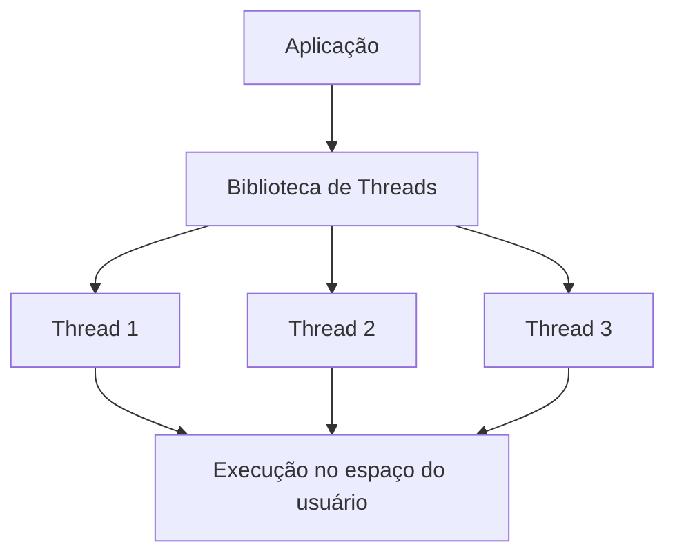
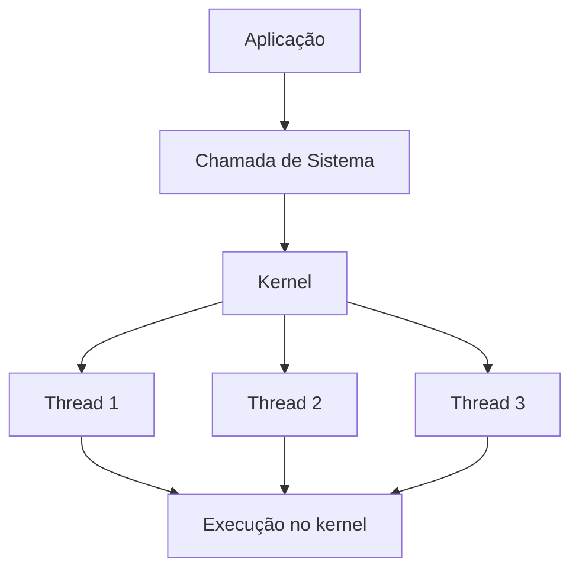
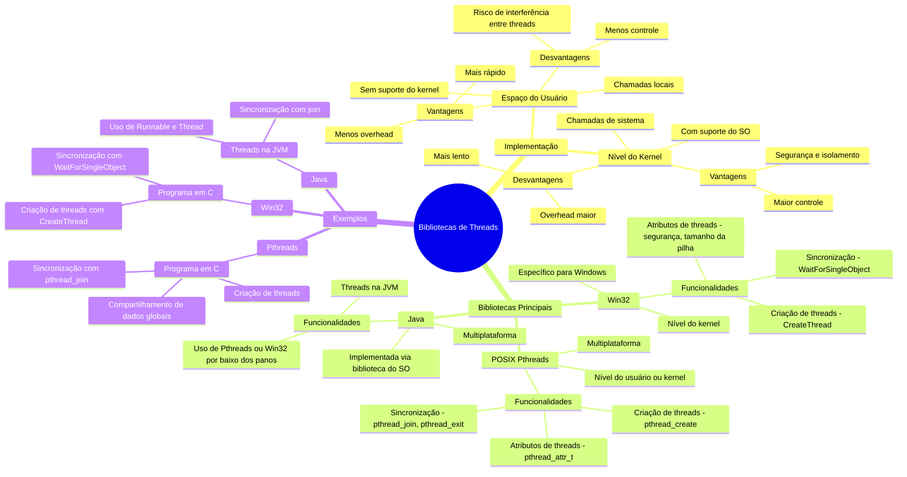
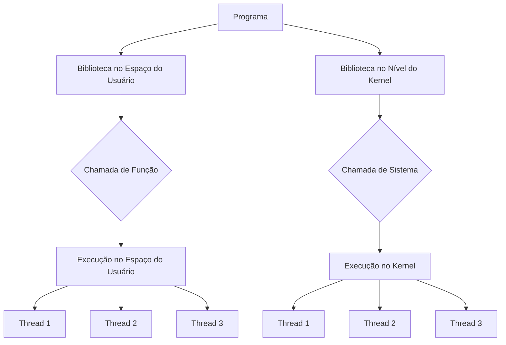
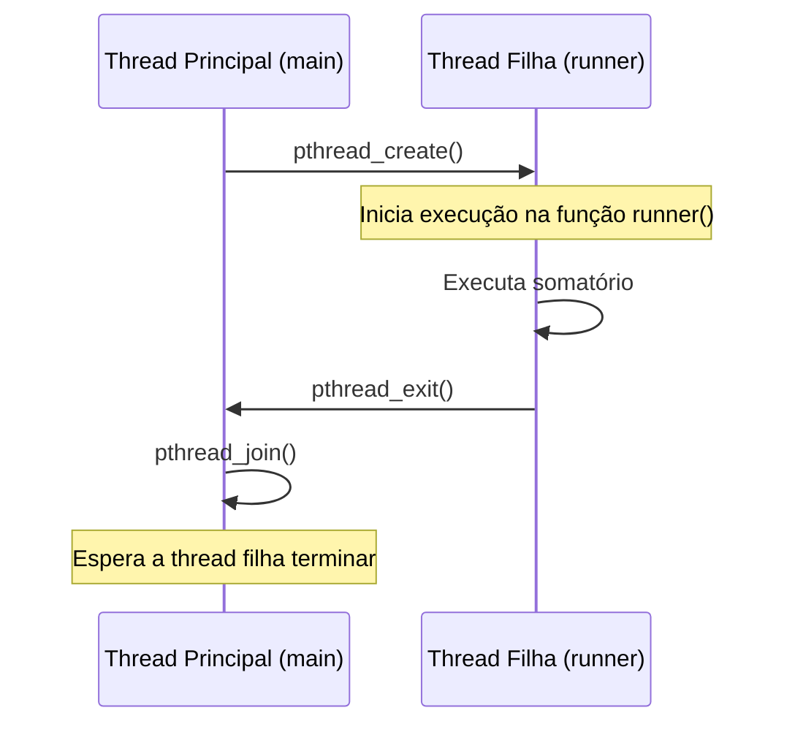
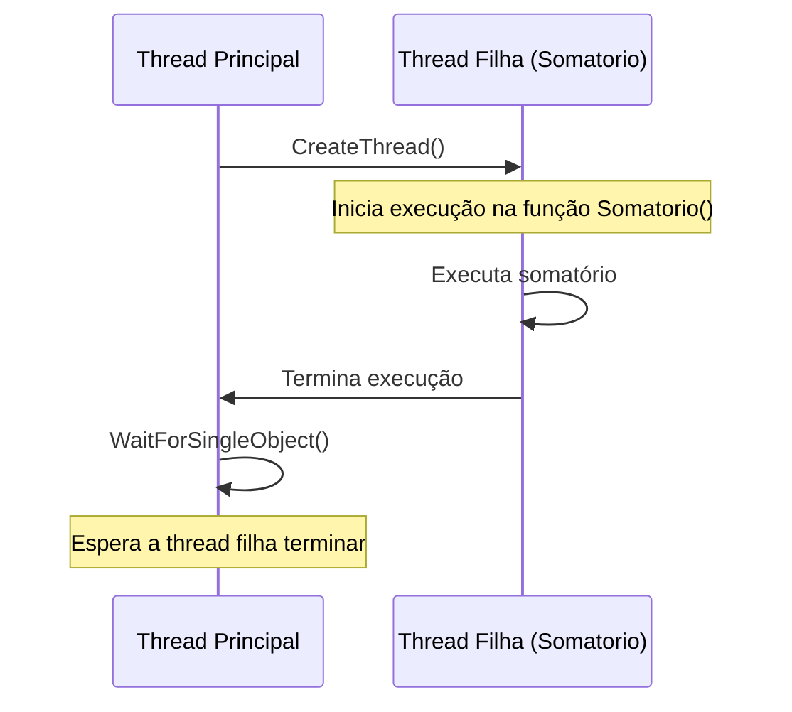

# 4.5 Bibliotecas de threads

Imagine que você está construindo uma cidade gigante no Minecraft. Para acelerar o processo, você decide chamar amigos (threads) para ajudar. Cada amigo pode trabalhar em uma tarefa específica, como construir casas, minerar recursos ou plantar árvores. Aqui está como as bibliotecas de threads se encaixam nessa analogia:


## **1. Threads no Espaço do Usuário**

### **Como Funciona** {id="como-funciona_1"}
- As threads são gerenciadas **inteiramente pela aplicação**, sem intervenção direta do sistema operacional (SO).
- A biblioteca de threads (como Pthreads em modo usuário) é responsável por criar, escalonar e gerenciar as threads.
- Quando uma thread é criada, a biblioteca aloca uma estrutura de dados no espaço de memória do processo para armazenar informações sobre a thread (como estado, pilha, etc.).
- O **escalonamento** (decidir qual thread roda a seguir) é feito pela biblioteca, não pelo SO.

### **Vantagens** {id="vantagens_1"}
1. **Menos overhead**:
   - Como não há chamadas ao kernel, a criação e troca de threads são mais rápidas.
   - A troca de contexto entre threads é feita no espaço do usuário, sem a necessidade de mudar para o modo kernel.
   
2. **Portabilidade**:
   - A aplicação pode ser portada para diferentes sistemas operacionais sem alterações significativas, desde que a biblioteca de threads seja suportada.

3. **Controle total**:
   - O programador tem controle completo sobre o comportamento das threads, como políticas de escalonamento personalizadas.

### **Desvantagens** {id="desvantagens_1"}
1. **Falta de isolamento**:
   - Se uma thread falhar (por exemplo, causar um acesso inválido à memória), todo o processo pode ser afetado, já que todas as threads compartilham o mesmo espaço de memória.

2. **Escalonamento limitado**:
   - O SO não está ciente das threads, então ele escalona o processo como um todo. Se uma thread faz uma operação bloqueante (como I/O), todo o processo é bloqueado, mesmo que outras threads estejam prontas para executar.

3. **Menos suporte a multiprocessamento**:
   - Como o SO não conhece as threads, ele não pode distribuir as threads entre múltiplos núcleos de CPU de forma eficiente.

### **Exemplo Prático** {id="exemplo-pr-tico_1"}
Imagine que você está jogando Minecraft em um servidor privado com seus amigos. Vocês decidem quem faz o quê e como, sem precisar pedir permissão ao administrador do servidor. Isso é rápido e eficiente, mas se alguém cometer um erro (como derrubar um bloco errado), pode afetar todo o grupo.

---

## **2. Threads no Nível do Kernel**

### **Como Funciona**
- As threads são gerenciadas **diretamente pelo sistema operacional**.
- Quando uma thread é criada, o kernel aloca uma estrutura de dados no espaço do kernel para armazenar informações sobre a thread.
- O **escalonamento** é feito pelo SO, que decide qual thread deve ser executada em qual núcleo de CPU.
- Cada chamada à biblioteca de threads (como `pthread_create` ou `CreateThread`) resulta em uma **chamada de sistema** ao kernel.

### **Vantagens**
1. **Isolamento e segurança**:
   - O kernel garante que uma thread não interfira no funcionamento de outras threads ou do sistema como um todo.
   - Se uma thread falhar, o SO pode encerrá-la sem afetar o restante do processo.

2. **Escalonamento eficiente**:
   - O SO pode distribuir as threads entre múltiplos núcleos de CPU, aproveitando ao máximo o hardware disponível.
   - Se uma thread é bloqueada (por exemplo, esperando I/O), o SO pode escalonar outra thread para executar.

3. **Suporte a operações bloqueantes**:
   - Como o SO conhece as threads, ele pode gerenciar operações bloqueantes de forma eficiente, sem parar todo o processo.

### **Desvantagens**
1. **Overhead maior**:
   - Cada operação relacionada a threads (criação, troca de contexto, etc.) envolve uma chamada de sistema ao kernel, o que é mais lento do que operações no espaço do usuário.

2. **Menos portabilidade**:
   - As APIs de threads no nível do kernel (como Win32) são específicas para cada sistema operacional, o que pode dificultar a portabilidade do código.

3. **Complexidade**:
   - O programador tem menos controle sobre o comportamento das threads, pois o SO gerencia tudo.

### **Exemplo Prático**
Agora, imagine que vocês estão jogando Minecraft em um servidor público. Tudo o que vocês fazem precisa ser aprovado pelo administrador do servidor. Isso é mais seguro e organizado, mas pode ser um pouco mais lento, pois vocês precisam esperar a aprovação do admin para cada ação.

---

## **Comparação Detalhada**

| Característica               | Threads no Espaço do Usuário          | Threads no Nível do Kernel          |
|------------------------------|---------------------------------------|-------------------------------------|
| **Gerenciamento**            | Pela aplicação (biblioteca de threads) | Pelo sistema operacional           |
| **Chamadas de sistema**      | Não usa                               | Usa (chamadas ao kernel)           |
| **Velocidade**               | Mais rápido                           | Mais lento (devido ao overhead)    |
| **Isolamento**               | Menos seguro (threads compartilham memória) | Mais seguro (isolamento pelo SO)   |
| **Escalonamento**            | Limitado (feito pela aplicação)       | Eficiente (feito pelo SO)          |
| **Suporte a multiprocessamento** | Limitado                            | Completo (SO distribui threads entre núcleos) |
| **Portabilidade**            | Alta (depende da biblioteca)          | Baixa (depende do SO)              |

---

## **Diagrama de Funcionamento**

### **Threads no Espaço do Usuário**


- A aplicação gerencia as threads diretamente, sem interação com o kernel.

### **Threads no Nível do Kernel**


- A aplicação faz chamadas ao kernel para criar e gerenciar threads.

---

## **Quando Usar Cada Abordagem**

1. **Threads no Espaço do Usuário**:
   - Quando a aplicação precisa de **alto desempenho** e baixo overhead.
   - Quando o sistema operacional não suporta threads no nível do kernel.
   - Quando o programador precisa de **controle total** sobre o comportamento das threads.

2. **Threads no Nível do Kernel**:
   - Quando a aplicação precisa de **segurança e isolamento**.
   - Quando o sistema operacional suporta multiprocessamento e você quer aproveitar ao máximo o hardware.
   - Quando a aplicação precisa lidar com operações bloqueantes (como I/O) de forma eficiente.


1. **Bibliotecas de Threads no Espaço do Usuário**:
   - É como se você e seus amigos estivessem trabalhando em um servidor privado (espaço do usuário). Tudo o que vocês fazem é gerenciado por vocês mesmos, sem precisar pedir permissão ao administrador do servidor (kernel). Isso é rápido e eficiente, mas se alguém cometer um erro (como derrubar um bloco errado), pode afetar todo o grupo. Além disso, vocês têm recursos limitados, pois o servidor privado não tem o poder total do servidor público.

   2. **Bibliotecas de Threads no Nível do Kernel**:
      - Agora, imagine que vocês estão em um servidor público (espaço do kernel). Tudo o que vocês fazem precisa ser aprovado pelo administrador do servidor. Isso é mais seguro e organizado, pois o administrador garante que ninguém vai interferir no trabalho dos outros. No entanto, pode ser um pouco mais lento, pois vocês precisam esperar a aprovação do admin para cada ação.

   3. **Pthreads, Win32 e Java**:
      - **Pthreads**: É como um manual de instruções universal para construir vilas, que funciona em diferentes servidores (sistemas operacionais). Você pode usá-lo em servidores privados ou públicos. Ele é flexível e amplamente suportado.
      - **Win32**: É um manual específico para servidores Windows. Ele é muito eficiente, mas só funciona nesse tipo de servidor. É como ter um guia detalhado para construir no Minecraft, mas que só funciona em um tipo específico de servidor.
      - **Java**: É como um manual que funciona em qualquer servidor, mas por baixo dos panos, ele usa o manual específico do servidor (Pthreads no Linux ou Win32 no Windows). É como se você tivesse um tradutor automático que converte suas instruções para o manual do servidor em que você está jogando.



---

## **Diagramas Específicos Detalhados**

## **1. Funcionamento de Threads no Espaço do Usuário vs. Nível do Kernel**



- **Espaço do Usuário**: As threads são gerenciadas pelo próprio programa, sem interação direta com o sistema operacional. Isso é mais rápido, mas menos seguro.
  - **Nível do Kernel**: O sistema operacional gerencia as threads, garantindo maior controle e segurança, mas com um overhead maior.

## **2. Fluxo de Execução com Pthreads**



- A thread principal cria uma nova thread com `pthread_create`.
  - A thread filha executa o somatório na função `runner`.
  - A thread filha termina com `pthread_exit`.
  - A thread principal espera a thread filha terminar com `pthread_join`.

## **3. Fluxo de Execução com Win32**



- A thread principal cria uma nova thread com `CreateThread`.
  - A thread filha executa o somatório na função `Somatorio`.
  - A thread filha termina sua execução.
  - A thread principal espera a thread filha terminar com `WaitForSingleObject`.

---

## **Explicação Detalhada dos Conceitos**

1. **Pthreads**:
   - **Criação de Threads**: Usa `pthread_create` para criar uma nova thread, passando a função que a thread executará (`runner` no exemplo).
   - **Sincronização**: Usa `pthread_join` para fazer a thread principal esperar a thread filha terminar.
   - **Atributos de Threads**: Podem ser configurados com `pthread_attr_t`, mas no exemplo, usamos os atributos padrão.

   2. **Win32**:
      - **Criação de Threads**: Usa `CreateThread`, passando a função `Somatorio` e os atributos da thread.
      - **Sincronização**: Usa `WaitForSingleObject` para fazer a thread principal esperar a thread filha terminar.
      - **Atributos de Threads**: Incluem segurança, tamanho da pilha e flags de inicialização.

   3. **Java**:
      - **Threads na JVM**: A JVM usa a biblioteca de threads do sistema operacional subjacente (Pthreads no Linux, Win32 no Windows).
      - **Sincronização**: Usa métodos como `join()` para esperar que uma thread termine.


## Exemplos de código na prática


### **1. Exemplo de Threads no Espaço do Usuário (Pthreads)**

Neste exemplo, usamos a biblioteca **Pthreads** para criar e gerenciar threads no espaço do usuário. O programa calcula o somatório de um número inteiro não negativo em uma thread separada.

#### **Código em C**

```c
#include <stdio.h>
#include <stdlib.h>
#include <pthread.h>

// Variável global para armazenar o resultado do somatório
int sum = 0;

// Função que a thread executará
void* runner(void* param) {
    int upper = atoi(param); // Converte o parâmetro para inteiro
    for (int i = 1; i <= upper; i++) {
        sum += i; // Calcula o somatório
    }
    pthread_exit(0); // Termina a thread
}

int main(int argc, char* argv[]) {
    if (argc != 2) {
        fprintf(stderr, "Uso: %s <valor>\n", argv[0]);
        return 1;
    }

    pthread_t tid; // Identificador da thread
    pthread_attr_t attr; // Atributos da thread

    // Inicializa os atributos da thread com os valores padrão
    pthread_attr_init(&attr);

    // Cria a thread
    pthread_create(&tid, &attr, runner, argv[1]);

    // Espera a thread terminar
    pthread_join(tid, NULL);

    // Exibe o resultado
    printf("Somatório = %d\n", sum);

    return 0;
}
```

#### **Explicação do Código**
1. **Variável Global `sum`**:
   - Armazena o resultado do somatório. Como é global, é compartilhada entre a thread principal e a thread filha.

2. **Função `runner`**:
   - É a função que a thread filha executa. Ela calcula o somatório de 1 até o valor passado como argumento.

3. **Criação da Thread**:
   - `pthread_create` cria uma nova thread que executa a função `runner`.
   - O argumento `argv[1]` (valor passado na linha de comando) é passado para a thread.

4. **Sincronização**:
   - `pthread_join` faz a thread principal esperar a thread filha terminar.

5. **Saída**:
   - O resultado do somatório é exibido após a thread filha terminar.

#### **Como Executar** {id="como-executar_1"}
Compile o programa com:
```bash
gcc -o somatorio somatorio.c -lpthread
```

Execute passando um valor:
```bash
./somatorio 5
```

Saída esperada:
```
Somatório = 15
```

---

### **2. Exemplo de Threads no Nível do Kernel (Win32)**

Neste exemplo, usamos a API **Win32** para criar e gerenciar threads no nível do kernel. O programa também calcula o somatório de um número inteiro não negativo, mas usando a API específica do Windows.

#### **Código em C** {id="c-digo-em-c_1"}

```c
#include <windows.h>
#include <stdio.h>

// Variável global para armazenar o resultado do somatório
DWORD sum = 0;

// Função que a thread executará
DWORD WINAPI Somatorio(LPVOID param) {
    int upper = *(int*)param; // Converte o parâmetro para inteiro
    for (int i = 1; i <= upper; i++) {
        sum += i; // Calcula o somatório
    }
    return 0; // Termina a thread
}

int main(int argc, char* argv[]) {
    if (argc != 2) {
        fprintf(stderr, "Uso: %s <valor>\n", argv[0]);
        return 1;
    }

    int upper = atoi(argv[1]); // Converte o argumento para inteiro
    HANDLE hThread; // Handle para a thread
    DWORD threadID; // ID da thread

    // Cria a thread
    hThread = CreateThread(
        NULL, // Atributos de segurança padrão
        0, // Tamanho da pilha padrão
        Somatorio, // Função que a thread executará
        &upper, // Argumento para a função
        0, // Flags de criação (0 = execução imediata)
        &threadID // ID da thread
    );

    if (hThread == NULL) {
        fprintf(stderr, "Erro ao criar a thread.\n");
        return 1;
    }

    // Espera a thread terminar
    WaitForSingleObject(hThread, INFINITE);

    // Fecha o handle da thread
    CloseHandle(hThread);

    // Exibe o resultado
    printf("Somatório = %lu\n", sum);

    return 0;
}
```

#### **Explicação do Código** {id="explica-o-do-c-digo_1"}
1. **Variável Global `sum`**:
   - Armazena o resultado do somatório. É compartilhada entre a thread principal e a thread filha.

2. **Função `Somatorio`**:
   - É a função que a thread filha executa. Ela calcula o somatório de 1 até o valor passado como argumento.

3. **Criação da Thread**:
   - `CreateThread` cria uma nova thread que executa a função `Somatorio`.
   - O argumento `upper` (valor passado na linha de comando) é passado para a thread.

4. **Sincronização**:
   - `WaitForSingleObject` faz a thread principal esperar a thread filha terminar.

5. **Saída**:
   - O resultado do somatório é exibido após a thread filha terminar.

#### **Como Executar**
Compile o programa com um compilador compatível com Windows (como o MinGW ou Visual Studio):
```bash
gcc -o somatorio_win32 somatorio_win32.c -lws2_32
```

Execute passando um valor:
```bash
somatorio_win32 5
```

Saída esperada:
```
Somatório = 15
```

---

### **Comparação entre os Exemplos**

| Característica               | Pthreads (Espaço do Usuário)          | Win32 (Nível do Kernel)            |
|------------------------------|---------------------------------------|-------------------------------------|
| **Biblioteca**               | Pthreads                             | Win32 API                          |
| **Chamadas de sistema**      | Não usa                              | Usa (`CreateThread`, `WaitForSingleObject`) |
| **Portabilidade**            | Multiplataforma (Linux, macOS, etc.) | Específico para Windows            |
| **Overhead**                 | Menor                                | Maior (devido a chamadas de sistema) |
| **Controle**                 | Total (programador gerencia threads) | Limitado (SO gerencia threads)     |
