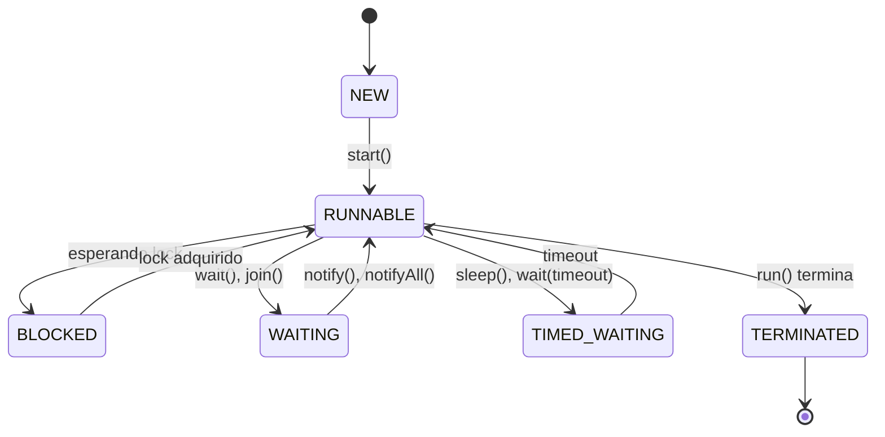

# 4.6 Threads em Java

## **Explicação Detalhada**

### **1. Threads em Java: Visão Geral**
Em Java, as threads são fundamentais para a execução de programas concorrentes. Todo programa Java começa com pelo menos uma thread, chamada de **thread principal**, que executa o método `main()`. A partir daí, outras threads podem ser criadas para realizar tarefas em paralelo.

### **2. Criando Threads em Java**
Existem duas maneiras principais de criar threads em Java:

1. **Estendendo a classe `Thread`**:
   - Cria-se uma nova classe que herda de `Thread` e sobrescreve o método `run()`.
   - Exemplo:
     ```java
     class MinhaThread extends Thread {
         public void run() {
             System.out.println("Thread em execução!");
         }
     }

     public class Main {
         public static void main(String[] args) {
             MinhaThread thread = new MinhaThread();
             thread.start(); // Inicia a thread
         }
     }
     ```

2. **Implementando a interface `Runnable`**:
   - Cria-se uma classe que implementa `Runnable` e define o método `run()`.
   - Essa abordagem é mais flexível, pois permite que a classe herde de outra classe.
   - Exemplo:
     ```java
     class MeuRunnable implements Runnable {
         public void run() {
             System.out.println("Thread em execução!");
         }
     }

     public class Main {
         public static void main(String[] args) {
             Thread thread = new Thread(new MeuRunnable());
             thread.start(); // Inicia a thread
         }
     }
     ```

### **3. Exemplo Completo: Somatório com Threads**
Vamos implementar o exemplo do somatório de um número inteiro não negativo usando threads em Java.

#### **Código Java** {id="c-digo-java_1"}
```java
class Somatorio implements Runnable {
    private int upper; // Limite superior do somatório
    private int sum = 0; // Resultado do somatório

    // Construtor
    public Somatorio(int upper) {
        this.upper = upper;
    }

    // Método run (executado pela thread)
    public void run() {
        for (int i = 1; i <= upper; i++) {
            sum += i;
        }
        System.out.println("Somatório até " + upper + " = " + sum);
    }

    // Método para obter o resultado do somatório
    public int getSum() {
        return sum;
    }
}

public class Main {
    public static void main(String[] args) {
        if (args.length != 1) {
            System.out.println("Uso: java Main <valor>");
            return;
        }

        int upper = Integer.parseInt(args[0]); // Converte o argumento para inteiro
        Somatorio task = new Somatorio(upper); // Cria a tarefa
        Thread thread = new Thread(task); // Cria a thread
        thread.start(); // Inicia a thread

        try {
            thread.join(); // Espera a thread terminar
        } catch (InterruptedException e) {
            e.printStackTrace();
        }

        System.out.println("Resultado final: " + task.getSum());
    }
}
```

#### **Explicação do Código**
1. **Classe `Somatorio`**:
   - Implementa `Runnable` e define o método `run()`, que calcula o somatório.
   - O resultado é armazenado na variável `sum`.

2. **Classe `Main`**:
   - Cria uma instância de `Somatorio` e uma thread associada a ela.
   - Inicia a thread com `start()` e espera seu término com `join()`.
   - Exibe o resultado final.

#### **Como Executar**
Compile e execute o programa:
```bash
javac Main.java
java Main 5
```

Saída esperada:
```
Somatório até 5 = 15
Resultado final: 15
```

---

### **4. Estados de uma Thread em Java**
Uma thread em Java pode estar em um dos seguintes estados:

1. **NEW**: A thread foi criada, mas ainda não foi iniciada.
2. **RUNNABLE**: A thread está em execução ou pronta para executar.
3. **BLOCKED**: A thread está bloqueada, esperando por um lock.
4. **WAITING**: A thread está esperando indefinidamente por outra thread.
5. **TIMED_WAITING**: A thread está esperando por um tempo específico.
6. **TERMINATED**: A thread terminou sua execução.

#### **Diagrama de Estados**


---

### **5. Threads Daemon vs. Não Daemon**
- **Threads Daemon**:
  - São threads de baixa prioridade que rodam em segundo plano.
  - A JVM termina quando todas as threads **não daemon** terminam.
  - Exemplo: Garbage Collector.
  - Definida com `thread.setDaemon(true)`.

- **Threads Não Daemon**:
  - São threads comuns.
  - A JVM espera que todas terminem antes de encerrar.

---

### **6. JVM e o Sistema Operacional Hospedeiro**
A JVM pode mapear threads Java para threads do sistema operacional de diferentes formas:
- **Modelo 1:1**: Cada thread Java é associada a uma thread do kernel (usado no Windows).
- **Modelo M:N**: Várias threads Java são mapeadas para um número menor de threads do kernel (usado em alguns sistemas UNIX).
- **Modelo M:1**: Várias threads Java são mapeadas para uma única thread do kernel (antigo modelo "green threads").

---

## **Exemplo Completo: Produtor-Consumidor**
Vamos implementar uma solução para o problema clássico do produtor-consumidor usando threads em Java.

#### **Código Java**
```java
import java.util.LinkedList;
import java.util.Queue;

class MessageQueue {
    private Queue<String> queue = new LinkedList<>();
    private int capacity;

    public MessageQueue(int capacity) {
        this.capacity = capacity;
    }

    public synchronized void send(String message) throws InterruptedException {
        while (queue.size() == capacity) {
            wait(); // Espera se a fila estiver cheia
        }
        queue.add(message);
        notifyAll(); // Notifica os consumidores
    }

    public synchronized String receive() throws InterruptedException {
        while (queue.isEmpty()) {
            wait(); // Espera se a fila estiver vazia
        }
        String message = queue.poll();
        notifyAll(); // Notifica os produtores
        return message;
    }
}

class Produtor implements Runnable {
    private MessageQueue queue;

    public Produtor(MessageQueue queue) {
        this.queue = queue;
    }

    public void run() {
        try {
            for (int i = 0; i < 10; i++) {
                String message = "Mensagem " + i;
                queue.send(message);
                System.out.println("Produzido: " + message);
                Thread.sleep(500); // Simula tempo de produção
            }
        } catch (InterruptedException e) {
            e.printStackTrace();
        }
    }
}

class Consumidor implements Runnable {
    private MessageQueue queue;

    public Consumidor(MessageQueue queue) {
        this.queue = queue;
    }

    public void run() {
        try {
            for (int i = 0; i < 10; i++) {
                String message = queue.receive();
                System.out.println("Consumido: " + message);
                Thread.sleep(1000); // Simula tempo de consumo
            }
        } catch (InterruptedException e) {
            e.printStackTrace();
        }
    }
}

public class Main {
    public static void main(String[] args) {
        MessageQueue queue = new MessageQueue(5); // Fila com capacidade 5
        Thread produtor = new Thread(new Produtor(queue));
        Thread consumidor = new Thread(new Consumidor(queue));

        produtor.start();
        consumidor.start();
    }
}
```

#### **Explicação do Código** {id="explica-o-do-c-digo_1"}
1. **MessageQueue**:
   - Gerencia uma fila de mensagens com capacidade limitada.
   - Usa `wait()` e `notifyAll()` para sincronização.

2. **Produtor**:
   - Gera mensagens e as envia para a fila.

3. **Consumidor**:
   - Recebe e processa mensagens da fila.

4. **Main**:
   - Cria a fila e inicia as threads do produtor e consumidor.
