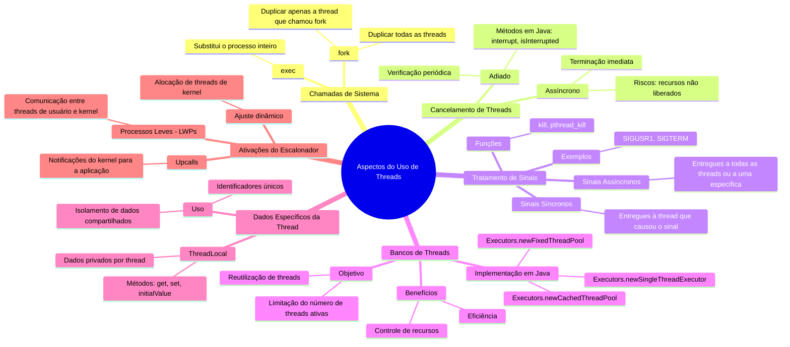

# 4.7 Aspectos do Uso de Threads

Vamos explorar os **aspectos do uso de threads** de forma detalhada, com exemplos práticos, analogias e diagramas para facilitar o entendimento.




1. **Chamadas de Sistema**:
   - Aborda o comportamento de `fork()` e `exec()` em programas multithread, destacando as duas versões de `fork()` e o impacto de `exec()`.

2. **Cancelamento de Threads**:
   - Discute as técnicas de cancelamento assíncrono e adiado, com exemplos em Java usando `interrupt()` e `isInterrupted()`.

3. **Tratamento de Sinais**:
   - Explora como os sinais são entregues em programas multithread, diferenciando sinais síncronos e assíncronos, e como são tratados em sistemas UNIX e Windows.

4. **Bancos de Threads**:
   - Explica a criação e uso de bancos de threads para melhorar a eficiência e o controle de recursos, com exemplos práticos em Java.

5. **Dados Específicos da Thread**:
   - Introduz o conceito de `ThreadLocal` para armazenar dados privados por thread, útil em cenários como processamento de transações.

6. **Ativações do Escalonador**:
   - Descreve a comunicação entre threads de usuário e kernel por meio de LWPs e upcalls, permitindo ajustes dinâmicos no escalonamento.

---

## **1. Chamadas de Sistema `fork()` e `exec()`**

### **Problema**
Quando uma thread em um programa multithread chama `fork()`, o novo processo deve duplicar todas as threads ou apenas a thread que chamou `fork()`? Além disso, como a chamada `exec()` afeta as threads?

### **Solução**
- **Duas versões de `fork()`**:
  1. **Duplicar todas as threads**: O novo processo terá uma cópia de todas as threads do processo original.
  2. **Duplicar apenas a thread que chamou `fork()`**: O novo processo terá apenas uma thread.

- **Escolha da versão**:
  - Se `exec()` for chamado logo após `fork()`, duplicar todas as threads é desnecessário, pois o programa será substituído.
  - Se `exec()` não for chamado, o novo processo deve duplicar todas as threads para manter a funcionalidade.

### **Exemplo em C**
```c
#include <stdio.h>
#include <unistd.h>
#include <pthread.h>

void* thread_func(void* arg) {
    printf("Thread filha em execução\n");
    sleep(2);
    printf("Thread filha terminou\n");
    return NULL;
}

int main() {
    pthread_t thread;
    pthread_create(&thread, NULL, thread_func, NULL);

    pid_t pid = fork();
    if (pid == 0) { // Processo filho
        printf("Processo filho criado\n");
        execlp("ls", "ls", NULL); // Substitui o processo filho
    } else if (pid > 0) { // Processo pai
        printf("Processo pai esperando\n");
        pthread_join(thread, NULL);
    }

    return 0;
}
```

### **Explicação**
- O processo filho criado por `fork()` substitui seu espaço de memória com `exec()`, então apenas a thread que chamou `fork()` é duplicada.

---

## **2. Cancelamento de Threads**

### **Problema** {id="problema_5"}
Cancelar uma thread antes que ela termine sua execução pode ser necessário, mas isso pode causar problemas se a thread estiver manipulando recursos compartilhados.

### **Solução** {id="solu-o_5"}
- **Cancelamento Assíncrono**: A thread é terminada imediatamente.
- **Cancelamento Adiado**: A thread verifica periodicamente se deve ser cancelada, permitindo uma finalização segura.

### **Exemplo em Java**
```java
class InterruptibleThread implements Runnable {
    public void run() {
        while (!Thread.currentThread().isInterrupted()) {
            System.out.println("Thread em execução");
            try {
                Thread.sleep(1000);
            } catch (InterruptedException e) {
                System.out.println("Thread interrompida");
                Thread.currentThread().interrupt(); // Restaura o status de interrupção
            }
        }
        System.out.println("Thread terminada");
    }
}

public class Main {
    public static void main(String[] args) throws InterruptedException {
        Thread thread = new Thread(new InterruptibleThread());
        thread.start();

        Thread.sleep(3000); // Espera 3 segundos
        thread.interrupt(); // Interrompe a thread
    }
}
```

### **Explicação** {id="explica-o_4"}
- A thread verifica seu status de interrupção com `isInterrupted()` e termina de forma segura.

---

## **3. Tratamento de Sinais**

### **Problema** {id="problema_4"}
Em programas multithread, os sinais podem ser entregues a uma thread específica ou a todas as threads, dependendo do tipo de sinal.

### **Solução** {id="solu-o_4"}
- **Sinais Síncronos**: Entregues à thread que causou o sinal.
- **Sinais Assíncronos**: Podem ser entregues a todas as threads ou a uma thread específica.

### **Exemplo em C (UNIX)**
```c
#include <stdio.h>
#include <signal.h>
#include <pthread.h>
#include <unistd.h>

void handle_signal(int sig) {
    printf("Sinal %d recebido pela thread %ld\n", sig, (long)pthread_self());
}

void* thread_func(void* arg) {
    signal(SIGUSR1, handle_signal);
    while (1) {
        sleep(1);
    }
    return NULL;
}

int main() {
    pthread_t thread1, thread2;
    pthread_create(&thread1, NULL, thread_func, NULL);
    pthread_create(&thread2, NULL, thread_func, NULL);

    sleep(2);
    pthread_kill(thread1, SIGUSR1); // Envia sinal para thread1
    pthread_kill(thread2, SIGUSR1); // Envia sinal para thread2

    pthread_join(thread1, NULL);
    pthread_join(thread2, NULL);

    return 0;
}
```

### **Explicação** {id="explica-o_3"}
- O sinal `SIGUSR1` é enviado para threads específicas usando `pthread_kill()`.

---

## **4. Bancos de Threads**

### **Problema** {id="problema_3"}
Criar uma nova thread para cada requisição em um servidor pode ser ineficiente e consumir muitos recursos.

### **Solução** {id="solu-o_3"}
- **Bancos de Threads**: Um conjunto de threads é criado no início e reutilizado para atender requisições.

### **Exemplo em Java** {id="exemplo-em-java_2"}
```java
import java.util.concurrent.ExecutorService;
import java.util.concurrent.Executors;

class Task implements Runnable {
    private int id;

    public Task(int id) {
        this.id = id;
    }

    public void run() {
        System.out.println("Task " + id + " executada por " + Thread.currentThread().getName());
        try {
            Thread.sleep(2000);
        } catch (InterruptedException e) {
            e.printStackTrace();
        }
    }
}

public class Main {
    public static void main(String[] args) {
        ExecutorService executor = Executors.newFixedThreadPool(3); // Banco com 3 threads

        for (int i = 1; i <= 10; i++) {
            executor.execute(new Task(i));
        }

        executor.shutdown();
    }
}
```

### **Explicação** {id="explica-o_2"}
- O banco de threads com 3 threads executa 10 tarefas, reutilizando as threads disponíveis.

---

## **5. Dados Específicos da Thread**

### **Problema** {id="problema_2"}
Threads compartilham dados globais, mas às vezes cada thread precisa de sua própria cópia de dados.

### **Solução** {id="solu-o_2"}
- **ThreadLocal**: Permite que cada thread tenha sua própria cópia de dados.

### **Exemplo em Java** {id="exemplo-em-java_1"}
```java
class ThreadLocalExample {
    private static ThreadLocal<Integer> threadLocal = ThreadLocal.withInitial(() -> 0);

    public static void main(String[] args) {
        Runnable task = () -> {
            int value = threadLocal.get();
            threadLocal.set(value + 1);
            System.out.println(Thread.currentThread().getName() + ": " + threadLocal.get());
        };

        Thread thread1 = new Thread(task);
        Thread thread2 = new Thread(task);

        thread1.start();
        thread2.start();
    }
}
```

### **Explicação** {id="explica-o_1"}
- Cada thread mantém sua própria cópia do valor em `threadLocal`.

---

## **6. Ativações do Escalonador (Scheduler Activations)**

### **Problema** {id="problema_1"}
A comunicação entre threads de usuário e threads do kernel pode ser necessária para ajustar dinamicamente o número de threads de kernel.

### **Solução** {id="solu-o_1"}
- **Processos Leves (LWPs)**: Estruturas intermediárias que permitem a comunicação entre threads de usuário e threads do kernel.
- **Upcalls**: O kernel notifica a aplicação sobre eventos, como o bloqueio de uma thread.

### **Exemplo Conceitual**
1. O kernel aloca LWPs para a aplicação.
2. Quando uma thread de usuário é bloqueada, o kernel faz um upcall para a aplicação.
3. A aplicação salva o estado da thread bloqueada e escalona outra thread no LWP disponível.

---

## **Resumo**

| Tópico                     | Descrição                                                                 |
|----------------------------|---------------------------------------------------------------------------|
| **`fork()` e `exec()`**     | Duplicação de threads e substituição de processos.                        |
| **Cancelamento de Threads** | Assíncrono (imediato) ou adiado (seguro).                                 |
| **Tratamento de Sinais**    | Entregues a threads específicas ou a todas as threads.                    |
| **Bancos de Threads**       | Reutilização de threads para melhorar eficiência.                         |
| **Dados Específicos**       | Uso de `ThreadLocal` para dados privados por thread.                       |
| **Ativações do Escalonador**| Comunicação entre threads de usuário e kernel via LWPs e upcalls.          |
