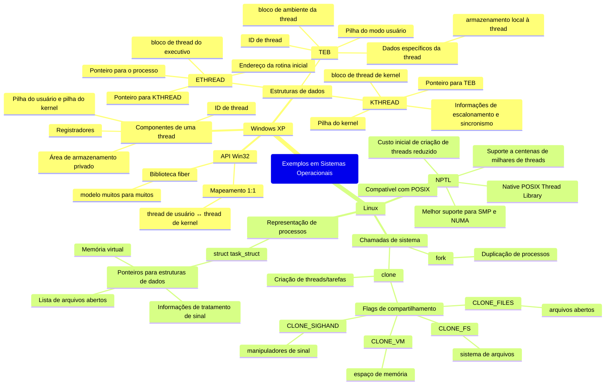

#  4.8 Exemplos em Sistemas Operacionais

Nesta seção, exploramos como as **threads** são implementadas em dois sistemas operacionais populares: **Windows XP** e **Linux**. Cada sistema operacional tem sua própria abordagem para gerenciar threads, refletindo suas filosofias de design e necessidades específicas. Vamos detalhar cada um deles.

## **Threads no Windows XP**

O Windows XP utiliza a **API Win32**, que é a principal interface para criação e gerenciamento de threads na família de sistemas operacionais da Microsoft (Windows 95, 98, NT, 2000 e XP). Aqui estão os principais pontos:

### **1. Mapeamento 1:1**
- O Windows XP usa o **modelo de mapeamento 1:1**, onde cada thread no nível do usuário é associada a uma thread no nível do kernel.
- Isso significa que o sistema operacional gerencia diretamente cada thread, o que simplifica o escalonamento e a sincronização, mas pode limitar a escalabilidade em sistemas com muitas threads.

### **2. Biblioteca Fiber**
- Além do modelo 1:1, o Windows XP oferece suporte à **biblioteca fiber**, que implementa o **modelo muitos para muitos**.
- Nesse modelo, várias threads de usuário são mapeadas para um número menor de threads de kernel, permitindo maior flexibilidade e eficiência em certos cenários.

### **3. Componentes de uma Thread**
Cada thread no Windows XP é composta por:
- **ID da thread**: Identifica a thread de forma única.
- **Registradores**: Armazenam o estado atual da CPU.
- **Pilhas**: Uma pilha para o modo usuário e outra para o modo kernel.
- **Área de armazenamento privado**: Usada por bibliotecas em tempo de execução e DLLs.

### **4. Estruturas de Dados**
O Windows XP utiliza três estruturas de dados principais para gerenciar threads:
- **ETHREAD (Executive Thread Block)**:
  - Armazena informações sobre o processo ao qual a thread pertence.
  - Contém o endereço da rotina onde a thread começa a executar.
  - Aponta para a estrutura **KTHREAD** correspondente.
- **KTHREAD (Kernel Thread Block)**:
  - Gerencia informações de escalonamento e sincronização.
  - Contém a pilha do kernel, usada quando a thread está no modo kernel.
  - Aponta para a estrutura **TEB**.
- **TEB (Thread Environment Block)**:
  - Estrutura no espaço do usuário que contém dados específicos da thread, como a pilha do usuário e um array para armazenamento local à thread.

### **5. Conclusão sobre Windows XP**
O Windows XP é projetado para oferecer um gerenciamento robusto de threads, com suporte tanto para o modelo 1:1 quanto para o modelo muitos para muitos (via fibers). Suas estruturas de dados são bem definidas, permitindo um controle eficiente das threads no nível do kernel e do usuário.

---

## **4.6.2 Threads no Linux**

O Linux tem uma abordagem diferente para threads, baseada na ideia de **tarefas** (tasks), que podem ser tanto processos quanto threads. Aqui estão os principais pontos:

### **1. Chamadas de Sistema**
- **`fork()`**:
  - Cria um novo processo duplicando o processo atual.
  - Não há compartilhamento de recursos entre o processo pai e o filho.
- **`clone()`**:
  - Permite criar threads (ou tarefas) com diferentes níveis de compartilhamento de recursos.
  - Dependendo dos **flags** passados, a nova tarefa pode compartilhar recursos como memória, arquivos abertos e manipuladores de sinais.

### **2. Flags do `clone()`**
O `clone()` aceita vários flags que determinam o nível de compartilhamento entre a tarefa pai e a filha:
- **CLONE_FS**: Compartilha informações do sistema de arquivos (ex.: diretório atual).
- **CLONE_VM**: Compartilha o espaço de memória virtual.
- **CLONE_SIGHAND**: Compartilha manipuladores de sinais.
- **CLONE_FILES**: Compartilha arquivos abertos.

### **3. Representação de Processos**
- No Linux, cada processo ou thread é representado por uma estrutura de dados chamada **`struct task_struct`**.
- Essa estrutura não armazena diretamente os dados do processo, mas contém **ponteiros** para outras estruturas que gerenciam recursos como:
  - Lista de arquivos abertos.
  - Informações de tratamento de sinais.
  - Memória virtual.

### **4. NPTL (Native POSIX Thread Library)**
- O Linux moderno utiliza a **NPTL**, uma biblioteca de threads compatível com o padrão POSIX.
- A NPTL oferece:
  - Melhor suporte para sistemas **SMP (Symmetric Multiprocessing)** e **NUMA (Non-Uniform Memory Access)**.
  - Custo reduzido para criação de threads.
  - Suporte a centenas de milhares de threads, o que é essencial para sistemas multicore e servidores de alta carga.

### **5. Conclusão sobre Linux**
O Linux trata threads e processos de forma semelhante, usando a estrutura `task_struct` e a chamada `clone()` para gerenciar o compartilhamento de recursos. A NPTL trouxe melhorias significativas, especialmente em sistemas multiprocessados, tornando o Linux uma plataforma robusta para aplicações multithread.

---

## **Comparação entre Windows XP e Linux**

| Característica               | Windows XP                              | Linux                                  |
|------------------------------|-----------------------------------------|----------------------------------------|
| **Modelo de Threads**        | Mapeamento 1:1 (com suporte a fibers)   | Tarefas (processos/threads) via `clone()` |
| **Chamadas de Sistema**      | API Win32 (`CreateThread`, etc.)        | `fork()` e `clone()`                   |
| **Compartilhamento**         | Definido pelo sistema                   | Configurável via flags no `clone()`    |
| **Biblioteca de Threads**    | Biblioteca fiber                        | NPTL (POSIX-compliant)                 |
| **Estruturas de Dados**      | ETHREAD, KTHREAD, TEB                   | `struct task_struct`                   |
| **Escalabilidade**           | Limitada pelo modelo 1:1                | Alta (suporte a centenas de milhares de threads) |

---

## **Conclusão Geral**

Tanto o **Windows XP** quanto o **Linux** oferecem suporte robusto para threads, mas com abordagens diferentes:
- O **Windows XP** prioriza o controle direto sobre as threads, com estruturas de dados bem definidas e suporte a modelos de mapeamento flexíveis.
- O **Linux** trata threads como tarefas, com compartilhamento de recursos configurável via `clone()`, e a NPTL trouxe melhorias significativas para sistemas modernos.

Essas diferenças refletem as filosofias de design de cada sistema operacional e suas aplicações típicas. Ambos são eficientes em seus contextos, mas o Linux se destaca em cenários que exigem alta escalabilidade e suporte a sistemas multiprocessados.
