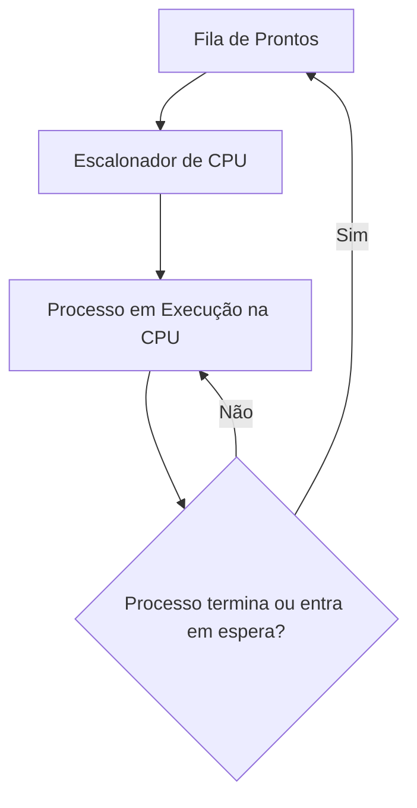
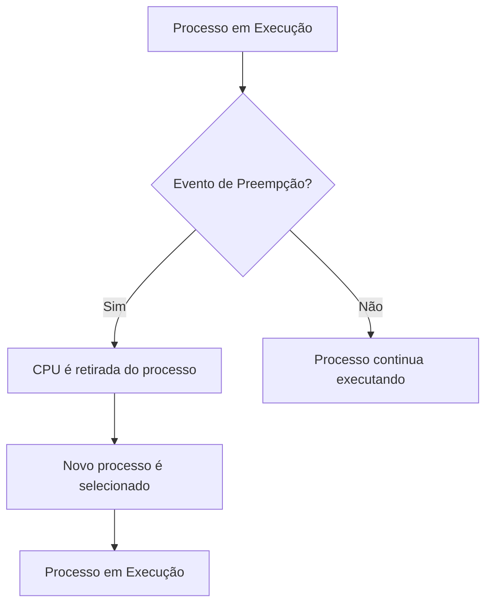
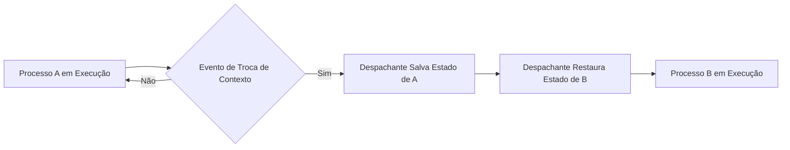
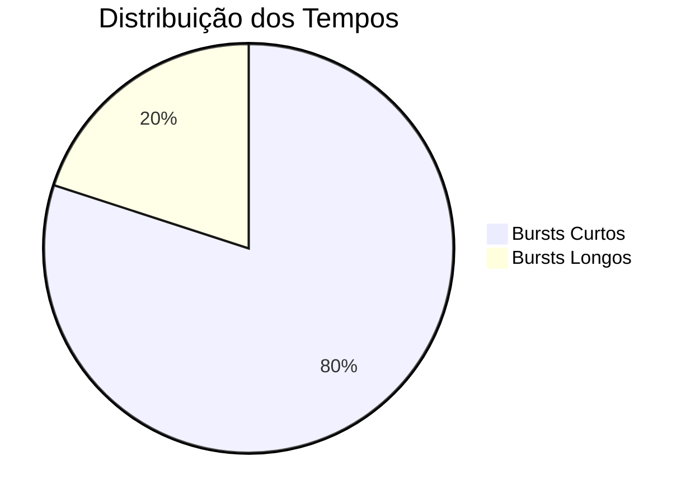

# 5.1 Conceitos básicos

Nesta seção, exploramos os conceitos fundamentais do escalonamento de CPU, que é essencial para o funcionamento eficiente de sistemas operacionais multiprogramados. Vamos detalhar cada tópico para facilitar o entendimento.

---

### **5.1.1 Ciclo de Burst CPU-E/S**

#### **O que é o Ciclo de Burst CPU-E/S?**
- Os processos alternam entre dois estados principais:
  1. **Burst de CPU**: O processo está executando instruções na CPU.
  2. **Burst de E/S**: O processo está aguardando a conclusão de uma operação de entrada/saída (E/S).
- Esse ciclo se repete até que o processo termine.

#### **Exemplo de Ciclo de Burst**
1. O processo começa com um **burst de CPU**.
2. Em seguida, faz uma requisição de E/S e entra em um **burst de E/S**.
3. Após a conclusão da E/S, o processo retorna para outro **burst de CPU**.
4. Esse padrão continua até o término do processo.

#### **Distribuição dos Tempos de Burst**
- A maioria dos processos tem **bursts de CPU curtos**, enquanto uma minoria tem **bursts de CPU longos**.
- Isso é representado por uma curva exponencial ou hiperexponencial (veja a Figura 5.2).

#### **Implicações para o Escalonamento**
- Algoritmos de escalonamento devem ser escolhidos com base no comportamento dos processos (CPU-bound ou I/O-bound).
  - **Processos I/O-bound**: Muitos bursts de CPU curtos.
  - **Processos CPU-bound**: Poucos bursts de CPU longos.

---

### **5.1.2 Escalonador de CPU**

#### **O que é o Escalonador de CPU?**
- O **escalonador de curto prazo** (ou escalonador de CPU) é responsável por selecionar qual processo na **fila de prontos** (ready queue) deve receber a CPU.

#### **Funcionamento**
1. Quando a CPU fica ociosa, o escalonador escolhe um processo da fila de prontos.
2. O processo selecionado é alocado para execução na CPU.

#### **Estrutura da Fila de Prontos**
- A fila de prontos pode ser implementada de várias formas:
  - **FIFO (First-In, First-Out)**: O primeiro processo que entra é o primeiro a ser executado.
  - **Fila de Prioridade**: Processos com prioridade mais alta são executados primeiro.
  - **Lista Encadeada**: Permite flexibilidade na organização dos processos.

#### **Registros na Fila de Prontos**
- Cada entrada na fila de prontos é um **Bloco de Controle de Processo (PCB)**, que contém informações sobre o estado do processo.

---

### **5.1.3 Escalonamento Preemptivo vs. Não Preemptivo**

#### **Escalonamento Não Preemptivo**
- A CPU é alocada a um processo até que ele termine ou entre em estado de espera.
- **Vantagem**: Simplicidade e menor custo de troca de contexto.
- **Desvantagem**: Pode causar atrasos para outros processos, especialmente em sistemas interativos.

#### **Escalonamento Preemptivo**
- A CPU pode ser retirada de um processo em execução e alocada a outro processo.
- **Cenários de Preempção**:
  1. Um processo passa de **executando** para **esperando** (ex.: requisição de E/S).
  2. Um processo passa de **executando** para **pronto** (ex.: interrupção).
  3. Um processo passa de **esperando** para **pronto** (ex.: término de E/S).
  4. Um processo termina.

#### **Vantagens do Escalonamento Preemptivo**
- Melhor tempo de resposta para processos interativos.
- Mais justo, pois evita que um processo monopolize a CPU.

#### **Desafios do Escalonamento Preemptivo**
- **Problemas de sincronização**: Dados compartilhados podem ficar inconsistentes se um processo for preemptado durante uma atualização.
- **Complexidade do kernel**: O kernel deve garantir que estruturas de dados internas não fiquem inconsistentes durante a preempção.

#### **Exemplos de Sistemas**
- **Windows 95 e versões posteriores**: Usam escalonamento preemptivo.
- **Mac OS X**: Também usa escalonamento preemptivo.
- **Windows 3.x e Macintosh antigos**: Usavam escalonamento cooperativo (não preemptivo).

---

### **5.1.4 Despachante**

#### **O que é o Despachante?**
- O **despachante** é o módulo do sistema operacional responsável por:
  1. **Trocar o contexto**: Salvar o estado do processo atual e restaurar o estado do próximo processo.
  2. **Trocar para o modo usuário**: Retornar o controle ao programa do usuário.
  3. **Reiniciar o programa**: Continuar a execução do processo a partir do ponto onde ele foi interrompido.

#### **Latência de Despacho**
- É o tempo que o despachante leva para:
  - Interromper um processo.
  - Iniciar a execução de outro processo.
- **Objetivo**: Minimizar a latência de despacho para melhorar a eficiência do sistema.

#### **Importância do Despachante**
- O despachante é chamado toda vez que ocorre uma troca de processo, portanto, deve ser **rápido e eficiente**.

---

### **Resumo dos Conceitos**

| Tópico                     | Descrição                                                                 |
|----------------------------|---------------------------------------------------------------------------|
| **Ciclo de Burst CPU-E/S**  | Processos alternam entre execução na CPU e espera por E/S.                |
| **Escalonador de CPU**      | Seleciona o próximo processo a ser executado na fila de prontos.          |
| **Escalonamento Preemptivo**| Permite interromper um processo em execução para alocar a CPU a outro.    |
| **Despachante**             | Responsável pela troca de contexto e reinício da execução do processo.    |

---

### **Exemplo Prático**

#### **Cenário de Escalonamento Preemptivo**
1. O **Processo A** está em execução na CPU.
2. Uma **interrupção** ocorre (ex.: término de E/S do **Processo B**).
3. O escalonador decide preemptar o **Processo A** e alocar a CPU ao **Processo B**.
4. O **despachante** salva o estado do **Processo A** e restaura o estado do **Processo B**.
5. O **Processo B** começa a executar.
