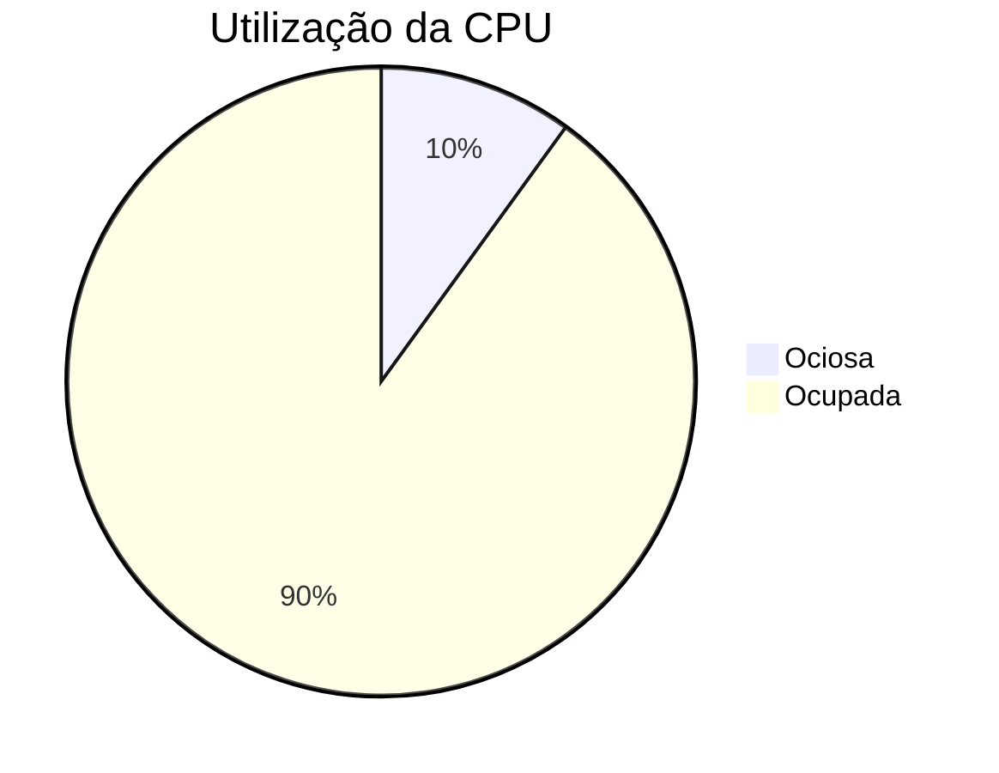
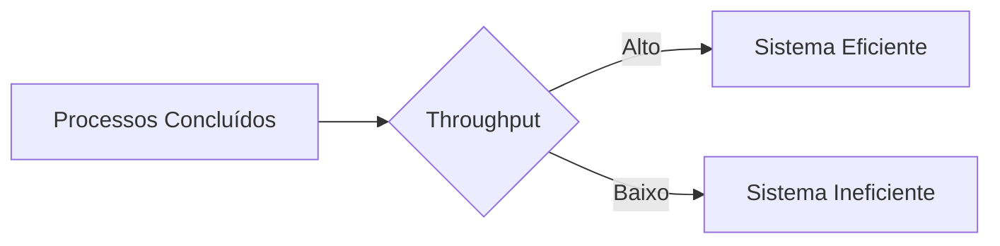
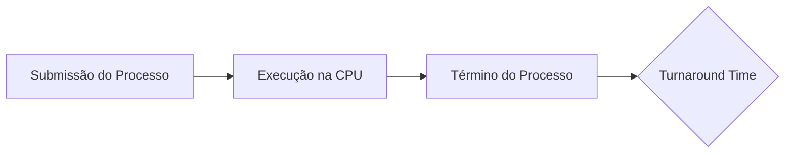
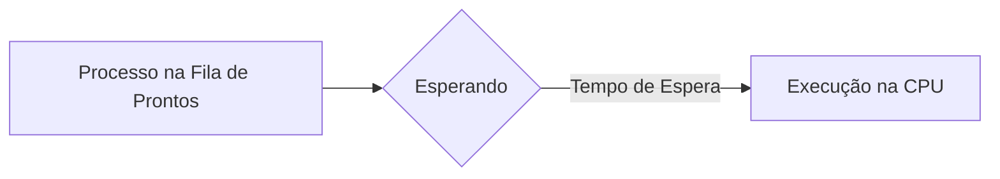

# 5.2 Critérios de Escalonamento

Nesta seção, discutimos os **critérios** usados para avaliar e comparar algoritmos de escalonamento de CPU. Esses critérios ajudam a determinar qual algoritmo é mais adequado para um determinado sistema ou cenário. Vamos detalhar cada um deles e explicar sua importância.

---

### **Critérios de Escalonamento**

#### **1. Utilização da CPU**
- **Definição**: Percentual de tempo em que a CPU está ocupada executando processos.
- **Intervalo**: Varia de **0%** (CPU ociosa) a **100%** (CPU sempre ocupada).
- **Objetivo**: Maximizar a utilização da CPU.
- **Exemplo**:
  - Em um sistema pouco carregado, a utilização pode ser de **40%**.
  - Em um sistema muito utilizado, pode chegar a **90%**.

#### **2. Throughput (Vazão)**
- **Definição**: Número de processos concluídos por unidade de tempo.
- **Objetivo**: Maximizar o throughput.
- **Exemplos**:
  - Para processos longos: **1 processo por hora**.
  - Para transações curtas: **10 processos por segundo**.

#### **3. Turnaround Time (Tempo de Retorno)**
- **Definição**: Tempo total desde a submissão de um processo até o seu término.
- **Componentes**:
  1. Tempo de espera para entrar na memória.
  2. Tempo de espera na fila de prontos.
  3. Tempo de execução na CPU.
  4. Tempo de E/S.
- **Objetivo**: Minimizar o turnaround time.
- **Exemplo**: Se um processo leva **10 segundos** para ser concluído, desde sua submissão até o término, seu turnaround time é **10 segundos**.

#### **4. Tempo de Espera**
- **Definição**: Tempo total que um processo passa esperando na fila de prontos.
- **Objetivo**: Minimizar o tempo de espera.
- **Observação**: O tempo de espera é influenciado apenas pelo algoritmo de escalonamento, não pelo tempo de execução ou E/S.

#### **5. Tempo de Resposta**
- **Definição**: Tempo desde a submissão de uma requisição até a primeira resposta ser produzida.
- **Objetivo**: Minimizar o tempo de resposta.
- **Importância**: Critério crucial para sistemas interativos (ex.: sistemas de tempo compartilhado).
- **Exemplo**: Em um sistema interativo, o tempo de resposta deve ser curto para garantir uma boa experiência do usuário.

---

### **Objetivos Gerais**
- **Maximizar**:
  - Utilização da CPU.
  - Throughput.
- **Minimizar**:
  - Turnaround time.
  - Tempo de espera.
  - Tempo de resposta.

#### **Otimização de Valores**
- Na maioria dos casos, o foco é otimizar os **valores médios**.
- Em alguns cenários, é importante otimizar os **valores mínimo ou máximo**.
  - Exemplo: Reduzir o **tempo máximo de resposta** para garantir que todos os usuários recebam um bom atendimento.

#### **Variância no Tempo de Resposta**
- Para sistemas interativos, minimizar a **variância no tempo de resposta** pode ser mais importante do que minimizar o tempo de resposta médio.
- Um sistema com tempo de resposta **previsível** é preferível a um sistema mais rápido, porém com alta variabilidade.

---

### **Exemplo de Comparação de Algoritmos**

Suponha que temos três processos com os seguintes tempos de burst de CPU:

| Processo | Tempo de Burst (ms) |
|----------|---------------------|
| P1       | 24                  |
| P2       | 3                   |
| P3       | 3                   |

Vamos comparar os tempos de espera médios para dois algoritmos de escalonamento: **FCFS (First-Come, First-Served)** e **SJF (Shortest-Job-First)**.

#### **FCFS**
- Ordem de execução: P1 → P2 → P3.
- Tempos de espera:
  - P1: 0 ms.
  - P2: 24 ms.
  - P3: 27 ms.
- **Tempo de espera médio**: (0 + 24 + 27) / 3 = **17 ms**.

#### **SJF**
- Ordem de execução: P2 → P3 → P1.
- Tempos de espera:
  - P2: 0 ms.
  - P3: 3 ms.
  - P1: 6 ms.
- **Tempo de espera médio**: (0 + 3 + 6) / 3 = **3 ms**.

#### **Conclusão**
- O algoritmo **SJF** é melhor nesse caso, pois reduz o tempo de espera médio.

---

### **Diagramas para Ilustração**

#### **1. Diagrama de Utilização da CPU**

#### **2. Diagrama de Throughput**

#### **3. Diagrama de Turnaround Time**

#### **4. Diagrama de Tempo de Espera**

#### **5. Diagrama de Tempo de Resposta**

---

### **Resumo dos Critérios**

| Critério               | Definição                                                                 | Objetivo          |
|------------------------|---------------------------------------------------------------------------|-------------------|
| **Utilização da CPU**  | Percentual de tempo em que a CPU está ocupada.                            | Maximizar         |
| **Throughput**         | Número de processos concluídos por unidade de tempo.                      | Maximizar         |
| **Turnaround Time**    | Tempo total desde a submissão até o término do processo.                  | Minimizar         |
| **Tempo de Espera**    | Tempo que um processo passa esperando na fila de prontos.                 | Minimizar         |
| **Tempo de Resposta**  | Tempo desde a submissão até a primeira resposta.                          | Minimizar         |
