# 5.3 Algoritmos de Escalonamento

Nesta seção, discutimos os principais **algoritmos de escalonamento de CPU**, que são responsáveis por decidir qual processo na fila de prontos deve receber a CPU. Cada algoritmo tem suas próprias características, vantagens e desvantagens, e a escolha do algoritmo adequado depende das necessidades do sistema e dos processos.

---

### **5.3.1 Escalonamento First-Come, First-Served (FCFS)**

#### **Descrição** {id="descri-o_1"}
- O algoritmo **FCFS** (First-Come, First-Served) é o mais simples: o primeiro processo que chega à fila de prontos é o primeiro a ser executado.
- É implementado usando uma **fila FIFO** (First-In, First-Out).

#### **Vantagens** {id="vantagens_1"}
- Simples de implementar e entender.
- Justo, pois os processos são atendidos na ordem de chegada.

#### **Desvantagens** {id="desvantagens_1"}
- **Tempo de espera médio** pode ser alto, especialmente se processos longos chegarem antes de processos curtos.
- Pode causar o **efeito comboio**: processos curtos ficam esperando por processos longos, o que reduz a eficiência do sistema.

#### **Exemplo** {id="exemplo_1"}
- Processos: P1 (24 ms), P2 (3 ms), P3 (3 ms).
- Ordem de chegada: P1 → P2 → P3.
- **Tempo de espera médio**: (0 + 24 + 27) / 3 = **17 ms**.

---

### **5.3.2 Escalonamento Shortest-Job-First (SJF)**

#### **Descrição** {id="descri-o_2"}
- O algoritmo **SJF** (Shortest-Job-First) seleciona o processo com o menor **tempo de burst de CPU**.
- Pode ser **preemptivo** (chamado **SRTF - Shortest Remaining Time First**) ou **não preemptivo**.

#### **Vantagens** {id="vantagens_2"}
- Minimiza o **tempo de espera médio**.
- Ideal para sistemas onde o tempo de burst de CPU é conhecido ou pode ser previsto.

#### **Desvantagens** {id="desvantagens_2"}
- Difícil de implementar, pois o tempo de burst de CPU nem sempre é conhecido.
- Pode causar **starvation** (processos longos podem nunca ser executados).

#### **Exemplo** {id="exemplo_2"}
- Processos: P1 (6 ms), P2 (8 ms), P3 (7 ms), P4 (3 ms).
- Ordem de execução: P4 → P1 → P3 → P2.
- **Tempo de espera médio**: (0 + 3 + 9 + 16) / 4 = **7 ms**.

---

### **5.3.3 Escalonamento por Prioridade**

#### **Descrição** {id="descri-o_3"}
- Cada processo tem uma **prioridade**, e a CPU é alocada ao processo com a **maior prioridade**.
- Prioridades podem ser **internas** (baseadas em características do processo) ou **externas** (definidas pelo usuário).

#### **Vantagens** {id="vantagens_3"}
- Permite priorizar processos importantes.
- Flexível, pois as prioridades podem ser ajustadas dinamicamente.

#### **Desvantagens** {id="desvantagens_3"}
- Pode causar **starvation** para processos de baixa prioridade.
- Requer mecanismos como **envelhecimento** (aging) para evitar starvation.

#### **Exemplo** {id="exemplo_3"}
- Processos: P1 (10 ms, prioridade 3), P2 (1 ms, prioridade 1), P3 (2 ms, prioridade 4), P4 (1 ms, prioridade 5), P5 (5 ms, prioridade 2).
- Ordem de execução: P2 → P5 → P1 → P3 → P4.
- **Tempo de espera médio**: (0 + 1 + 6 + 16 + 17) / 5 = **8 ms**.

---

### **5.3.4 Escalonamento Round-Robin (RR)**

#### **Descrição** {id="descri-o_4"}
- O algoritmo **RR** (Round-Robin) aloca a CPU a cada processo por um **quantum de tempo** (ex.: 10 ms).
- Se o processo não terminar dentro do quantum, ele é preemptado e colocado no final da fila de prontos.

#### **Vantagens** {id="vantagens_4"}
- Justo, pois todos os processos recebem uma fatia de tempo igual.
- Adequado para sistemas **interativos** e de **tempo compartilhado**.

#### **Desvantagens** {id="desvantagens_4"}
- **Tempo de espera médio** pode ser alto se o quantum for muito grande.
- **Troca de contexto** frequente pode reduzir a eficiência do sistema.

#### **Exemplo** {id="exemplo_4"}
- Processos: P1 (24 ms), P2 (3 ms), P3 (3 ms).
- Quantum: 4 ms.
- **Tempo de espera médio**: (6 + 4 + 7) / 3 = **5,66 ms**.

---

### **5.3.5 Escalonamento Multilevel Queue**

#### **Descrição** {id="descri-o_5"}
- A fila de prontos é dividida em **várias filas**, cada uma com seu próprio algoritmo de escalonamento.
- Exemplo: fila de processos **interativos** (usando RR) e fila de processos **batch** (usando FCFS).

#### **Vantagens** {id="vantagens_5"}
- Permite tratar diferentes tipos de processos de forma adequada.
- Flexível, pois cada fila pode ter um algoritmo diferente.

#### **Desvantagens**
- Complexo de implementar.
- Pode causar **starvation** se uma fila de alta prioridade monopolizar a CPU.

#### **Exemplo** {id="exemplo_5"}
- Filas:
  1. Processos do sistema (prioridade máxima).
  2. Processos interativos (RR).
  3. Processos batch (FCFS).

---

### **5.3.6 Escalonamento Multilevel Feedback Queue**

#### **Descrição**
- Similar ao **Multilevel Queue**, mas permite que processos **mudem de fila** com base em seu comportamento.
- Processos que usam muita CPU são movidos para filas de **menor prioridade**, enquanto processos que esperam muito são movidos para filas de **maior prioridade**.

#### **Vantagens**
- Combina as vantagens de vários algoritmos.
- Evita **starvation** por meio do envelhecimento.

#### **Desvantagens** {id="desvantagens_5"}
- Complexo de configurar e implementar.
- Requer ajuste cuidadoso dos parâmetros.

#### **Exemplo**
- Filas:
  1. Fila 0: Quantum de 8 ms (RR).
  2. Fila 1: Quantum de 16 ms (RR).
  3. Fila 2: FCFS.

---

### **Resumo dos Algoritmos**

| Algoritmo                  | Vantagens                                      | Desvantagens                                   | Melhor Uso                              |
|----------------------------|------------------------------------------------|-----------------------------------------------|-----------------------------------------|
| **FCFS**                   | Simples e justo                                | Tempo de espera médio alto                    | Sistemas com processos similares        |
| **SJF**                    | Minimiza tempo de espera médio                 | Difícil de prever tempos de burst             | Sistemas batch                          |
| **Prioridade**             | Prioriza processos importantes                | Pode causar starvation                        | Sistemas com prioridades definidas      |
| **Round-Robin (RR)**       | Justo e adequado para sistemas interativos    | Troca de contexto frequente                   | Sistemas de tempo compartilhado         |
| **Multilevel Queue**       | Trata diferentes tipos de processos           | Complexo e pode causar starvation             | Sistemas com múltiplas classes de processos |
| **Multilevel Feedback Queue** | Combina vantagens de vários algoritmos       | Complexo de configurar                        | Sistemas que exigem flexibilidade       |

---

### **Diagramas para Ilustração**

#### **1. Diagrama de Gantt para FCFS**

```mermaid
gantt
    title FCFS
    dateFormat  X
    axisFormat %s
    section Processos
    P1 : 0, 24
    P2 : 24, 27
    P3 : 27, 30
```

#### **2. Diagrama de Gantt para SJF**

```mermaid
gantt
    title SJF
    dateFormat  X
    axisFormat %s
    section Processos
    P4 : 0, 3
    P1 : 3, 9
    P3 : 9, 16
    P2 : 16, 24
```

#### **3. Diagrama de Gantt para Round-Robin**

```mermaid
gantt
    title Round-Robin (Quantum = 4 ms)
    dateFormat  X
    axisFormat %s
    section Processos
    P1 : 0, 4
    P2 : 4, 7
    P3 : 7, 10
    P1 : 10, 14
    P1 : 14, 18
    P1 : 18, 22
    P1 : 22, 24
```

