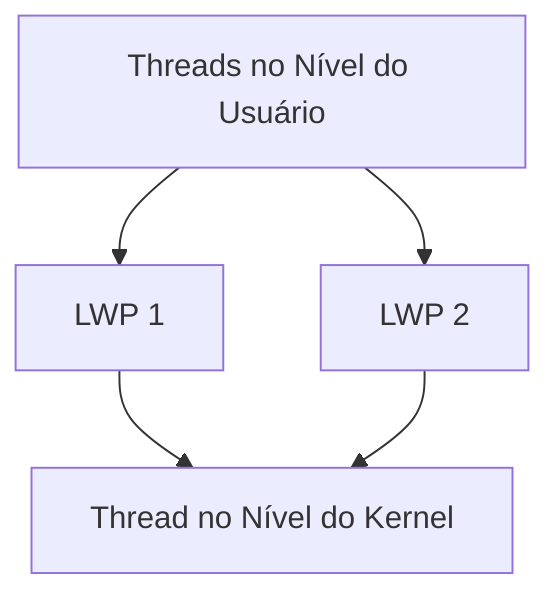
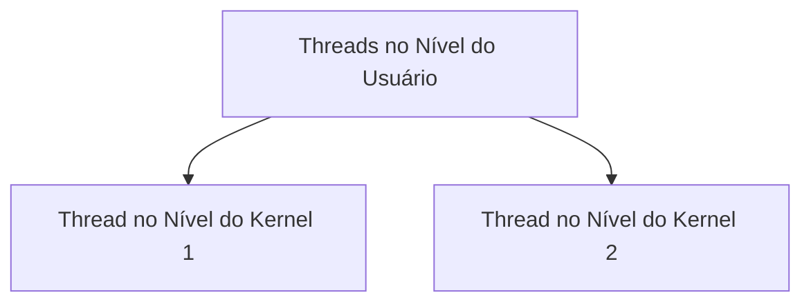

# 5.4 Escalonamento de Threads

Nesta seção, exploramos como o **escalonamento de threads** é tratado em sistemas operacionais, com foco nas diferenças entre **threads no nível do usuário** e **threads no nível do kernel**. Também discutimos como a API **Pthreads** permite configurar o **escopo de disputa** para threads.

---

## **5.4.1 Escopo de Disputa**

### **Threads no Nível do Usuário vs. Threads no Nível do Kernel**
- **Threads no nível do usuário**:
  - Gerenciadas por uma **biblioteca de threads**.
  - O **kernel** não tem conhecimento direto dessas threads.
  - Para executar em uma CPU, as threads no nível do usuário precisam ser **mapeadas** para threads no nível do kernel, geralmente por meio de **Processos Leves (LWPs)**.

- **Threads no nível do kernel**:
  - Gerenciadas diretamente pelo **sistema operacional**.
  - São escalonadas pelo **escalonador de CPU** do sistema.

### **Escopo de Disputa**
- **Process Contention Scope (PCS)**:
  - A disputa pela CPU ocorre entre **threads do mesmo processo**.
  - Usado em sistemas que implementam os modelos **muitos para um** ou **muitos para muitos**.
  - A biblioteca de threads escalona as threads no nível do usuário para executar em **LWPs disponíveis**.

- **System Contention Scope (SCS)**:
  - A disputa pela CPU ocorre entre **todas as threads do sistema**.
  - Usado em sistemas que implementam o modelo **um para um** (ex.: Windows XP, Solaris, Linux).

### **Prioridades no PCS**
- As threads no nível do usuário são escalonadas com base em **prioridades** definidas pelo programador.
- O escalonador interrompe uma thread em execução para dar lugar a uma thread de **prioridade mais alta**.
- Não há garantia de **fatia de tempo** (time-slicing) entre threads de mesma prioridade.

---

## **5.4.2 Escalonamento Pthread**

### **API Pthreads para Escopo de Disputa**
A API **Pthreads** permite especificar o **escopo de disputa** durante a criação de threads. Os valores possíveis são:
- **PTHREAD_SCOPE_PROCESS**:
  - Usa o **PCS** (Process Contention Scope).
  - Threads no nível do usuário são escalonadas para **LWPs disponíveis**.

- **PTHREAD_SCOPE_SYSTEM**:
  - Usa o **SCS** (System Contention Scope).
  - Cada thread no nível do usuário é associada a um **LWP**, efetivamente mapeando threads no modelo **um para um**.

### **Funções Pthreads**
- **pthread_attr_setscope**:
  - Define o escopo de disputa para uma thread.
  - Sintaxe:
    ```c
    int pthread_attr_setscope(pthread_attr_t *attr, int scope);
    ```
  - Parâmetros:
    - `attr`: Ponteiro para os atributos da thread.
    - `scope`: Valor do escopo de disputa (`PTHREAD_SCOPE_PROCESS` ou `PTHREAD_SCOPE_SYSTEM`).

- **pthread_attr_getscope**:
  - Obtém o escopo de disputa atual de uma thread.
  - Sintaxe:
    ```c
    int pthread_attr_getscope(pthread_attr_t *attr, int *scope);
    ```
  - Parâmetros:
    - `attr`: Ponteiro para os atributos da thread.
    - `scope`: Ponteiro para armazenar o valor do escopo de disputa.

### **Exemplo de Uso**
Aqui está um exemplo de código que define o escopo de disputa como **PCS** e cria cinco threads:

```c
#include <pthread.h>
#include <stdio.h>

void* thread_function(void* arg) {
    printf("Thread %ld executando\n", (long)arg);
    return NULL;
}

int main() {
    pthread_t threads[5];
    pthread_attr_t attr;
    int scope;

    // Inicializa os atributos da thread
    pthread_attr_init(&attr);

    // Define o escopo de disputa como PCS
    pthread_attr_setscope(&attr, PTHREAD_SCOPE_PROCESS);

    // Obtém o escopo de disputa atual
    pthread_attr_getscope(&attr, &scope);
    if (scope == PTHREAD_SCOPE_PROCESS)
        printf("Escopo de disputa: PCS\n");
    else
        printf("Escopo de disputa: SCS\n");

    // Cria cinco threads
    for (long i = 0; i < 5; i++) {
        pthread_create(&threads[i], &attr, thread_function, (void*)i);
    }

    // Aguarda as threads terminarem
    for (int i = 0; i < 5; i++) {
        pthread_join(threads[i], NULL);
    }

    // Destroi os atributos da thread
    pthread_attr_destroy(&attr);

    return 0;
}
```

### **Explicação do Código**
1. **pthread_attr_init**: Inicializa os atributos da thread.
2. **pthread_attr_setscope**: Define o escopo de disputa como **PCS**.
3. **pthread_attr_getscope**: Obtém o escopo de disputa atual para verificação.
4. **pthread_create**: Cria cinco threads que executam a função `thread_function`.
5. **pthread_join**: Aguarda todas as threads terminarem.
6. **pthread_attr_destroy**: Destroi os atributos da thread.

---

## **Resumo**

| Conceito                     | Descrição                                                                 |
|------------------------------|---------------------------------------------------------------------------|
| **Threads no Nível do Usuário** | Gerenciadas por bibliotecas de threads; mapeadas para LWPs.               |
| **Threads no Nível do Kernel** | Gerenciadas diretamente pelo sistema operacional.                         |
| **PCS (Process Contention Scope)** | Disputa pela CPU entre threads do mesmo processo.                        |
| **SCS (System Contention Scope)** | Disputa pela CPU entre todas as threads do sistema.                       |
| **PTHREAD_SCOPE_PROCESS**    | Usa PCS; threads no nível do usuário são escalonadas para LWPs disponíveis.|
| **PTHREAD_SCOPE_SYSTEM**     | Usa SCS; cada thread no nível do usuário é associada a um LWP.            |

---

## **Diagramas para Ilustração**

### **1. Modelo Muitos para Um (PCS)**


### **2. Modelo Um para Um (SCS)**

