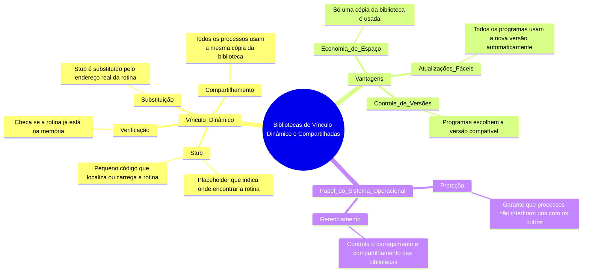

# Bibliotecas de vínculo dinâmico e compartilhadas 

Imagine que você está jogando um jogo que usa várias "ferramentas" (como espadas, magias, etc.) que são compartilhadas entre diferentes jogadores. Em vez de cada jogador carregar sua própria cópia dessas ferramentas, todos usam a **mesma cópia** guardada em um local central. Isso é o conceito de **bibliotecas compartilhadas** e **vínculo dinâmico**.

### O que é Vínculo Dinâmico?
- **Vínculo Estático**: Todas as ferramentas (bibliotecas) são copiadas para o jogo de cada jogador (programa). Isso ocupa muito espaço.
- **Vínculo Dinâmico**: As ferramentas ficam em um local central (biblioteca compartilhada). Quando um jogador precisa de uma ferramenta, ele "empresta" da biblioteca central.

### Como Funciona?
1. **Stub**: No jogo (programa), há um "placeholder" (stub) que diz onde encontrar a ferramenta (rotina da biblioteca).
   - **O que é um Stub?**: É um pequeno trecho de código que age como um "atalho" para a rotina real. Ele sabe como localizar ou carregar a rotina da biblioteca.
2. **Verificação**: Quando o jogo precisa da ferramenta, o stub verifica se ela já está na memória.
   - Se não estiver, a ferramenta é carregada da biblioteca para a memória.
3. **Substituição**: O stub é substituído pelo endereço real da ferramenta, e ela é usada diretamente.
4. **Compartilhamento**: Todos os jogadores (processos) usam a mesma cópia da ferramenta, economizando memória.

### Vantagens
- **Economia de Espaço**: Só uma cópia da biblioteca é usada por todos os programas.
- **Atualizações Fáceis**: Se a biblioteca for atualizada (ex: corrigir bugs), todos os programas automaticamente usam a nova versão.
- **Controle de Versões**: Programas podem escolher qual versão da biblioteca usar, evitando incompatibilidades.

### Papel do Sistema Operacional
- **Proteção**: O sistema operacional garante que os programas não interfiram uns com os outros ao acessar a mesma biblioteca.
- **Gerenciamento**: Ele controla o carregamento e o compartilhamento das bibliotecas na memória.

---

---

## Resumo
- **Stub**: Um "atalho" que localiza ou carrega a rotina da biblioteca.
- **Vínculo Dinâmico**: As bibliotecas são carregadas e compartilhadas em tempo de execução.
- **Vantagens**: Economia de espaço, atualizações fáceis e controle de versões.
- **Sistema Operacional**: Gerencia o acesso e a proteção das bibliotecas compartilhadas.