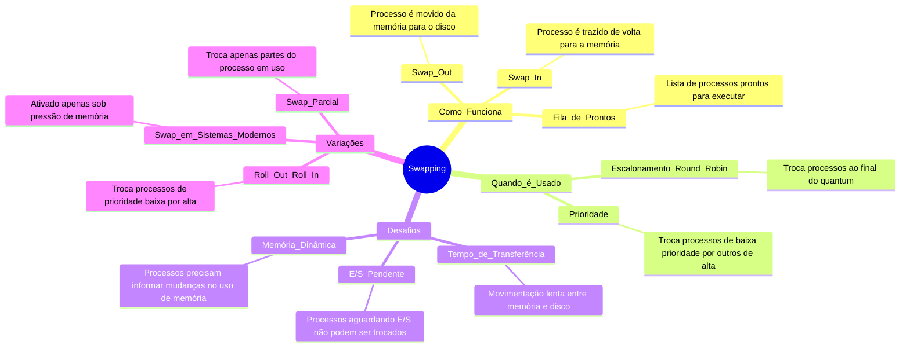

# 6.3 Swapping

Imagine que você está jogando um jogo de estratégia onde só pode ter um número limitado de unidades (processos) no campo de batalha (memória) ao mesmo tempo. Quando uma nova unidade precisa entrar, você remove temporariamente uma unidade existente e a guarda no "banco de reservas" (backing store, como um disco). Isso é o **swapping**: mover processos entre a memória e o disco para liberar espaço.

## Como Funciona?
1. **Swap Out**: Quando um processo não está ativo (ex: terminou seu tempo de execução ou tem prioridade baixa), ele é movido da memória para o disco.
2. **Swap In**: Quando o processo precisa ser executado novamente, ele é trazido de volta para a memória.
3. **Fila de Prontos**: O sistema mantém uma lista de processos prontos para executar, estejam na memória ou no disco.

## Quando é Usado?
- **Escalonamento Round Robin**: Quando o tempo de execução (quantum) de um processo acaba, ele é trocado por outro.
- **Prioridade**: Se um processo de alta prioridade chega, um de baixa prioridade pode ser trocado para liberar espaço.

## Desafios do Swapping
1. **Tempo de Transferência**: Mover processos entre memória e disco é lento. Por exemplo:
   - Um processo de 100 MB em um disco com taxa de transferência de 50 MB/s leva 2 segundos para ser movido.
   - Considerando a latência do disco, o tempo total pode chegar a 4 segundos (swap out + swap in).
2. **E/S Pendente**: Se um processo está aguardando uma operação de E/S (ex: leitura de dados), ele não pode ser trocado, pois a E/S pode tentar acessar memória que não está mais disponível.
3. **Memória Dinâmica**: Processos que mudam seu uso de memória durante a execução precisam informar ao sistema operacional para evitar problemas.

## Variações do Swapping
- **Roll Out, Roll In**: Troca processos de baixa prioridade por outros de alta prioridade.
- **Swap Parcial**: Troca apenas partes do processo que estão em uso, em vez de todo o processo.
- **Swap em Sistemas Modernos**: Em sistemas como UNIX, o swap é ativado apenas quando a memória está sob pressão.

## Exemplo Prático
- **Windows 3.1**: Usava uma versão simples de swap, onde o usuário decidia manualmente quais processos trocar.
- **Sistemas Modernos**: Usam técnicas mais avançadas, como memória virtual, para evitar o swap completo.

---

---

### Resumo
- **Swapping**: Move processos entre memória e disco para liberar espaço.
- **Desafios**: Tempo de transferência lento e problemas com E/S pendente.
- **Variações**: Roll out/roll in, swap parcial e uso em sistemas modernos.
- **Objetivo**: Maximizar o uso da memória e permitir a execução de múltiplos processos.