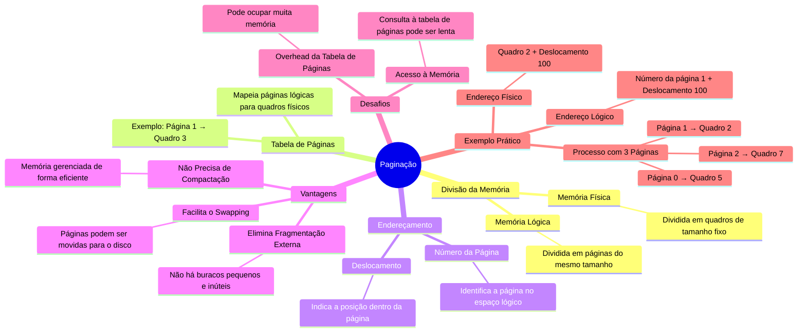

# 6.5 Páginação

Imagine que a memória do computador é como um livro, e cada página desse livro é um pequeno bloco de memória. A **paginação** é uma técnica que divide a memória em "páginas" de tamanho fixo, permitindo que um processo use páginas não contíguas. Isso resolve problemas como a **fragmentação externa** e elimina a necessidade de **compactação**.

## Como Funciona?
1. **Divisão da Memória**:
   - A memória física é dividida em **quadros** (frames) de tamanho fixo.
   - A memória lógica (vista pelo processo) é dividida em **páginas** do mesmo tamanho dos quadros.
2. **Tabela de Páginas**:
   - Cada processo tem uma **tabela de páginas** que mapeia suas páginas lógicas para quadros físicos.
   - Exemplo: A página 1 do processo pode estar no quadro 3 da memória física.
3. **Endereçamento**:
   - O endereço lógico é dividido em duas partes:
     - **Número da página**: Identifica a página no espaço lógico.
     - **Deslocamento**: Indica a posição dentro da página.
   - A tabela de páginas converte o número da página no número do quadro físico, e o deslocamento é mantido.

## Vantagens
- **Elimina Fragmentação Externa**: Como as páginas são de tamanho fixo, não há buracos pequenos e inúteis.
- **Não Precisa de Compactação**: A memória é gerenciada de forma eficiente sem precisar reorganizar processos.
- **Facilita o Swapping**: Páginas podem ser movidas para o disco (backing store) e trazidas de volta sem problemas de fragmentação.

## Desafios
- **Overhead da Tabela de Páginas**: A tabela de páginas pode ocupar muita memória, especialmente em sistemas com espaço de endereçamento grande.
- **Acesso à Memória**: Cada acesso à memória requer uma consulta à tabela de páginas, o que pode ser lento sem otimizações como **TLB** (Translation Lookaside Buffer).

## Exemplo Prático
- **Processo com 3 Páginas**:
  - Página 0 → Quadro 5
  - Página 1 → Quadro 2
  - Página 2 → Quadro 7
- **Endereço Lógico**: Número da página 1 + Deslocamento 100.
- **Endereço Físico**: Quadro 2 + Deslocamento 100.

---

---

### Resumo
- **Paginação**: Divide a memória em páginas de tamanho fixo, permitindo alocação não contígua.
- **Vantagens**: Elimina fragmentação externa, não precisa de compactação e facilita o swapping.
- **Desafios**: Overhead da tabela de páginas e acesso à memória mais lento.
- **Funcionamento**: Tabela de páginas mapeia páginas lógicas para quadros físicos.