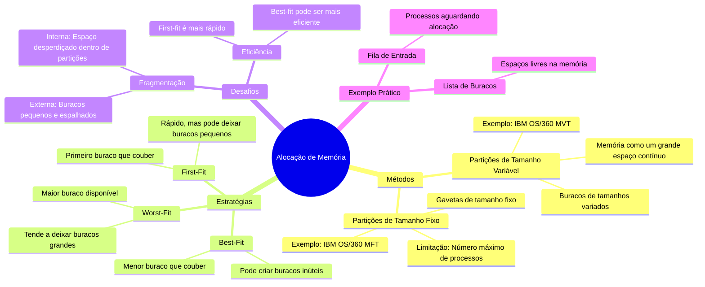

# Alocação de Memória

Imagine que a memória do computador é como um grande armário com várias gavetas. Cada gaveta pode guardar uma coisa, mas o tamanho das gavetas pode variar. A **alocação de memória** é o processo de decidir qual gaveta usar para cada coisa, de forma eficiente.

## Métodos de Alocação
1. **Partições de Tamanho Fixo**:
   - A memória é dividida em gavetas de tamanho fixo.
   - Cada gaveta guarda um processo.
   - Limitação: O número máximo de processos é igual ao número de gavetas.
   - Exemplo: IBM OS/360 MFT.

2. **Partições de Tamanho Variável**:
   - A memória é tratada como um grande espaço contínuo, dividido em buracos de tamanhos variados.
   - Quando um processo chega, ele é colocado em um buraco que caiba.
   - Se o buraco for maior que o necessário, ele é dividido: uma parte é usada pelo processo, e a outra volta para a lista de buracos.
   - Quando um processo termina, seu espaço é liberado e pode ser mesclado com buracos adjacentes para formar um buraco maior.
   - Exemplo: IBM OS/360 MVT.

## Estratégias de Alocação
- **First-Fit**:
  - Aloca o primeiro buraco que couber o processo.
  - Rápido, mas pode deixar buracos pequenos e não contíguos.
- **Best-Fit**:
  - Aloca o menor buraco que couber o processo.
  - Pode criar muitos buracos pequenos e inúteis.
- **Worst-Fit**:
  - Aloca o maior buraco disponível.
  - Tende a deixar buracos grandes, que podem ser úteis no futuro.

## Desafios
- **Fragmentação**:
  - Fragmentação Externa: Buracos pequenos e espalhados que não podem ser usados.
  - Fragmentação Interna: Espaço desperdiçado dentro de uma partição alocada.
- **Eficiência**:
  - O first-fit é geralmente mais rápido, enquanto o best-fit pode ser mais eficiente no uso da memória.

## Exemplo Prático
- **Fila de Entrada**: Processos aguardando para serem alocados na memória.
- **Lista de Buracos**: Espaços livres na memória, que podem ser mesclados ou divididos conforme necessário.

---

---

## Resumo
- **Partições Fixas**: Gavetas de tamanho fixo, limitando o número de processos.
- **Partições Variáveis**: Buracos de tamanho variável, permitindo alocação dinâmica.
- **Estratégias**: First-fit é rápido, best-fit pode ser mais eficiente, worst-fit deixa buracos grandes.
- **Desafios**: Fragmentação externa e interna, e eficiência na alocação.