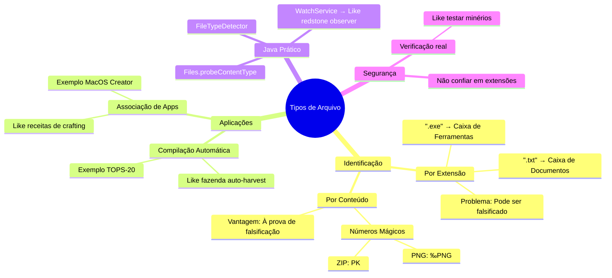

# 7.1.3 Tipos de Arquivos

## **1. Conceitos Fundamentais Aprofundados**

### **1.1 O que São Tipos de Arquivos?**
Imagine que arquivos são como **caixas de supermercado**:
- **Sem rótulo**: Você não sabe se contém alimentos, produtos químicos ou frágeis (risco de misturar!)
- **Com rótulo**: Sabe exatamente como manipular (congelados, quebráveis, etc.)

**No computador**:
- `.exe` = Caixa de ferramentas (executável)
- `.txt` = Caixa de documentos (texto puro)
- `.jpg` = Caixa com foto na etiqueta (imagem)

### **1.2 Métodos de Identificação (Minecraft vs Realidade)**

| **Método**       | **Minecraft**                          | **Mundo Real**                         |
|------------------|----------------------------------------|----------------------------------------|
| **Extensões**    | Nome do bloco (ex: "minério_de_ferro") | `.pdf`, `.mp3`                         |
| **Metadados**    | NBT Tags (dados extras do bloco)       | Atributos do arquivo (MacOS)           |
| **Números Mágicos** | Textura do bloco (reconhecimento visual) | Bytes iniciais (`%PDF-`, `PNG`)       |

---

## **2. Implementação Java Passo a Passo**

### **2.1 Detecção por Extensão (Como Organizar Baús no Minecraft)**
```java
import java.nio.file.*;

public class OrganizadorDeBaús {
    public static void main(String[] args) {
        // == COMO RODAR ==
        // 1. Salve como OrganizadorDeBaús.java
        // 2. Compile: javac OrganizadorDeBaús.java
        // 3. Execute: java OrganizadorDeBaús
        
        String[] itens = {"diamante.png", "encantamento.txt", "construção.schematic"};
        
        for (String item : itens) {
            System.out.println(item + " → " + classificarItem(item));
        }
    }
    
    // Analogia: Separar itens nos baús certos
    public static String classificarItem(String nome) {
        return switch (nome.substring(nome.lastIndexOf('.') + 1).toLowerCase()) {
            case "png", "jpg" -> "Baú de Texturas";
            case "txt", "md"  -> "Baú de Anotações";
            case "schematic" -> "Baú de Construções";
            default          -> "Baú Desconhecido";
        };
    }
}
```
**Saída**:
```
diamante.png → Baú de Texturas
encantamento.txt → Baú de Anotações
construção.schematic → Baú de Construções
```

### **2.2 Detecção por Conteúdo (Como os Alquimistas Verificam Minérios)**
```java
import java.io.*;
import java.util.*;

public class AnalisadorDeMinérios {
    // == COMO RODAR ==
    // 1. Crie um arquivo 'diamante.png' com bytes reais de PNG
    // 2. javac AnalisadorDeMinérios.java
    // 3. java AnalisadorDeMinérios diamante.png
    
    public static void main(String[] args) throws IOException {
        if (args.length == 0) {
            System.out.println("Uso: java AnalisadorDeMinérios <arquivo>");
            return;
        }
        
        File arquivo = new File(args[0]);
        if (!arquivo.exists()) {
            System.out.println("Arquivo não encontrado!");
            return;
        }
        
        System.out.println("Tipo real: " + verificarConteúdo(arquivo));
    }
    
    // Analogia: Teste de alquimia para identificar minérios
    private static String verificarConteúdo(File arquivo) throws IOException {
        try (InputStream is = new FileInputStream(arquivo)) {
            byte[] header = new byte[4];
            if (is.read(header) != 4) return "Desconhecido (arquivo muito pequeno)";
            
            if (header[0] == (byte) 0x89 && header[1] == 'P' && 
                header[2] == 'N' && header[3] == 'G') {
                return "PNG Legítimo (Minério Autêntico)";
            }
            
            return "Tipo Desconhecido (Possível Falsificação)";
        }
    }
}
```

---

## **3. Casos de Uso Avançados com Analogias**

### **3.1 Compilação Automática (Como Fazendas Automáticas)**
```java
import java.nio.file.*;
import java.nio.file.attribute.*;

public class FazendaDeCódigos {
    // == COMO RODAR ==
    // 1. Coloque este código e um Teste.java no mesmo diretório
    // 2. javac FazendaDeCódigos.java
    // 3. java FazendaDeCódigos
    
    public static void main(String[] args) throws IOException {
        Path arquivoFonte = Paths.get("Teste.java");
        Path arquivoCompilado = Paths.get("Teste.class");
        
        // Analogia: Sensor de colheita madura
        if (!Files.exists(arquivoCompilado) || 
            Files.getLastModifiedTime(arquivoFonte)
                 .compareTo(Files.getLastModifiedTime(arquivoCompilado)) > 0) {
            
            System.out.println("⚡ Código modificado! Replantando (compilando)...");
            Runtime.getRuntime().exec("javac " + arquivoFonte);
        } else {
            System.out.println("✅ Nada mudou na plantação. Tudo atualizado!");
        }
    }
}
```

### **3.2 Associação de Arquivos (Como Receitas de Crafting)**
```java
import java.awt.Desktop;
import java.io.File;

public class LivroDeReceitasDigital {
    // == COMO RODAR ==
    // 1. Crie um arquivo 'poção.txt' ou 'mapa.png'
    // 2. javac LivroDeReceitasDigital.java
    // 3. java LivroDeReceitasDigital poção.txt
    
    public static void main(String[] args) throws Exception {
        if (args.length == 0) {
            System.out.println("Uso: java LivroDeReceitasDigital <arquivo>");
            return;
        }
        
        File arquivo = new File(args[0]);
        if (!arquivo.exists()) {
            System.out.println("Arquivo não encontrado no inventário!");
            return;
        }
        
        // Analogia: Abrir o livro de crafting certo
        switch (args[0].substring(args[0].lastIndexOf('.') + 1).toLowerCase()) {
            case "txt":
                Desktop.getDesktop().open(new File("notepad.exe"));
                break;
            case "png":
                Desktop.getDesktop().open(new File("mspaint.exe"));
                break;
            default:
                System.out.println("Receita desconhecida!");
        }
    }
}
```

---

## 4. Mindmap



---

## **5. Exercícios Práticos (Missões no Mundo Minecraft)**

1. **Missão do Minerador**:
   - Crie um programa que:
     - Analisa arquivos na pasta "minérios"
     - Move `.png` para `/texturas`
     - Move `.java` para `/codigos`
   - **Dica**: Use `Files.move()`

2. **Feitiço de Verificação**:
   - Escreva um "feiticeiro" (programa) que:
     - Lê os primeiros 8 bytes de um arquivo
     - Detecta se é PNG, ZIP ou JAVA class

3. **Automação com Redstone**:
   - Use `WatchService` para:
     - Monitorar uma pasta "fornalha"
     - Compilar automaticamente `.java` que forem dropados
   - **Analogia**: Como um forno automático de minecraft

---

## **6. Erros Comuns (Como Criperrors que Explodem seu Código)**

```java
// ⚠️ Problema 1: Confiar só em extensões
if (arquivo.endsWith(".png")) { /* Pode ser vírus! */ }

// ✅ Solução: Verificar conteúdo
if (isRealPNG(arquivo)) { /* Seguro */ }

// ⚠️ Problema 2: Não fechar recursos
FileInputStream fis = new FileInputStream("dados.dat");
// Esqueceu de fis.close() → Memory leak!

// ✅ Solução: Try-with-resources
try (InputStream is = new FileInputStream(...)) {
    // Auto-close magic!
}
```