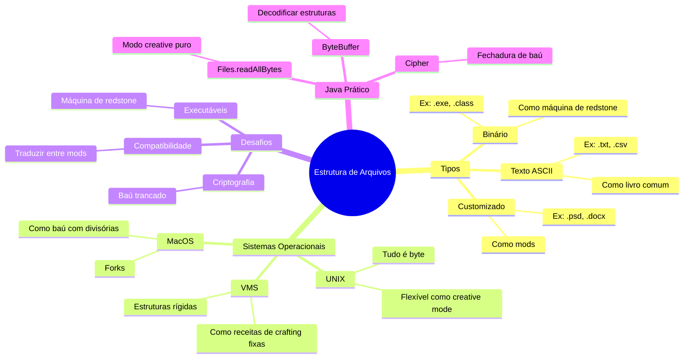

# 7.1.4 Estrutura de Arquivos

## **1. Conceitos Fundamentais (Como Blocos no Minecraft)**

### **1.1 O que é Estrutura de Arquivo?**
Imagine que arquivos são como **construções no Minecraft**:
- **Estrutura Simples** = Casa de madeira (todos sabem como usar)
- **Estrutura Complexa** = Redstone avançada (só especialistas entendem)

**No computador**:
- **Texto ASCII** = Livro comum (legível por qualquer programa)
- **Binário Executável** = Máquina de redstone (só funciona com o circuito certo)
- **Estruturas Customizadas** = Mods (precisam de interpretação especial)

### **1.2 Sistemas Operacionais e Estruturas**
| **Abordagem**       | **Exemplos**           | **Vantagens**               | **Desvantagens**            |
|----------------------|------------------------|-----------------------------|-----------------------------|
| **Múltiplas Estruturas** | VMS (DEC)          | Suporte nativo a formatos   | Sistema inchado             |
| **Estrutura Única**  | UNIX (sequência de bytes) | Flexibilidade máxima      | Sem suporte embutido        |
| **Híbrida**         | MacOS (forks)           | Balanceamento               | Complexidade moderada       |

---

## **2. Implementação Prática em Java**

### **2.1 Leitura de Arquivo Genérico (Estilo UNIX)**
```java
import java.nio.file.*;

public class LeitorUniversal {
    // == COMO RODAR ==
    // 1. Salve como LeitorUniversal.java
    // 2. javac LeitorUniversal.java
    // 3. java LeitorUniversal <arquivo>
    
    public static void main(String[] args) throws IOException {
        byte[] dados = Files.readAllBytes(Paths.get(args[0]));
        
        // Analogia: Analisar blocos desconhecidos
        System.out.println("🔍 Primeiros bytes:");
        for (int i = 0; i < Math.min(16, dados.length); i++) {
            System.out.printf("%02x ", dados[i]);
            if (i == 7) System.out.print("| ");
        }
    }
}
```
**Uso**:
```bash
java LeitorUniversal programa.exe
```
**Saída**:
```
🔍 Primeiros bytes:
4d 5a 90 00 03 00 00 00 | 04 00 00 00 ff ff 00 00
```

### **2.2 Manipulação de Fork (Estilo MacOS)**
```java
import java.io.*;

public class MacOSSimulator {
    // == COMO RODAR ==
    // 1. Crie um arquivo "aplicacao.mac" com:
    //    [RECURSOS]
    //    Botão=Salvar
    //    [DADOS]
    //    010203
    // 2. javac MacOSSimulator.java
    // 3. java MacOSSimulator aplicacao.mac
    
    static class Fork {
        String recursos;
        byte[] dados;
    }

    public static void main(String[] args) throws IOException {
        Fork arquivo = new Fork();
        String conteudo = Files.readString(Paths.get(args[0]));

        // Analogia: Separar partes de uma poção
        arquivo.recursos = conteudo.split("\\[DADOS\\]")[0];
        arquivo.dados = conteudo.split("\\[DADOS\\]")[1].trim().getBytes();
        
        System.out.println("Recursos: " + arquivo.recursos);
        System.out.println("Dados: " + new String(arquivo.dados));
    }
}
```

---

## **3. Casos Complexos com Analogias**

### **3.1 Arquivo Criptografado (Como Baú Trancado)**
**Problema**: Não se encaixa em texto nem binário executável.

**Solução Java**:
```java
import javax.crypto.*;
import java.security.*;

public class BaúCriptografado {
    // == COMO RODAR ==
    // 1. javac BaúCriptografado.java
    // 2. java BaúCriptografado
    
    public static void main(String[] args) throws Exception {
        KeyGenerator kg = KeyGenerator.getInstance("AES");
        kg.init(128);
        SecretKey chave = kg.generateKey();
        
        // Analogia: Trancar baú com redstone
        Cipher cifra = Cipher.getInstance("AES");
        cifra.init(Cipher.ENCRYPT_MODE, chave);
        
        byte[] dadosOriginais = "Segredo!".getBytes();
        byte[] dadosCripto = cifra.doFinal(dadosOriginais);
        
        System.out.println("Baú trancado: " + new String(dadosCripto));
    }
}
```

### **3.2 Executável Customizado (Como Máquina de Redstone)**
```java
import java.nio.*;

public class LoaderExecutável {
    // == COMO RODAR ==
    // 1. javac LoaderExecutável.java
    // 2. java LoaderExecutável
    
    static class Cabeçalho {
        int magicNumber;
        int pontoDeEntrada;
    }

    public static void main(String[] args) {
        // Analogia: Decodificar circuito de redstone
        ByteBuffer buffer = ByteBuffer.wrap(new byte[] {
            0x7F, 'E', 'L', 'F',  // Número mágico
            0x00, 0x00, 0x01, 0x00 // Ponto de entrada
        });
        
        Cabeçalho header = new Cabeçalho();
        header.magicNumber = buffer.getInt();
        header.pontoDeEntrada = buffer.getInt();
        
        System.out.printf("⚙️ Executável: 0x%08X @ 0x%04X%n",
            header.magicNumber, header.pontoDeEntrada);
    }
}
```

---

## 4. Mindmap



---

## **5. Exercícios Práticos (Missões Técnicas)**

### **Missão 1: Tradutor de Estruturas**
```java
// Converta um arquivo MacOS simulado para formato UNIX
// [RECURSOS]... + [DADOS]... → sequência de bytes linear
```

### **Missão 2: Analisador de Executáveis**
```java
// Detecte automaticamente se um arquivo é:
// - ELF (Unix) → 0x7F 'E' 'L' 'F'
// - PE (Windows) → 'M' 'Z'
// - Mach-O (Mac) → 0xFEEDFACE
```

### **Missão 3: Sistema de Plugins**
```java
// Implemente um carregador que:
// 1. Lê metadados customizados (como forks)
// 2. Executa código verificando assinatura digital
// Analogia: Mod com certificado
```

---

## **6. Erros Comuns (Como Explosões de Creeper)**

```java
// ⚠️ Problema 1: Assumir estrutura fixa
if (arquivo.length() == 128) { /* Fragil! */ }

// ✅ Solução: Usar headers
if (arquivo.startsWith("PK\x03\x04")) { /* ZIP real */ }

// ⚠️ Problema 2: Ignorar endianness
int valor = buffer.getInt(); // Pode inverter bytes!

// ✅ Solução: Especificar ordem
buffer.order(ByteOrder.LITTLE_ENDIAN);
```
