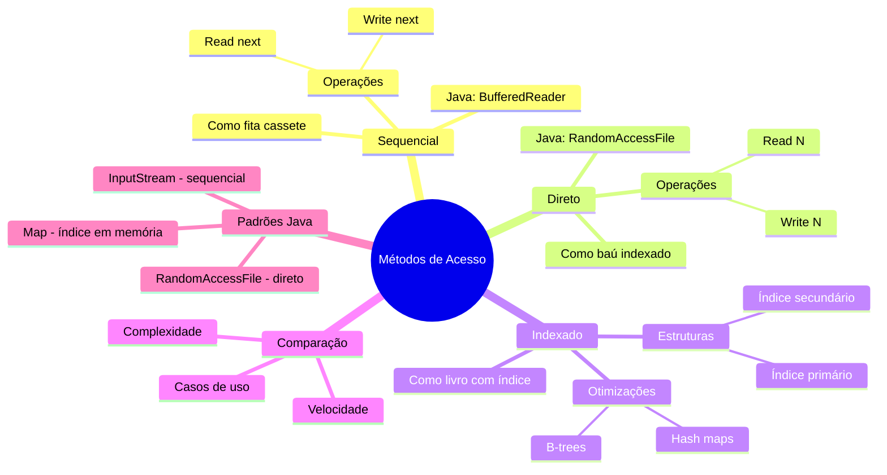

# 7.2 Métodos de Acesso a Arquivos

## **1. Acesso Sequencial (Como uma Fita Cassete)**

### **1.1 Conceito Fundamental**
Imagine um arquivo como uma **fita cassete** do Minecraft (mod Retro):
- Você só pode avançar ou retroceder sequencialmente
- Para acessar uma música no final, precisa passar por todas as anteriores

**Características**:
- Ponteiro de posição avança após cada operação
- Ideal para processamento linear (logs, streaming)

### **1.2 Implementação em Java**
```java
import java.io.*;

public class AcessoSequencial {
    // == COMO RODAR ==
    // 1. Crie um arquivo 'dados.txt' com várias linhas
    // 2. javac AcessoSequencial.java
    // 3. java AcessoSequencial dados.txt
    
    public static void main(String[] args) throws IOException {
        try (BufferedReader reader = new BufferedReader(new FileReader(args[0]))) {
            String linha;
            while ((linha = reader.readLine()) != null) {
                System.out.println("Lendo: " + linha);
                // Simula processamento
                Thread.sleep(500);
            }
        }
    }
}
```

**Analogia no Minecraft**:
- Como ler um livro com páginas encadernadas
- Você não pode pular diretamente para a página 50 sem virar as anteriores

## **2. Acesso Direto (Como um Baú com Ítens Numerados)**

### **2.1 Conceito Fundamental**
Pense em um arquivo como um **baú do Minecraft com slots indexados**:
- Cada slot tem um número fixo (ex: Slot 0 = Diamante, Slot 1 = Ouro)
- Você pode acessar qualquer slot diretamente sem passar pelos anteriores

**Características**:
- Registros de tamanho fixo
- Acesso instantâneo a qualquer posição
- Ideal para bancos de dados

### **2.2 Implementação em Java**
```java
import java.io.RandomAccessFile;

public class AcessoDireto {
    // == COMO RODAR ==
    // 1. javac AcessoDireto.java
    // 2. java AcessoDireto
    
    static final int TAMANHO_REGISTRO = 100; // bytes
    
    public static void main(String[] args) throws IOException {
        // Simula banco de voos (registro = número do voo + assentos)
        try (RandomAccessFile file = new RandomAccessFile("voos.dat", "rw")) {
            // Escreve no voo 713 (registro 713)
            file.seek(713 * TAMANHO_REGISTRO);
            file.writeUTF("Voo 713 - Assentos: 120");
            
            // Lê o voo 42
            file.seek(42 * TAMANHO_REGISTRO);
            System.out.println("Voo 42: " + file.readUTF());
        }
    }
}
```

**Analogia no Minecraft**:
- Como usar `/give @p diamond 64` para obter diamantes diretamente
- Não precisa minerar blocos sequencialmente até achar diamantes

## **3. Acesso Indexado (Como um Livro com Índice)**

### **3.1 Conceito Fundamental**
Imagine um **livro de encantamentos** do Minecraft:
- Índice no final mostra onde cada encantamento está
- Primeiro busca no índice, depois vai direto para a página

**Estrutura típica**:
1. **Índice Primário**: Chave → Bloco do índice secundário
2. **Índice Secundário**: Chave → Bloco de dados
3. **Dados**: Registros completos

### **3.2 Implementação em Java (Simplificada)**
```java
import java.util.*;

public class AcessoIndexado {
    // == COMO RODAR ==
    // 1. javac AcessoIndexado.java
    // 2. java AcessoIndexado
    
    static class Indice {
        String chave;
        long posicao;
        
        Indice(String chave, long posicao) {
            this.chave = chave;
            this.posicao = posicao;
        }
    }
    
    public static void main(String[] args) {
        // Simulação de índice em memória
        List<Indice> indice = new ArrayList<>();
        indice.add(new Indice("DIAMANTE", 0));
        indice.add(new Indice("OURO", 100));
        
        // Busca binária no índice
        String busca = "DIAMANTE";
        int idx = Collections.binarySearch(indice, new Indice(busca, 0), 
            Comparator.comparing(i -> i.chave));
        
        if (idx >= 0) {
            System.out.println("Registro encontrado na posição: " + indice.get(idx).posicao);
            // Aqui usaria RandomAccessFile para acessar a posição diretamente
        } else {
            System.out.println("Registro não encontrado!");
        }
    }
}
```

## **4. Comparação dos Métodos**

| **Método**       | **Velocidade** | **Uso de Memória** | **Casos de Uso**          | **Analogia Minecraft**       |
|-------------------|----------------|---------------------|---------------------------|------------------------------|
| **Sequencial**    | Lento          | Baixa               | Logs, streaming           | Ler livro página por página  |
| **Direto**        | Rápido         | Média               | Bancos de dados           | Acessar baú por slot número  |
| **Indexado**      | Muito rápido   | Alta                | Sistemas complexos        | Livro com índice de encantos |

## **5. Exercícios Práticos**

### **Missão 1: Sistema de Reservas**
```java
// Implemente um sistema de reservas com:
// - Acesso direto para voos por número
// - Acesso sequencial para listar todos voos
// Dica: Use RandomAccessFile + BufferedReader
```

### **Missão 2: Índice de Encantamentos**
```java
// Crie um sistema que:
// 1. Indexa encantamentos por nível
// 2. Permite busca rápida por:
//    - Nome do encantamento (índice primário)
//    - Nível mínimo (índice secundário)
```

### **Missão 3: Hybrid Access**
```java
// Desenvolva um leitor que:
// - Usa acesso direto para metadados no início do arquivo
// - Depois muda para sequencial para o conteúdo principal
// Analogia: Ver slots do baú primeiro, depois itens
```

## **6. Erros Comuns (Como Bugs no Redstone)**

```java
// ⚠️ Problema 1: Acesso direto sem cálculo de posição
file.seek(713); // Errado se registros não forem de 1 byte!

// ✅ Solução: 
file.seek(713 * TAMANHO_REGISTRO);

// ⚠️ Problema 2: Esquecer de manter índices ordenados
indice.add(new Indice("OURO", 100)); // Deve inserir em ordem!

// ✅ Solução:
indice.sort(Comparator.comparing(i -> i.chave));
```

## **Mindmap**


