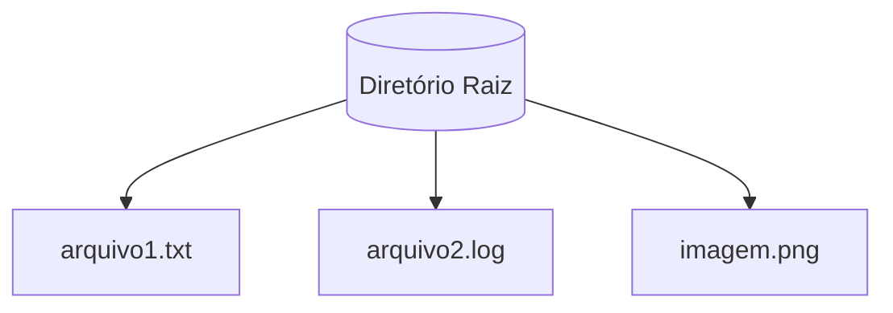
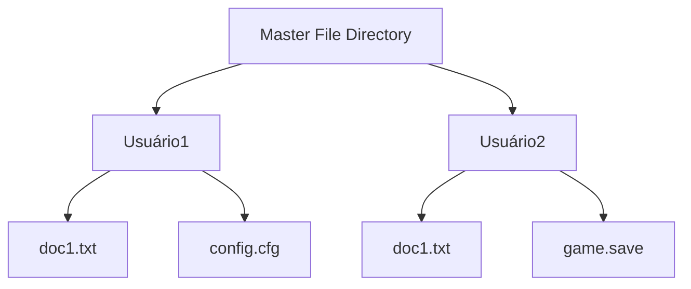
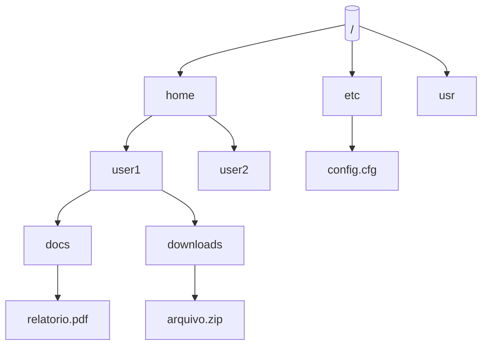
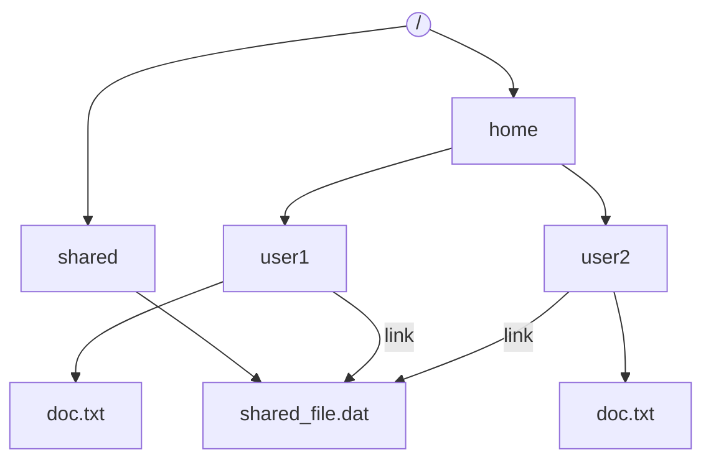
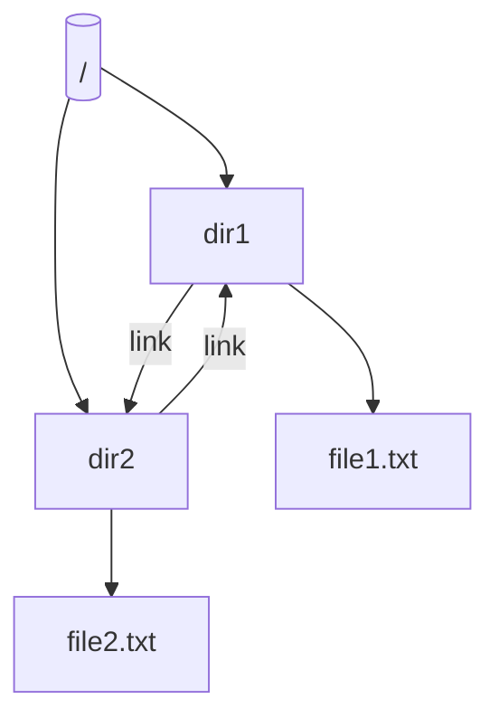
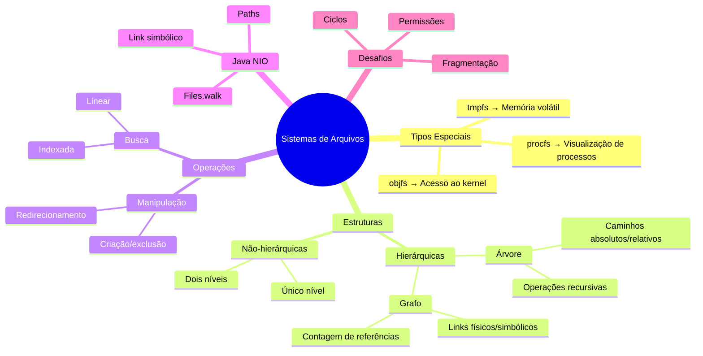

# 7.3 Estrutura de diretório e disco

## **1. Sistemas de Arquivos Especiais (Solaris e Outros)**

### **1.1 Tipos de Sistemas de Arquivos**
| **Tipo**       | **Descrição**                                  | **Analogia Minecraft**                     |
|----------------|-----------------------------------------------|--------------------------------------------|
| **tmpfs**      | Sistema temporário em memória volátil         | Baú que some ao sair do mundo              |
| **objfs**      | Interface para símbolos do kernel             | Livro de receitas de crafting do sistema   |
| **ctfs**       | Armazena contratos de inicialização           | Painel de controle do servidor             |
| **lofs**       | Sistema de "loop back" para redirecionamento  | Portal que leva a outro baú                |
| **procfs**     | Apresenta processos como arquivos             | Painel de status dos jogadores             |
| **ufs/zfs**    | Sistemas de arquivos de uso geral             | Baús convencionais                         |

## **2. Estruturas de Diretórios**

### **2.1. Diretório de Único Nível**

### **Características**
- Todos os arquivos em um único diretório
- Nomes de arquivos devem ser únicos
- Sem organização hierárquica

**Problemas**: 
- Colisões de nomes entre usuários
- Dificuldade de organização para muitos arquivos



#### **Implementação Java** {id="implementa-o-java_1"}
```java
import java.io.File;
import java.util.Arrays;

public class SingleLevelDirectory {
    public static void main(String[] args) {
        File root = new File("/tmp/root_dir");
        root.mkdir();
        
        // Criar arquivos
        Arrays.asList("file1.txt", "file2.dat", "document.pdf").forEach(f -> {
            try {
                new File(root, f).createNewFile();
            } catch (Exception e) {
                e.printStackTrace();
            }
        });
        
        // Listar conteúdo
        System.out.println("Arquivos no diretório único:");
        Arrays.stream(root.listFiles()).forEach(System.out::println);
    }
}
```

### **2.2 Diretório de Dois Níveis**

#### **Características** {id="caracter-sticas_4"}
- Diretório mestre (MFD) contém diretórios de usuários (UFD)
- Isolamento entre usuários
- Resolve problema de colisão de nomes



#### **Implementação Java** {id="implementa-o-java_2"}
```java
import java.io.File;
import java.util.HashMap;
import java.util.Map;

public class TwoLevelDirectory {
    private static Map<String, File> userDirs = new HashMap<>();
    
    public static void main(String[] args) {
        // Criar estrutura
        File mfd = new File("/tmp/mfd");
        mfd.mkdir();
        
        // Adicionar usuários
        addUser("alice");
        addUser("bob");
        
        // Criar arquivos
        createFile("alice", "notes.txt");
        createFile("bob", "notes.txt"); // Nome repetido permitido
        
        System.out.println("Estrutura criada em: " + mfd.getAbsolutePath());
    }
    
    private static void addUser(String username) {
        File userDir = new File("/tmp/mfd/" + username);
        userDir.mkdir();
        userDirs.put(username, userDir);
    }
    
    private static void createFile(String user, String filename) {
        try {
            new File(userDirs.get(user), filename).createNewFile();
        } catch (Exception e) {
            e.printStackTrace();
        }
    }
}
```

### **2.3 Estrutura em Árvore**

#### **Características** {id="caracter-sticas_1"}
- Hierarquia ilimitada de subdiretórios
- Caminhos absolutos e relativos
- Organização lógica de arquivos



#### **Implementação Java (usando NIO)**
```java
import java.nio.file.*;

public class TreeStructure {
    public static void main(String[] args) throws Exception {
        Path root = Paths.get("/tmp/fs_tree");
        
        // Criar estrutura
        Files.createDirectories(root.resolve("home/user1/documents"));
        Files.createDirectories(root.resolve("home/user2/downloads"));
        Files.createDirectories(root.resolve("etc/config"));
        
        // Criar arquivos
        Files.write(root.resolve("home/user1/documents/notes.txt"), 
                   "Conteúdo".getBytes());
        
        // Listar recursivamente
        System.out.println("Estrutura completa:");
        Files.walk(root).forEach(System.out::println);
    }
}
```

### **2.4 Grafo Acíclico**

#### **Características** {id="caracter-sticas_2"}
- Permite compartilhamento via links
- Estrutura não-linear sem ciclos
- Contagem de referências para exclusão segura



#### **Implementação Java**
```java
import java.nio.file.*;
import java.io.IOException;

public class AcyclicGraph {
    public static void main(String[] args) {
        Path base = Paths.get("/tmp/fs_graph");
        
        try {
            // Criar estrutura base
            Path sharedFile = base.resolve("shared/data.bin");
            Files.createDirectories(sharedFile.getParent());
            Files.write(sharedFile, "Dados compartilhados".getBytes());
            
            // Criar links
            Path user1Link = base.resolve("home/user1/link_to_shared");
            Path user2Link = base.resolve("home/user2/shared_data");
            
            Files.createSymbolicLink(user1Link, sharedFile);
            Files.createSymbolicLink(user2Link, sharedFile);
            
            // Verificar links
            System.out.println("Link 1 aponta para: " + Files.readSymbolicLink(user1Link));
            System.out.println("Link 2 aponta para: " + Files.readSymbolicLink(user2Link));
            
        } catch (IOException e) {
            e.printStackTrace();
        }
    }
}
```

### **2.5 Grafo Geral**

#### **Características** {id="caracter-sticas_3"}
- Permite ciclos (autorreferências)
- Requer coleta de lixo para gerenciamento
- Raro em sistemas de arquivos reais



#### **Implementação Java (Simulação)**
```java
import java.util.*;

class GraphNode {
    String name;
    List<GraphNode> links = new ArrayList<>();
    
    GraphNode(String name) {
        this.name = name;
    }
    
    void addLink(GraphNode node) {
        links.add(node);
    }
}

public class GeneralGraph {
    public static void main(String[] args) {
        GraphNode root = new GraphNode("/");
        GraphNode dir1 = new GraphNode("dir1");
        GraphNode dir2 = new GraphNode("dir2");
        
        // Criar ciclo
        root.addLink(dir1);
        root.addLink(dir2);
        dir1.addLink(dir2);
        dir2.addLink(dir1); // Ciclo!
        
        // Detectar ciclos (simplificado)
        System.out.println("Grafo contém ciclos? " + 
            (hasCycle(root, new HashSet<>()) ? "Sim" : "Não"));
    }
    
    private static boolean hasCycle(GraphNode node, Set<GraphNode> visited) {
        if (visited.contains(node)) return true;
        visited.add(node);
        for (GraphNode child : node.links) {
            if (hasCycle(child, visited)) return true;
        }
        visited.remove(node);
        return false;
    }
}
```

### **2.6 Tabela Comparativa**

| **Estrutura**       | **Vantagens**                     | **Desvantagens**                  | **Uso Típico**               |
|----------------------|-----------------------------------|-----------------------------------|-------------------------------|
| **Único Nível**      | Simplicidade                      | Sem organização                   | Sistemas embarcados simples   |
| **Dois Níveis**      | Isolamento de usuários            | Compartilhamento difícil          | Sistemas multi-usuário básicos |
| **Árvore**           | Organização flexível              | Links não-nativos                 | Maioria dos SOs modernos      |
| **Grafo Acíclico**   | Compartilhamento eficiente        | Complexidade de gerenciamento     | UNIX/Linux                    |
| **Grafo Geral**      | Máxima flexibilidade              | Risco de vazamentos               | Casos especiais               |

Cada implementação Java demonstra como criar e manipular essas estruturas na prática, usando tanto a API tradicional (`java.io.File`) quanto a NIO moderna (`java.nio.file`).


## **3. Implementação Prática em Java**

### **3.1 Navegação em Árvore de Diretórios**
```java
import java.nio.file.*;
import java.io.*;

public class DirectoryTree {
    // == COMO RODAR ==
    // 1. javac DirectoryTree.java
    // 2. java DirectoryTree [diretório]
    
    public static void main(String[] args) throws IOException {
        Path start = Paths.get(args.length > 0 ? args[0] : ".");
        System.out.println("Estrutura a partir de: " + start.toAbsolutePath());
        
        Files.walkFileTree(start, new SimpleFileVisitor<Path>() {
            @Override
            public FileVisitResult preVisitDirectory(Path dir, BasicFileAttributes attrs) {
                System.out.println(" ".repeat(dir.getNameCount()*2) + "📁 " + dir.getFileName());
                return FileVisitResult.CONTINUE;
            }
            
            @Override
            public FileVisitResult visitFile(Path file, BasicFileAttributes attrs) {
                System.out.println(" ".repeat(file.getNameCount()*2) + "📄 " + file.getFileName());
                return FileVisitResult.CONTINUE;
            }
        });
    }
}
```

### **3.2 Gerenciamento de Links Simbólicos**
```java
import java.nio.file.*;

public class LinkManager {
    // == COMO RODAR ==
    // 1. javac LinkManager.java
    // 2. java LinkManager
    
    public static void main(String[] args) throws IOException {
        Path target = Paths.get("original.txt");
        Files.writeString(target, "Conteúdo original");
        
        Path link = Paths.get("atalho.txt");
        Files.createSymbolicLink(link, target);
        
        System.out.println("Target real: " + Files.readSymbolicLink(link));
        System.out.println("Mesmo arquivo? " + Files.isSameFile(target, link));
    }
}
```

## **4. Técnicas Avançadas**

### **4.1 Contagem de Referências (Grafo Acíclico)**
```java
class FileNode {
    String name;
    int refCount = 1;
    List<FileNode> children = new ArrayList<>();
    
    void addReference() { refCount++; }
    boolean removeReference() { return --refCount == 0; }
}
```

### **4.2 Detecção de Ciclos (Grafo Geral)**
```java
boolean hasCycle(FileNode node) {
    return hasCycle(node, new HashSet<>());
}

boolean hasCycle(FileNode node, Set<FileNode> visited) {
    if (visited.contains(node)) return true;
    visited.add(node);
    for (FileNode child : node.children) {
        if (hasCycle(child, visited)) return true;
    }
    visited.remove(node);
    return false;
}
```

## **5. Tabela de Operações por Estrutura**

| **Operação**       | **Único Nível** | **Árvore** | **Grafo Acíclico** |
|--------------------|-----------------|------------|--------------------|
| Busca              | O(n)            | O(log n)   | O(log n)           |
| Inserção           | O(1)            | O(log n)   | O(log n)           |
| Exclusão           | O(1)            | O(log n)   | O(log n)*          |
| Compartilhamento   | Não             | Limitado   | Completo           |
| (*) Requer coleta de lógico se houver ciclos |

## **6. Exercícios Práticos**

### **Missão 1: Backup Seletivo**
```java
// Implemente um sistema que:
// 1. Varre estrutura de diretórios
// 2. Copia apenas arquivos modificados desde último backup
// 3. Mantém estrutura original
```

### **Missão 2: Sistema de Quotas**
```java
// Crie um monitor que:
// 1. Calcula uso por usuário
// 2. Considera links simbólicos
// 3. Bloqueia novos arquivos ao atingir limite
```

### **Missão 3: Navegador Visual**
```java
// Desenvolva uma interface que:
// 1. Mostra estrutura como árvore
// 2. Diferencia links/reais
// 3. Permite navegação interativa
```

## **Mindmap**


