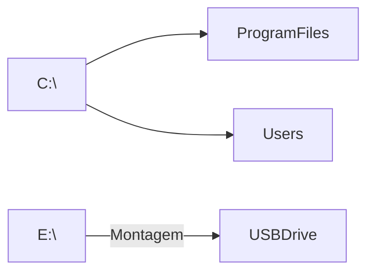
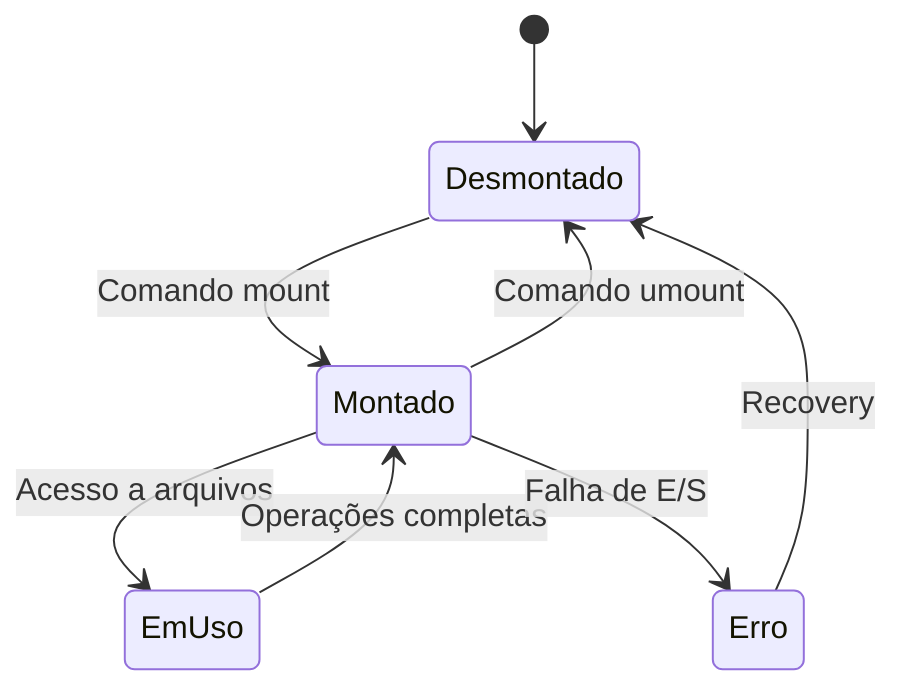

# 7.4 Montagem de Sistemas de Arquivos

## **1. Conceito Fundamental**

A montagem é o processo de tornar um sistema de arquivos acessível em um ponto específico na hierarquia de diretórios existente. Funciona como um "ponto de conexão" entre a estrutura lógica e o dispositivo físico.

### **Analogia Prática**
Imagine um sistema de arquivos como um **pendrive**:
- **Desmontado**: O pendrive está conectado ao computador, mas não aparece no explorador de arquivos
- **Montado**: Aparece como unidade (ex: `E:\`) ou em `/mnt/usb` no Linux

## **2. Processo de Montagem (Passo a Passo)**

1. **Identificação do Dispositivo**
   - Exemplo: `/dev/sdb1` (Linux) ou `\\.\PhysicalDrive1` (Windows)

2. **Verificação do Sistema de Arquivos**
   ```c
   // Pseudocódigo kernel
   if (verify_filesystem_signature(device) != FS_VALID) {
       return -EINVAL; // Erro: sistema de arquivos inválido
   }
   ```

3. **Associação ao Ponto de Montagem**
   ```mermaid
   graph LR
       A[Dispositivo /dev/sdb1] -->|Montado em| B[/mnt/dados]
       B --> C[arquivo1.txt]
       B --> D[subdir/]
   ```

4. **Ativação do Acesso**
   - Atualização da tabela de montagem do kernel
   - Criação de handle para operações de E/S

## **3. Implementação em Java (Exemplo Prático)**

```java
import java.nio.file.*;

public class FilesystemMountSimulator {
    public static void main(String[] args) throws Exception {
        // Simulação de dispositivos
        Path device1 = Paths.get("/dev/disk1");
        Path mountPoint = Paths.get("/mnt/external");
        
        // Criar ponto de montagem (diretório vazio)
        Files.createDirectories(mountPoint);
        
        // Verificar sistema de arquivos (simulação)
        String fstype = detectFilesystem(device1);
        System.out.println("Tipo detectado: " + fstype);
        
        // Montar (Linux)
        if (System.getProperty("os.name").toLowerCase().contains("linux")) {
            Runtime.getRuntime().exec("mount -t " + fstype + " " + 
                                    device1 + " " + mountPoint);
        }
        
        // Acesso pós-montagem
        Files.list(mountPoint).forEach(System.out::println);
    }
    
    private static String detectFilesystem(Path device) {
        // Simulação - na prática usaria bibliotecas nativas
        return "ext4";
    }
}
```

## **4. Diferenças Entre Sistemas Operacionais**

### **Linux/UNIX**
```mermaid
graph TB
    root[/] --> etc
    root --> home
    root --> mnt
    mnt --> external[/mnt/external]
    external -->|Montagem| dev_sdb1[/dev/sdb1]
```

- Comandos:
  ```bash
  # Montar
  mount -t ext4 /dev/sdb1 /mnt/data
  
  # Desmontar
  umount /mnt/data
  ```

### **Windows**


- Letras de unidade (C:, D:, E:)
- Montagem em diretórios desde o Windows 2000:
  ```cmd
  mountvol X: \\?\Volume{guid}\
  ```

### **MacOS**
```mermaid
graph TB
    Volumes[/Volumes] --> ExternalHD
    Volumes --> TimeMachine
    ExternalHD -->|Montagem| disk2s1
```

- Montagem automática em `/Volumes`
- Integração com Finder

## **5. Tabela de Comportamentos**

| **Operação**       | Linux            | Windows         | MacOS           |
|--------------------|------------------|-----------------|-----------------|
| Ponto de montagem  | Qualquer dir     | Letra ou dir    | /Volumes        |
| Montagem automática| Configurável     | Sim             | Sim             |
| Tipos suportados   | Ext4, XFS, etc   | NTFS, FAT       | HFS+, APFS      |
| Comando principal  | `mount`          | `mountvol`      | `diskutil`      |

## **6. Casos Especiais**

### **6.1 Montagem em Diretório Não Vazio**
```bash
# Linux - Sobrescreve conteúdo temporariamente
mount --bind /novo/conteudo /diretorio/existente
```

### **6.2 Montagem Parcial (Subtree)**
```java
// Exemplo: Montar apenas /var/log de outro FS
Runtime.getRuntime().exec("mount --bind /dev/sdc1/logs /var/log");
```

### **6.3 Sistemas de Arquivos Virtuais**
```mermaid
graph LR
    proc[/proc] -->|Montagem| kernel[Kernel]
    tmpfs[/tmp] --> RAM[Memória]
```

## **7. Boas Práticas**

1. **Sempre desmonte antes de remover mídia**
   ```java
   // Java - Verificar montagem
   FileStore store = Files.getFileStore(Paths.get("/mnt/data"));
   System.out.println("Montado: " + store.isReadOnly() ? "RO" : "RW");
   ```

2. **Use pontos de montagem lógicos**
   - Ruim: `/mnt/sdb1`
   - Bom: `/mnt/backup_server`

3. **Considere opções de montagem:**
   ```bash
   mount -o ro,noexec /dev/cdrom /media/cdrom
   ```

## **8. Implementação Avançada (JNI)**

Para controle preciso em Java:
```java
public class NativeMount {
    static {
        System.loadLibrary("mountcontrol");
    }
    
    // Métodos nativos
    public native static int mount(String source, String target, String fstype);
    public native static int umount(String target);
    
    public static void main(String[] args) {
        mount("/dev/sdb1", "/mnt/data", "ext4");
    }
}
```

Com C++:
```cpp
#include <sys/mount.h>

JNIEXPORT jint JNICALL Java_NativeMount_mount(JNIEnv *env, jclass cls, 
    jstring source, jstring target, jstring fstype) {
    
    const char *src = env->GetStringUTFChars(source, NULL);
    const char *tgt = env->GetStringUTFChars(target, NULL);
    const char *type = env->GetStringUTFChars(fstype, NULL);
    
    int result = mount(src, tgt, type, 0, NULL);
    
    env->ReleaseStringUTFChars(source, src);
    env->ReleaseStringUTFChars(target, tgt);
    env->ReleaseStringUTFChars(fstype, type);
    
    return result;
}
```

## **9. Diagrama**

