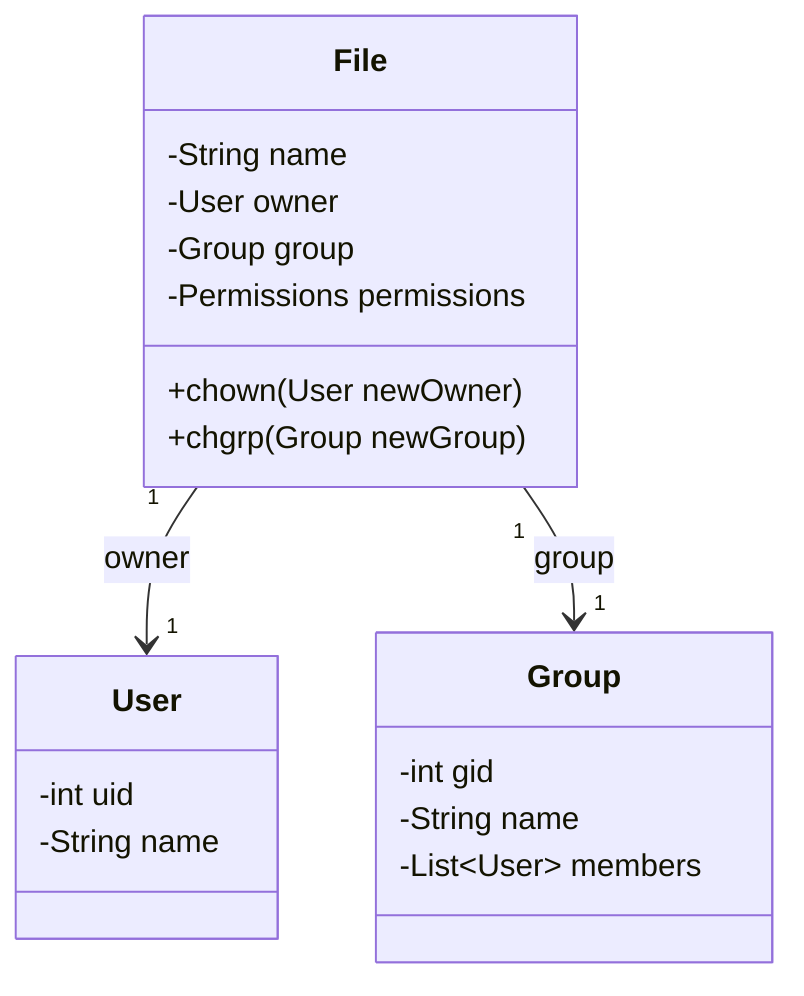
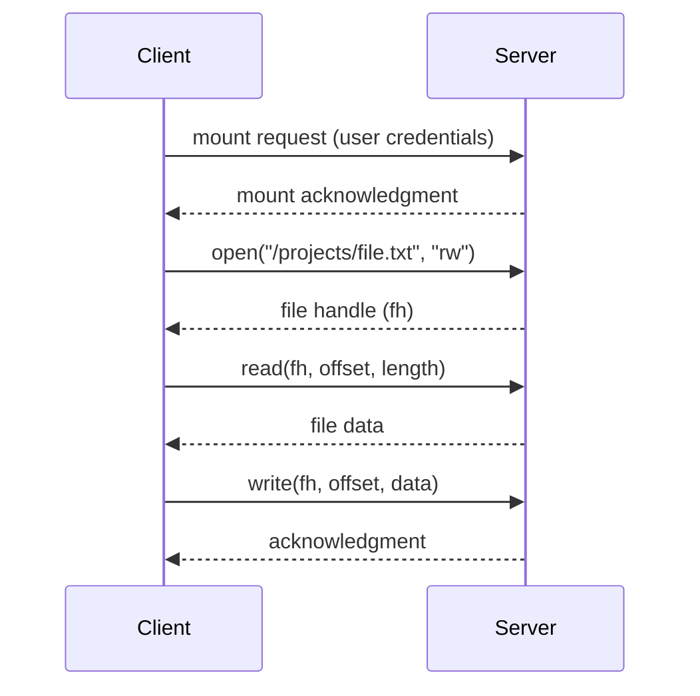
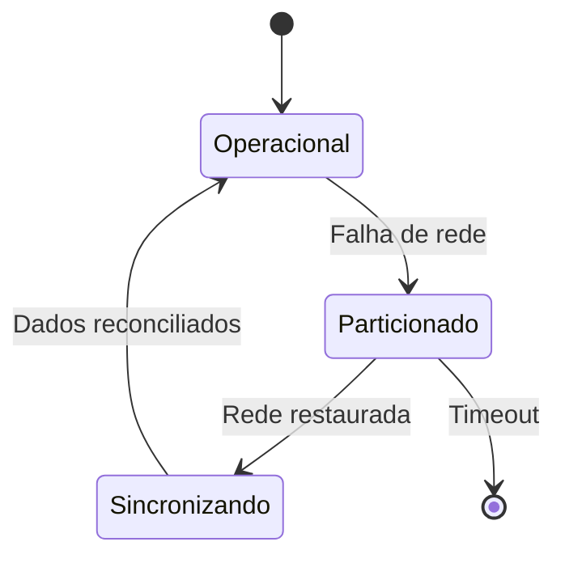

# 7.5 Compartilhamento de Arquivos

## **1 Modelo de Propriedade e Grupos**


**Implementação Java**:
```java
public class UnixLikePermissions {
    public static void main(String[] args) {
        FileDocument doc = new FileDocument("relatorio.pdf", 
            new User(1000, "alice"), 
            new Group(100, "devs"));
        
        doc.setPermissions("rw-r--r--");
        System.out.println(doc.checkAccess(new User(1001, "bob"), "read")); // true
        System.out.println(doc.checkAccess(new User(1001, "bob"), "write")); // false
    }
}

record User(int uid, String name) {}
record Group(int gid, String name) {}

class FileDocument {
    private final String name;
    private User owner;
    private Group group;
    private String permissions;
    
    // Implementação das verificações de permissão...
}
```

## **2. Sistemas de Arquivos Remotos**

### **2.1 Modelo Cliente-Servidor**


**Problemas de Autenticação**:
- UIDs/GIDs devem coincidir entre clientes e servidores
- Soluções modernas usam Kerberos/LDAP para mapeamento centralizado

## **3. Protocolos de Compartilhamento**

### **3.1 Comparação NFS vs CIFS/SMB**
| **Característica**       | **NFS**                  | **CIFS/SMB**            |
|--------------------------|--------------------------|-------------------------|
| Autenticação             | Baseada em UID/GID       | Credenciais de rede     |
| Bloqueio de arquivo      | Opcional                 | Mandatório              |
| Semântica de cache       | Forte consistência       | Desempenho sobre consistência |
| Plataforma               | Unix-like                | Multiplataforma         |

**Exemplo NFS em Java (JNR)**:
```java
import jnr.nfs.NFS;
import jnr.nfs.NFSFileHandle;

public class NFSClientExample {
    public static void main(String[] args) {
        NFS nfs = new NFS("nfs://server/export");
        NFSFileHandle file = nfs.open("/shared/data.txt", "rw");
        byte[] data = nfs.read(file, 0, 1024);
        nfs.close(file);
    }
}
```

## **4. Semânticas de Consistência**

### **4.1 Comparação Detalhada**

```mermaid
gantt
    title Semânticas de Consistência
    dateFormat  HH:mm:ss
    section UNIX
    Escrita Processo A :a1, 09:00:00, 2s
    Leitura Processo B :after a1, 1s
    
    section AFS
    Escrita Processo A :a2, 09:00:03, 2s
    Leitura Processo B :09:00:04, 1s
    
    section Imutável
    Criação Arquivo :09:00:06, 1s
    Todas Leituras :09:00:07, 4s
```


**Padrões de Acesso**:
```java
// Semântica UNIX
class UnixFile {
    synchronized void write(String data) {
        // Escrita visível imediatamente
    }
}

// Semântica AFS
class AFSFile {
    private String localCopy;
    
    void write(String data) {
        this.localCopy = data; // Só visível no close()
    }
    
    void close() {
        // Sincroniza com servidor
    }
}
```

## **5. Tratamento de Falhas**

### **5.1 Estratégias de Recuperação**


**Técnicas Avançadas**:
- **Leases**: Títulos temporários de acesso
- **Journaling**: Recuperação de transações incompletas
- **Replicação quorum**: Consistência em sistemas distribuídos

## **6. Implementação de Controle de Concorrência**

**Exemplo com ReadWriteLock**:
```java
import java.util.concurrent.locks.*;

public class ConcurrentFileAccess {
    private final ReadWriteLock rwLock = new ReentrantReadWriteLock();
    
    public String readContent() {
        rwLock.readLock().lock();
        try {
            // Operação de leitura
            return "...";
        } finally {
            rwLock.readLock().unlock();
        }
    }
    
    public void writeContent(String data) {
        rwLock.writeLock().lock();
        try {
            // Operação de escrita
        } finally {
            rwLock.writeLock().unlock();
        }
    }
}
```

## **7. Tabela de Melhores Práticas**

| **Cenário**              | **Solução Recomendada**       | **Benefícios**                     |
|--------------------------|-------------------------------|------------------------------------|
| Alta disponibilidade     | Replicação multi-servidor     | Tolerância a falhas                |
| Dados críticos           | Semântica UNIX                | Consistência forte                 |
| Colaboração remota       | Semântica AFS                 | Desempenho melhorado               |
| Dados históricos         | Arquivos imutáveis            | Integridade garantida              |
| Acesso concorrente       | Locking granular              | Balanceamento carga/consistência   |

## **8. Tendências Modernas**

1. **Sistemas de Arquivos Distribuídos**:
   - **IPFS**: Sistema de arquivos peer-to-peer
   - **Ceph**: Armazenamento altamente escalável

2. **Protocolos Emergentes**:
   ```java
   // Exemplo WebDAV
   WebResource resource = new WebdavResource("https://server/file.txt");
   resource.lock(); // Bloqueio remoto
   resource.write(content);
   resource.unlock();
   ```

3. **Blockchain para Metadados**:
   - Verificação imutável de propriedade
   - Histórico de alterações auditável
