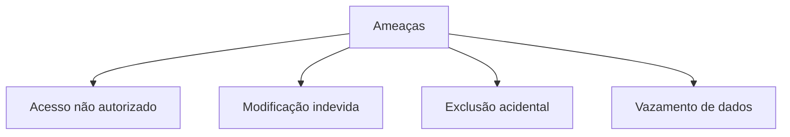
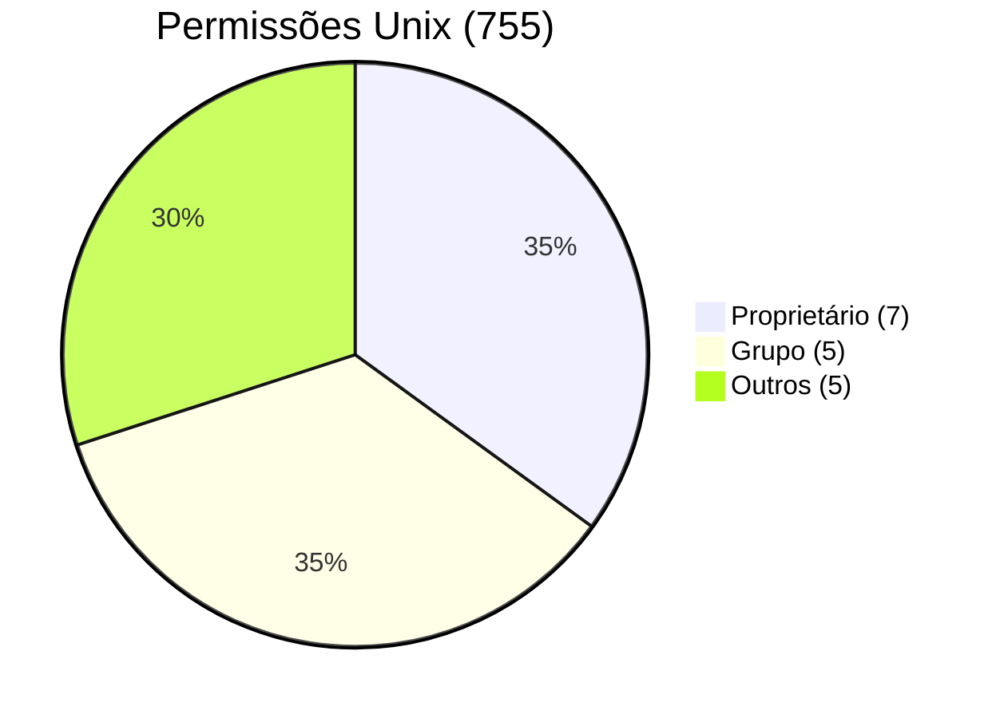
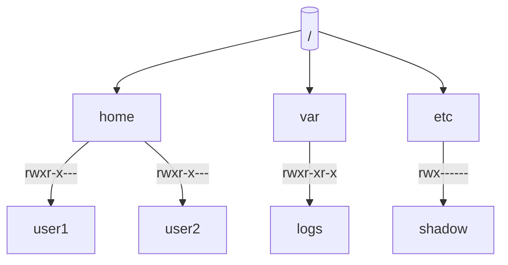
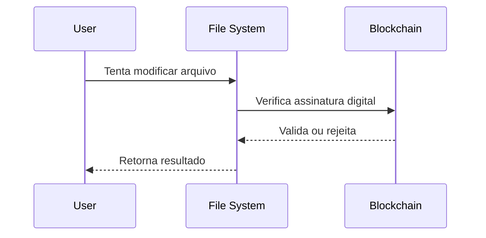

# 7.6 Proteção

## **1. Fundamentos de Proteção**

### **1.1 Objetivos Principais**
- **Confidencialidade**: Impedir acesso não autorizado
- **Integridade**: Prevenir modificações não autorizadas
- **Disponibilidade**: Garantir acesso para usuários legítimos

### **1.2 Modelo de Ameaças**


## **2. Controle de Acesso**

### **2.1 Modelo de Listas de Controle de Acesso (ACL)**
```java
public class FileACL {
    private String filePath;
    private Map<User, Set<Permission>> accessList;
    
    public enum Permission { READ, WRITE, EXECUTE, DELETE }
    
    public boolean checkAccess(User user, Permission permission) {
        return accessList.getOrDefault(user, Collections.emptySet())
                       .contains(permission);
    }
    
    // Implementação para adicionar/remover permissões
}
```

### **2.2 Modelo Unix (rwx)**


**Conversão numérica**:
- Read (r) = 4
- Write (w) = 2
- Execute (x) = 1

## **3. Implementação Prática**

### **3.1 Sistema de Arquivos com ACL**
```java
import java.nio.file.*;
import java.nio.file.attribute.*;

public class AdvancedFileProtection {
    public static void main(String[] args) throws Exception {
        Path file = Paths.get("/secure/data.txt");
        
        // Definindo ACL
        AclFileAttributeView aclView = Files.getFileAttributeView(
            file, AclFileAttributeView.class);
        
        UserPrincipal user = Files.getOwner(file);
        UserPrincipal group = file.getFileSystem()
                               .getUserPrincipalLookupService()
                               .lookupPrincipalByGroupName("admin");
        
        // Adicionando entradas de permissão
        aclView.setAcl(List.of(
            new AclEntry.Builder()
                .setType(AclEntryType.ALLOW)
                .setPrincipal(user)
                .setPermissions(
                    AclEntryPermission.READ_DATA,
                    AclEntryPermission.WRITE_DATA)
                .build(),
            new AclEntry.Builder()
                .setType(AclEntryType.ALLOW)
                .setPrincipal(group)
                .setPermissions(AclEntryPermission.READ_DATA)
                .build()
        ));
    }
}
```

### **3.2 Verificação de Permissões**
```java
public class AccessChecker {
    public static boolean canAccess(Path path, UserPrincipal user, 
                                  Set<AclEntryPermission> required) {
        try {
            AclFileAttributeView aclView = Files.getFileAttributeView(
                path, AclFileAttributeView.class);
            
            return aclView.getAcl().stream()
                .filter(entry -> entry.principal().equals(user))
                .flatMap(entry -> entry.permissions().stream())
                .collect(Collectors.toSet())
                .containsAll(required);
        } catch (IOException e) {
            return false;
        }
    }
}
```

## **4. Técnicas Avançadas**

### **4.1 Proteção por Senha**
```java
public class PasswordProtectedFile {
    private byte[] encryptedData;
    private byte[] salt;
    private byte[] iv;
    
    public void write(String data, String password) {
        // Implementação de criptografia AES
    }
    
    public String read(String password) {
        // Implementação de descriptografia
    }
}
```

### **4.2 Proteção em Nível de Diretório**


## **5. Modelos de Segurança**

### **5.1 Comparação de Modelos**
| **Modelo**         | **Vantagens**               | **Desvantagens**          | **Casos de Uso**         |
|---------------------|-----------------------------|---------------------------|--------------------------|
| **ACL**            | Controle granular           | Complexidade              | Sistemas corporativos    |
| **Unix rwx**       | Simplicidade                | Limitações funcionais     | Sistemas Unix-like       |
| **RBAC**           | Escalabilidade              | Configuração complexa     | Grandes organizações     |
| **Capabilities**   | Delegação flexível          | Difícil revogação         | Sistemas distribuídos    |

## **6. Implementação de RBAC**
```java
public class RoleBasedAccess {
    private Map<User, Set<Role>> userRoles;
    private Map<Role, Set<Permission>> rolePermissions;
    
    public boolean checkAccess(User user, Permission permission) {
        return userRoles.getOrDefault(user, Collections.emptySet())
                      .stream()
                      .flatMap(role -> rolePermissions.getOrDefault(
                          role, Collections.emptySet()).stream())
                      .anyMatch(p -> p.equals(permission));
    }
}
```

## **7. Auditoria e Logging**

### **7.1 Monitoramento de Acesso**
```java
public class AccessLogger {
    public void logAccess(User user, Path file, 
                        String action, boolean success) {
        String entry = String.format("[%s] %s %s %s %s",
            Instant.now(),
            user.getName(),
            action,
            file.toString(),
            success ? "SUCCESS" : "DENIED");
        
        Files.write(Paths.get("/var/log/access.log"),
                  (entry + "\n").getBytes(),
                  StandardOpenOption.CREATE,
                  StandardOpenOption.APPEND);
    }
}
```

## **8. Tabela de Melhores Práticas**

| **Cenário**              | **Técnica Recomendada**     | **Implementação**                |
|--------------------------|-----------------------------|-----------------------------------|
| Dados sensíveis          | Criptografia + ACL          | AES-256 + Listas de controle      |
| Colaboração em equipe    | Grupos Unix                 | chmod g+rwx                      |
| Acesso temporário        | ACLs temporárias            | setfacl -m u:guest:rwx:allow     |
| Conformidade regulatória | Auditoria detalhada         | Logging de todas as operações    |

## **9. Tendências Modernas**

### **9.1 Sistemas de Arquivos Criptografados**
- **eCryptfs**: Criptografia por arquivo
- **LUKS**: Criptografia de disco completo

### **9.2 Blockchain para Metadados**

