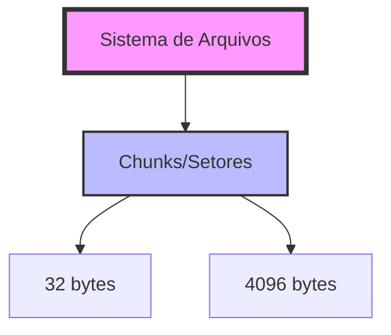
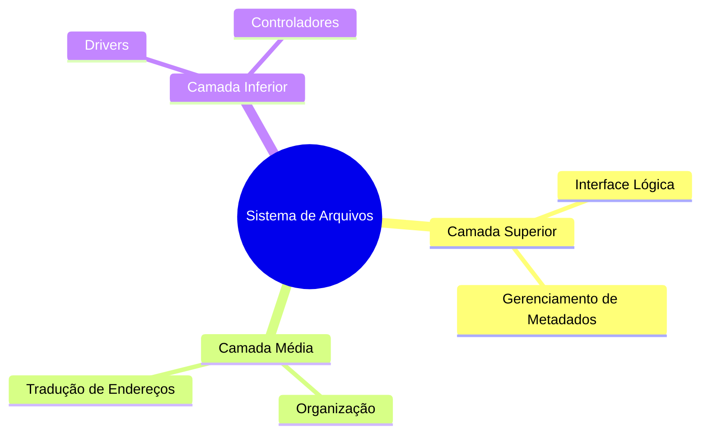

# 8.1 Estrutura do Sistema de Arquivos

Ah, aventureiro digital! Prepare-se para uma jornada pelo fascinante mundo dos sistemas de arquivos, onde cada bloco é como um precioso diamante em nosso inventário virtual.

## A Dança dos Blocos e a CPU

Imagine nosso sistema de arquivos como um mundo de Minecraft bem organizado. Assim como não podemos colocar blocos diretamente do inventário criativo para o survival, nosso sistema tem suas regras:

1. **O Ritual da Alteração** 🔄
   - O disco é como um baú encantado que só pode ser acessado através de rituais específicos
   - A RAM atua como nossa hotbar, segurando temporariamente os itens
   - A CPU, como um jogador habilidoso, modifica os itens na hotbar
   - O resultado volta ao baú original, mantendo a ordem do universo

2. **O Poder da Onisciência** 🎯
   - Como um jogador com mapa do mundo, o sistema conhece todos os seus blocos
   - Pode teleportar-se do bloco A ao Z instantaneamente
   - O acesso pode ser:
     - Aleatório (como um Ender Pearl)
     - Sequencial (como caminhar em linha reta)

## A Quest da Eficiência 

Como todo bom speedrunner sabe, eficiência é crucial. Nossos blocos de dados são organizados em chunks (setores):

## Os Desafios do Craft ️

Como craftar um item raro, construir um sistema de arquivos requer conhecimento e estratégia:

1. **Interface do Usuário**
   - Como um crafting table bem desenhado
   - Definição clara de receitas (operações)
   - Organização do inventário (diretórios)

2. **Mecânicas Internas**
   - Algoritmos (como redstone circuits)
   - Estruturas de Dados (como storage systems)

## A Torre de Camadas 🏰

Como uma construção bem planejada, nosso sistema tem níveis:

### Níveis do Sistema

1. **Nível Básico (Bedrock)**
   - Drivers: Os mineiros do sistema
   - Interrupções: Como um sistema de alarme contra Creepers

2. **Sistema de Arquivos Básico (Stone Layer)**
   - Gerencia comandos básicos
   - Coordena buffers e caches
   - Identifica blocos por coordenadas precisas

3. **Módulo de Organização (Diamond Layer)**
   - O olho que tudo vê
   - Mapeia o mundo dos blocos
   - Traduz coordenadas lógicas em físicas

Como um mundo de Minecraft bem construído, um sistema de arquivos eficiente é a base de toda grande aventura digital. Mantenha seus backups atualizados e seus blocos organizados!