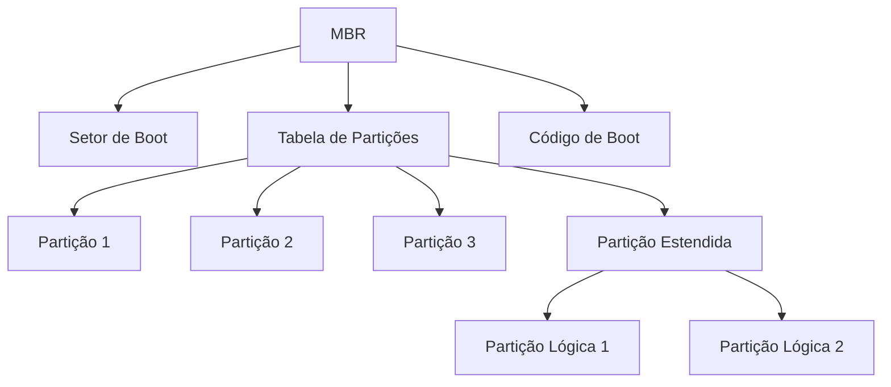
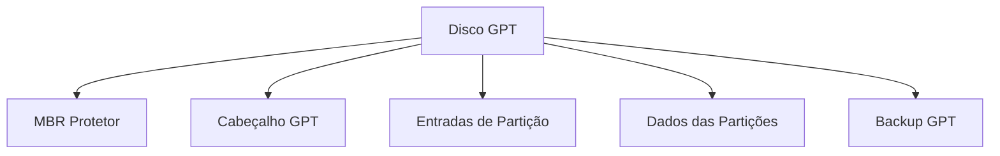
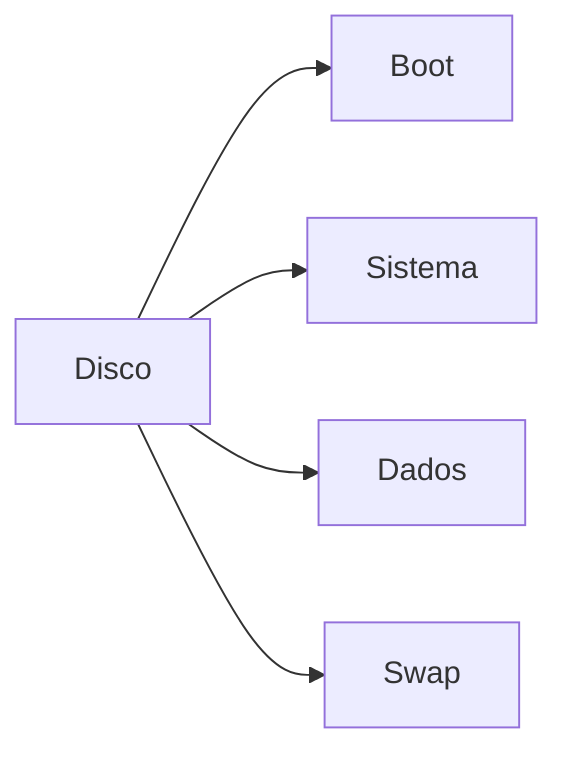
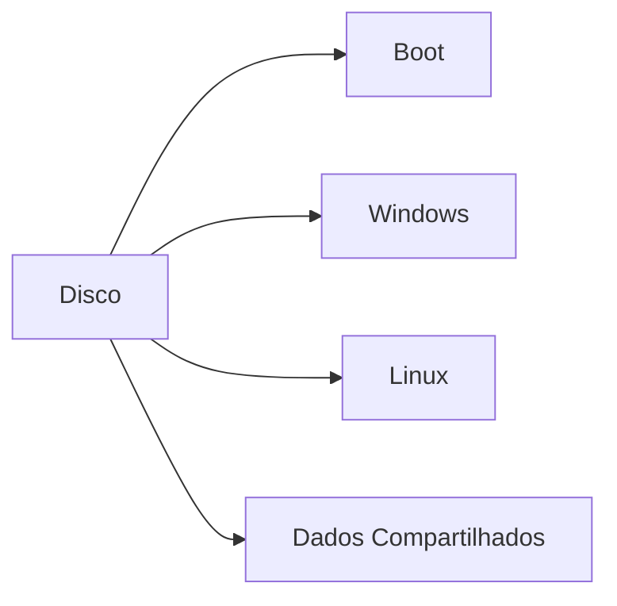
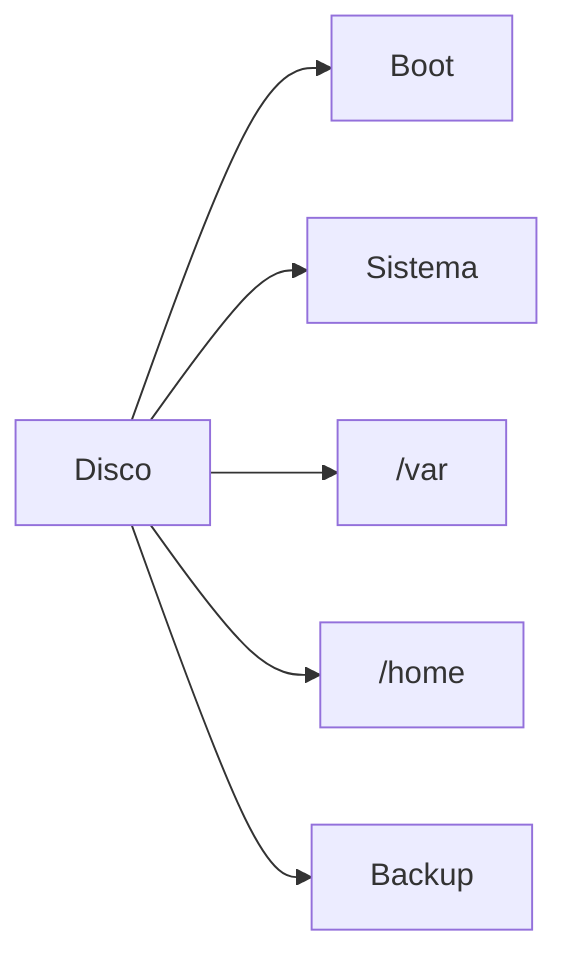

# Layouts de Disco

## Modelos Básicos

Existem dois modelos principais de organização de disco:

1. **Particionamento Simples**
   - Disco físico dividido em várias partições independentes
   - Cada partição funciona como um dispositivo lógico separado
   - Permite múltiplos sistemas operacionais ou tipos de sistemas de arquivos

2. **Volume Distribuído (RAID)**
   - Partições espalhadas por múltiplos discos físicos
   - Oferece redundância e/ou melhor desempenho
   - Requer controlador RAID (hardware ou software)

## Estruturas de Particionamento

### MBR (Master Boot Record)
- Formato tradicional de particionamento
- Limitações:
  - Máximo de 4 partições primárias
  - Partições limitadas a 2TB
- Estrutura:
  - Setor de boot (512 bytes)
  - Tabela de partições
  - Código de boot

### GPT (GUID Partition Table)
- Formato moderno de particionamento
- Vantagens:
  - Suporte para discos >2TB
  - Até 128 partições por disco
  - Redundância e verificação de integridade
- Estrutura:
  - Cabeçalho de proteção MBR
  - Cabeçalho GPT primário
  - Entradas de partição
  - Backup GPT

## Esquemas de Particionamento Comuns

### Sistema Único

### Multi-boot

### Servidor

## Considerações de Design

1. **Segurança**
   - Isolamento entre partições
   - Proteção contra corrupção
   - Backup e recuperação independentes

2. **Desempenho**
   - Localização das partições no disco
   - Alinhamento para melhor E/S
   - Fragmentação entre partições

3. **Flexibilidade**
   - Redimensionamento de partições
   - Adição/remoção de sistemas
   - Migração de dados

4. **Manutenção**
   - Backup independente por partição
   - Verificação de sistema de arquivos
   - Recuperação de falhas

## Boas Práticas

1. **Planejamento**
   - Estimar necessidades de espaço
   - Considerar crescimento futuro
   - Definir esquema de backup

2. **Implementação**
   - Usar GPT para discos modernos
   - Alinhar partições adequadamente
   - Documentar layout escolhido

3. **Monitoramento**
   - Acompanhar uso de espaço
   - Verificar integridade periodicamente
   - Planejar expansões necessárias