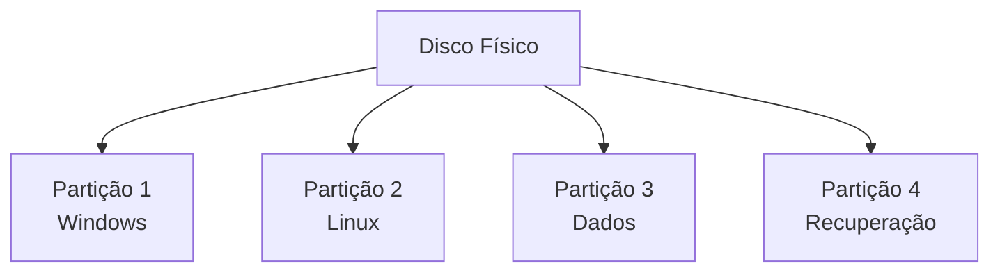
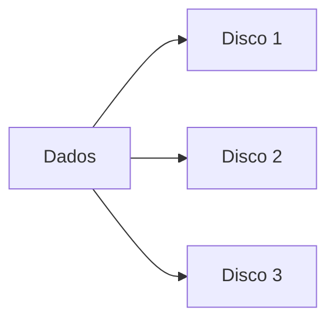
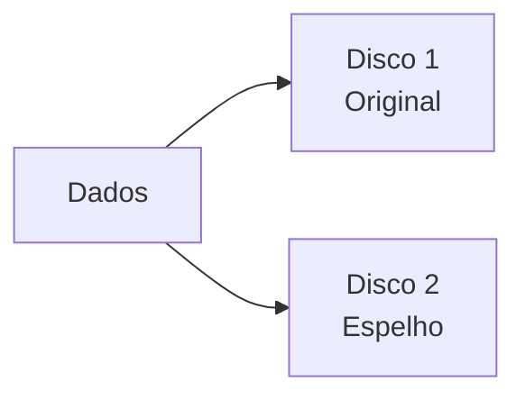
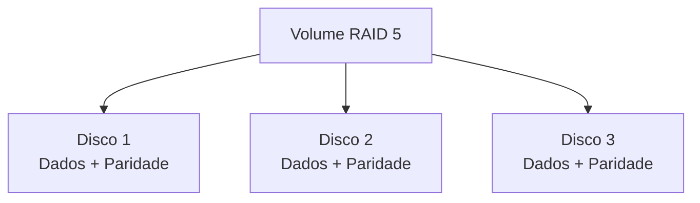

# 8.2.2 Modelos de Organização de Disco

## Particionamento Simples

O particionamento simples é o modelo mais básico e comum de organização de disco, onde um disco físico é dividido em múltiplas partições independentes.

### Características
- Cada partição funciona como um dispositivo lógico separado
- Permite isolamento de dados e sistemas
- Gerenciamento simplificado de espaço

### Usos Comuns
1. **Múltiplos Sistemas Operacionais**
   - Dual boot Windows/Linux
   - Isolamento entre sistemas
   - Compartilhamento de dados

2. **Organização de Dados**
   - Separação entre sistema e dados
   - Backup simplificado
   - Recuperação independente

### Vantagens {id="vantagens_1"}
- Simplicidade de implementação
- Não requer hardware especial
- Fácil manutenção

### Desvantagens {id="desvantagens_1"}
- Sem redundância de dados
- Limitado ao tamanho do disco físico
- Perda total em caso de falha do disco

## Volume Distribuído (RAID)

RAID (Redundant Array of Independent Disks) é um modelo que distribui dados entre múltiplos discos físicos para melhorar desempenho e/ou redundância.

### Características {id="caracter-sticas_1"}
- Partições espalhadas por múltiplos discos
- Gerenciamento centralizado
- Redundância configurável

### Níveis RAID Comuns

1. **RAID 0 (Striping)**
   - Dados distribuídos entre discos
   - Maior desempenho
   - Sem redundância

2. **RAID 1 (Espelhamento)**
   - Dados duplicados
   - Redundância total
   - Maior custo de armazenamento

3. **RAID 5 (Paridade Distribuída)**
   - Paridade distribuída
   - Boa relação custo/benefício
   - Tolerância a falhas

### Implementação

1. **RAID por Hardware**
   - Controladora RAID dedicada
   - Melhor desempenho
   - Maior custo inicial

2. **RAID por Software**
   - Implementado pelo sistema operacional
   - Menor custo
   - Usa recursos do sistema

### Vantagens
- Maior confiabilidade
- Melhor desempenho
- Escalabilidade

### Desvantagens
- Maior complexidade
- Custo mais elevado
- Overhead de gerenciamento

## Comparativo

| Aspecto | Particionamento Simples | Volume Distribuído (RAID) |
|---------|------------------------|-------------------------|
| Custo | Baixo | Médio/Alto |
| Complexidade | Simples | Complexa |
| Redundância | Não | Sim (exceto RAID 0) |
| Desempenho | Normal | Melhorado |
| Escalabilidade | Limitada | Alta |
| Manutenção | Simples | Requer conhecimento específico |