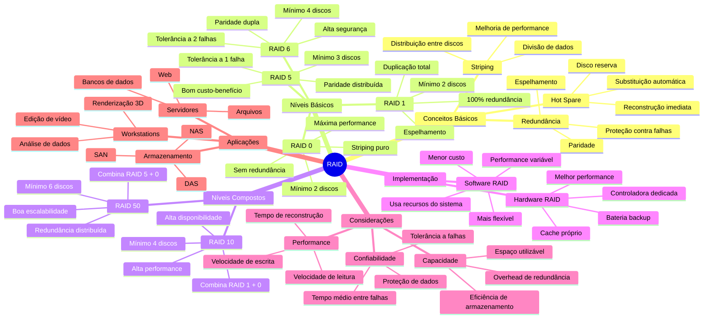

# Níveis de RAID (Redundant Array of Independent Disks)





## Conceitos Fundamentais

### Striping
- Divisão de dados em blocos
- Distribuição sequencial entre discos
- Tamanho do stripe afeta performance

### Paridade
- Método de detecção/correção de erros
- Calculada usando operação XOR
- Permite reconstrução em caso de falha

### Hot Spare
- Disco reserva em standby
- Ativação automática em falhas
- Reconstrução imediata

## RAID 0 (Striping)
- **Objetivo**: Máximo desempenho
- **Redundância**: Nenhuma
- **Eficiência**: 100% do espaço utilizável
- **Mínimo de discos**: 2

### Funcionamento {id="funcionamento_1"}
```
Arquivo Original: "SISTEMAS_OPERACIONAIS.txt"
                    ↓
      Divisão em blocos (striping)
                    ↓
Disco 1  |  Disco 2  |  Disco 3  |  Disco 4
---------|-----------|-----------|----------
 SIST    |    EMAS  |    _OP    |   ERA
 CION    |    AIS   |    .tx    |    t
```

### Cálculo de Capacidade {id="c-lculo-de-capacidade_1"}
```
Capacidade Total = N × Menor_Capacidade_Disco
Exemplo com 4 discos de 1TB:
  4 × 1TB = 4TB utilizáveis
```

### Casos de Uso
- Edição de vídeo
- Renderização 3D
- Arquivos temporários
- Ambientes sem necessidade de redundância

## RAID 1 (Mirroring)
- **Objetivo**: Máxima redundância
- **Redundância**: 100% (espelhamento completo)
- **Eficiência**: 50% do espaço utilizável
- **Mínimo de discos**: 2

### Funcionamento {id="funcionamento_2"}
```
          Dados Originais
         ↙            ↘
    Disco 1         Disco 2
   [A][B][C]  →  [A'][B'][C']  
   [D][E][F]  →  [D'][E'][F']
   
Leitura:
  ┌─ Disco 1 ─┐  ┌─ Disco 2 ─┐
  │ Bloco [A] │  │ Bloco [A'] │
  └───────────┘  └───────────┘
        ↓             ↓
    Load Balance (alternado)
```

### Performance
- **Leitura**: 2× mais rápida (balanceamento)
- **Escrita**: Mesma velocidade de um disco
- **Reconstrução**: Cópia direta 1:1

## RAID 5 (Striping com Paridade Distribuída)
- **Objetivo**: Equilíbrio entre redundância e capacidade
- **Redundância**: N-1 discos utilizáveis
- **Eficiência**: (N-1)/N do espaço total
- **Mínimo de discos**: 3

### Funcionamento e Paridade
```
Dados: A1, A2, A3
Paridade: P = A1 ⊕ A2 ⊕ A3 (XOR)

Disco 1  |  Disco 2  |  Disco 3  |  Disco 4
---------|-----------|-----------|----------
   A1    |    A2    |    A3    |    P1
   A5    |    A6    |    P2    |    A4
   A8    |    P3    |    A7    |    A9
   P4    |    A10   |    A11   |    A12

Reconstrução em falha do Disco 2:
A2 = A1 ⊕ A3 ⊕ P1
```

### Cálculo de Capacidade
```
Capacidade Total = (N-1) × Menor_Capacidade_Disco
Exemplo com 4 discos de 1TB:
  (4-1) × 1TB = 3TB utilizáveis
```

## RAID 6 (Striping com Paridade Dupla)
- **Objetivo**: Alta segurança de dados
- **Redundância**: Dupla paridade distribuída
- **Eficiência**: (N-2)/N do espaço total
- **Mínimo de discos**: 4

### Funcionamento {id="funcionamento_3"}
```
Dados: A1, A2
Paridades: P, Q (diferentes algoritmos)

Disco 1  |  Disco 2  |  Disco 3  |  Disco 4  |  Disco 5
---------|-----------|-----------|-----------|----------
   A1    |    A2    |    A3    |    P1    |    Q1
   A4    |    A5    |    P2    |    Q2    |    A6
   A7    |    P3    |    Q3    |    A8    |    A9
   P4    |    Q4    |    A10   |    A11   |    A12
```

## RAID 10 (1+0 ou Mirror+Stripe)
- **Objetivo**: Alta performance com redundância
- **Redundância**: 50% (espelhamento)
- **Eficiência**: 50% do espaço utilizável
- **Mínimo de discos**: 4

### Funcionamento {id="funcionamento_4"}
```
Dados Originais
      ↓
   RAID 1         RAID 1
  (Espelho)      (Espelho)
 ┌───────────┐  ┌───────────┐
│ D1    D2  │  │ D3    D4  │
└───┬───┬───┘  └───┬───┬───┘
    │   │          │   │
    ▼   ▼          ▼   ▼
  RAID 0 (Stripe entre espelhos)
```

## RAID 50 (5+0)
- **Objetivo**: Escalabilidade com redundância
- **Redundância**: Distribuída por grupos
- **Eficiência**: Variável por configuração
- **Mínimo de discos**: 6

### Funcionamento
```
Grupo RAID 5 #1              Grupo RAID 5 #2
┌─────────────────┐        ┌─────────────────┐
│ D1  D2  D3  P1 │        │ D4  D5  D6  P2 │
└────┬────┬────┬─┘        └────┬────┬────┬─┘
     │    │    │               │    │    │
     ▼    ▼    ▼               ▼    ▼    ▼
        RAID 0 (Stripe entre grupos)
```

## Comparativo Detalhado

### Performance Relativa
```
Velocidade de Leitura Sequencial:
RAID 0  [====================] 100%
RAID 1  [==================--]  90%
RAID 5  [================----]  80%
RAID 6  [===============-----]  75%
RAID 10 [===================]   95%
RAID 50 [================----]  80%

Velocidade de Escrita Aleatória:
RAID 0  [====================] 100%
RAID 1  [==========----------]  50%
RAID 5  [========------------]  40%
RAID 6  [=======-------------]  35%
RAID 10 [===============-----]  75%
RAID 50 [============--------]  60%
```

### Tabela Comparativa Completa

| Nível | Min. Discos | Redundância | Perda Capacidade | Reconstrução | Uso Comum | Performance R/W |
|-------|-------------|-------------|------------------|--------------|-----------|-----------------|
| 0 | 2 | Nenhuma | 0% | Impossível | Cache, Temp | Excelente/Excelente |
| 1 | 2 | Espelho | 50% | Rápida | OS, DB Log | Boa/Moderada |
| 5 | 3 | Single | 1 disco | Lenta | Fileserver | Boa/Baixa |
| 6 | 4 | Dupla | 2 discos | Muito Lenta | Arquivo | Moderada/Baixa |
| 10 | 4 | Espelho | 50% | Rápida | DB, Email | Excelente/Boa |
| 50 | 6 | Distribuída | N/grupos + 1 | Moderada | Aplicações | Boa/Moderada |

## Considerações de Implementação

### Hardware vs Software RAID
```
Hardware RAID
┌────────────────┐
│ CPU Dedicada   │
│ Cache Próprio  │
│ Bateria Backup │
└────────────────┘
        ↓
   Performance
   Confiabilidade
   Custo Alto

Software RAID
┌────────────────┐
│ CPU do Sistema │
│ RAM do Sistema │
│ Sem Bateria    │
└────────────────┘
        ↓
   Flexibilidade
   Custo Baixo
   Overhead CPU
```

### Melhores Práticas
1. **Discos Idênticos**
   - Mesma marca/modelo
   - Mesma capacidade
   - Mesmo desempenho

2. **Hot Spares**
   ```
   Array Principal    Hot Spare
   [D1][D2][D3][P] + [HS]
                      ↓
               Falha em D2:
             [D1][HS][D3][P]
   ```

3. **Monitoramento**
   - S.M.A.R.T.
   - Temperatura
   - Taxa de erros