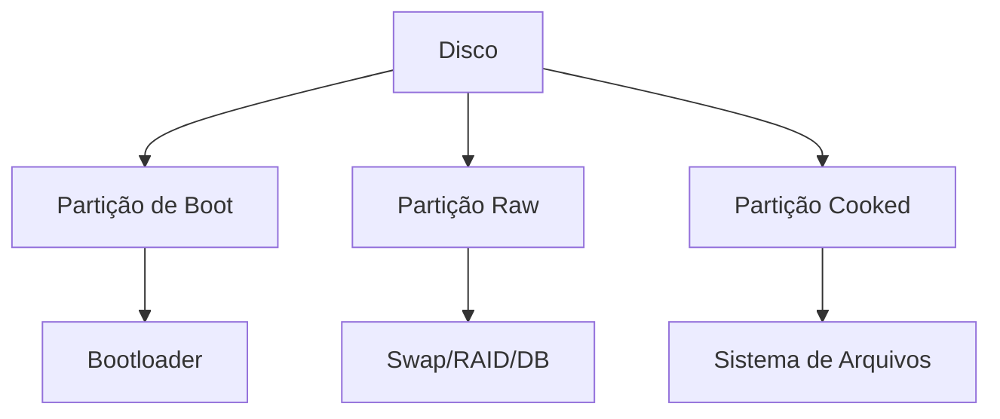
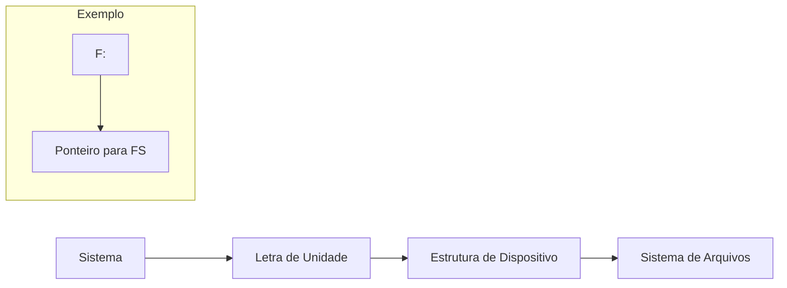
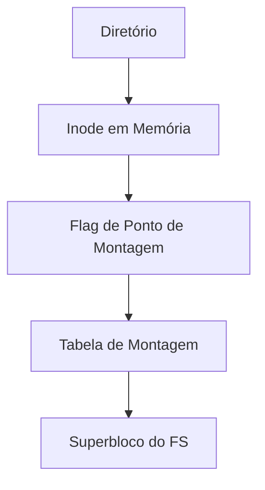
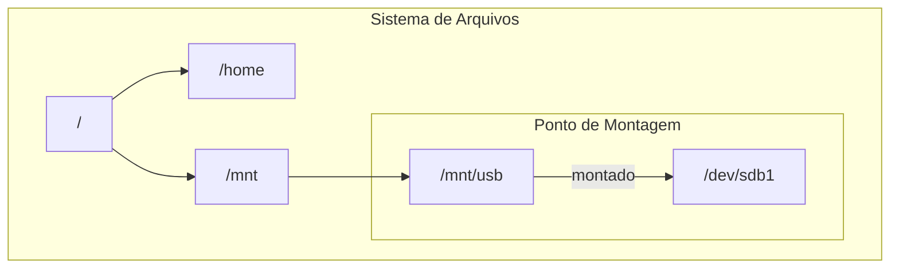

# 8.2.1 Partições e Montagem

## Layouts de Disco

O layout de um disco pode variar significativamente dependendo do sistema operacional. Existem dois modelos principais:
1. Disco dividido em várias partições
2. Volume espalhado por várias partições em múltiplos discos (RAID)

### Tipos de Partições

1. **Partição Raw (Bruta)**
   - Não contém sistema de arquivos
   - Usos comuns:
     - Área de swap do UNIX
     - Bancos de dados customizados
     - Informações de configuração RAID
     - Mapas de bits para espelhamento

2. **Partição Cooked (Processada)**
   - Contém sistema de arquivos formatado
   - Utilizada para armazenamento regular de arquivos

### Partição de Boot

- Armazena informações de inicialização
- Formato próprio (não utiliza sistema de arquivos)
- Características:
  - Carregada como imagem para memória
  - Execução inicia em local predefinido
  - Pode conter múltiplos bootloaders

## Processo de Montagem

### Montagem da Partição Raiz
1. Ocorre durante boot do sistema
2. Contém kernel e arquivos essenciais
3. Outras partições podem ser montadas:
   - Automaticamente no boot
   - Manualmente após boot

### Verificação do Sistema de Arquivos
1. Driver lê diretório do dispositivo
2. Sistema verifica formato
3. Se inválido:
   - Verificação de coerência
   - Possível correção
   - Pode requerer intervenção do usuário

### Estruturas de Montagem

#### Windows

- Cada volume em namespace separado
- Identificado por letra + dois-pontos
- Versões recentes: montagem em qualquer ponto

#### UNIX

- Montagem em qualquer diretório
- Implementação:
  1. Flag no inode em memória
  2. Ponteiro para tabela de montagem
  3. Entrada na tabela aponta para superbloco

### Exemplo de Estrutura de Montagem

## Considerações de Implementação

1. **Verificação de Integridade**
   - Executada durante montagem
   - Verifica estruturas do sistema de arquivos
   - Pode requerer fsck/chkdsk

2. **Tabela de Montagem**
   - Mantida em memória
   - Registra sistemas de arquivos ativos
   - Contém informações de tipo e estado

3. **Transparência**
   - Sistema atravessa estruturas transparentemente
   - Usuário não precisa conhecer pontos de montagem
   - Alternância automática entre sistemas de arquivos