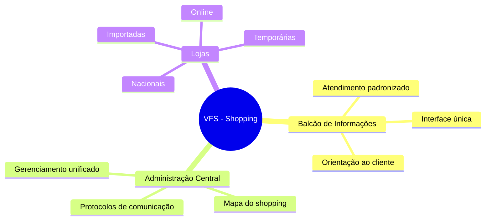
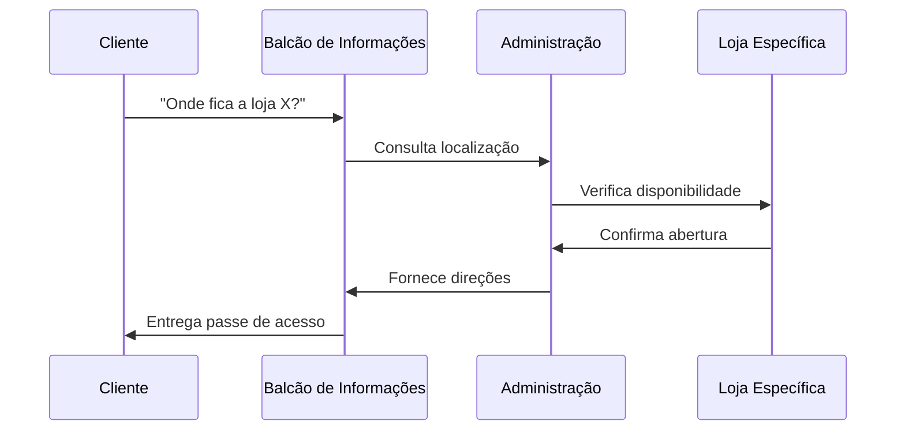
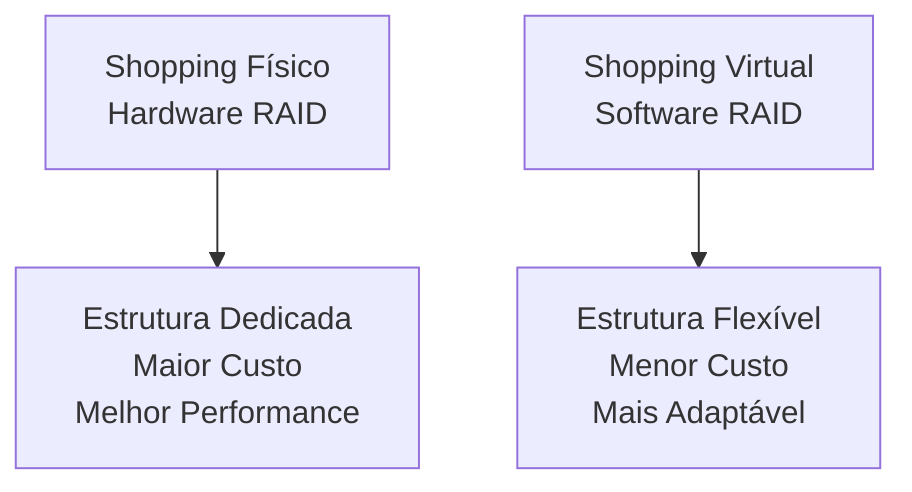

# 8.2.3 Sistemas de Arquivos Virtuais (VFS)

## Analogia Principal: O Shopping Center Universal

Imagine o VFS como um shopping center gigante onde você pode acessar diferentes tipos de lojas (sistemas de arquivos) de forma transparente. Assim como você não precisa saber se está comprando de uma loja nacional ou importada, o VFS permite que programas acessem arquivos sem se preocupar com o tipo de sistema que os armazena.

## Arquitetura em Três Camadas

### 1. Interface do Sistema (O Balcão de Informações)
- Como um balcão de informações do shopping que aceita qualquer pergunta
- Não importa se você quer saber de uma loja nacional, importada ou online
- Funções básicas: `open()`, `read()`, `write()`, `close()`

### 2. VFS (O Sistema de Gestão do Shopping)
- Como a administração central que:
  - Sabe como se comunicar com cada loja
  - Mantém um mapa unificado do shopping
  - Gerencia diferentes tipos de estabelecimentos

### 3. Implementações Específicas (As Lojas)
- Cada sistema de arquivos é como uma loja diferente:
  - Ext4: Loja nacional tradicional
  - NTFS: Loja importada
  - NFS: Loja online com entrega
  - tmpfs: Quiosque temporário



## Objetos Principais (Como um Shopping Center)

### 1. Inode (O Cadastro da Loja)
- Como a documentação oficial de cada loja
- Contém:
  - Licença de funcionamento (permissões)
  - Informações do proprietário
  - Localização no shopping

### 2. File (O Atendimento em Andamento)
- Como uma compra em andamento
- Mantém:
  - Carrinho de compras atual (buffer)
  - Histórico da interação
  - Estado da transação

### 3. Superblock (O Contrato de Locação)
- Como o contrato master com a rede de lojas
- Define:
  - Espaço total disponível
  - Regras de operação
  - Configurações gerais

### 4. Dentry (O Diretório do Shopping)
- Como o mapa/diretório do shopping
- Organiza:
  - Nome e localização das lojas
  - Hierarquia (piso, setor)
  - Atalhos e referências

## Exemplo Prático: Acessando Arquivos

```java
// Analogia: Sistema de Compras Universal
public interface ShoppingOperations {
    // Como abrir uma loja para compras
    Store openStore(String storeName, int accessType);
    
    // Como pegar produtos (ler dados)
    Product getProduct(Store store, ShoppingCart cart, int quantity);
    
    // Como entregar produtos (escrever dados)
    void deliverProduct(Store store, Product product);
    
    // Como fechar a loja
    void closeStore(Store store);
}

// Loja Física (Sistema de Arquivos Local)
public class PhysicalStore implements ShoppingOperations {
    @Override
    public Store openStore(String storeName, int accessType) {
        // Protocolo de abertura de loja física
    }
    
    // ... outras implementações
}

// Loja Online (Sistema de Arquivos Remoto)
public class OnlineStore implements ShoppingOperations {
    @Override
    public Store openStore(String storeName, int accessType) {
        // Protocolo de acesso à loja online
    }
    
    // ... outras implementações
}
```

## Fluxo de Operações (Como uma Compra)



## Benefícios (Como Vantagens do Shopping)

### 1. Organização Centralizada
- Como ter todas as lojas em um só lugar
- Gerenciamento unificado
- Experiência consistente

### 2. Flexibilidade
- Como poder comprar de diferentes tipos de lojas
- Mistura de lojas físicas e online
- Adaptação a diferentes necessidades

### 3. Segurança e Controle
- Como a segurança do shopping
- Monitoramento centralizado
- Regras padronizadas

## Desafios Comuns

### 1. Compatibilidade (Como Padrões de Tomada)
- Diferentes sistemas precisam de "adaptadores"
- Conversão de formatos
- Manutenção de padrões

### 2. Performance (Como Fluxo de Clientes)
- Balanceamento de carga
- Otimização de rotas
- Gestão de filas

### 3. Segurança (Como Controle de Acesso)
- Verificação de credenciais
- Isolamento de recursos
- Auditoria de operações

## Considerações de Implementação

### Hardware vs Software (Como Estrutura do Shopping)


### Melhores Práticas
1. **Padronização**
   - Como regras comuns para todas as lojas
   - Protocolos estabelecidos
   - Documentação clara

2. **Monitoramento**
   - Como câmeras de segurança
   - Logs de atividade
   - Alertas de problemas

3. **Backup e Recuperação**
   - Como planos de emergência
   - Cópias de segurança
   - Procedimentos de restauração