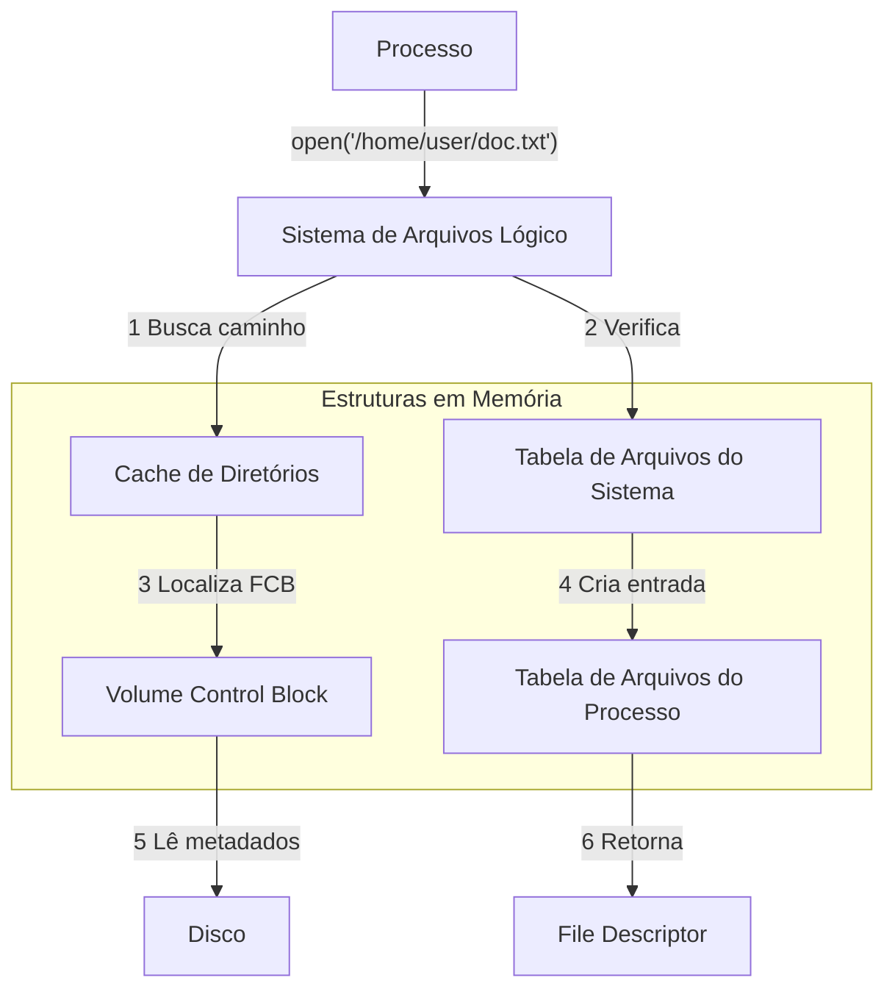
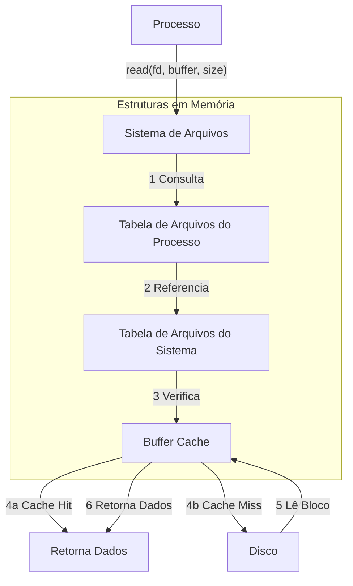

# 8.2 Implementação do Sistema de Arquivos

## Introdução

Os sistemas operacionais implementam as chamadas de sistema `open()` e `close()` para que os processos possam requisitar acesso ao conteúdo dos arquivos. Esta seção detalha as estruturas e operações fundamentais usadas para implementar as operações do sistema de arquivos.

## Estruturas Fundamentais

A implementação de um sistema de arquivos utiliza diversas estruturas tanto no disco quanto na memória. Embora existam variações entre diferentes sistemas operacionais e sistemas de arquivos, alguns princípios gerais são comuns a todos.

### Estruturas em Disco

O sistema de arquivos no disco contém informações essenciais como:
- Instruções de boot do sistema operacional
- Contagem total de blocos
- Quantidade e localização de blocos livres
- Estrutura de diretórios
- Arquivos individuais

#### 1. Boot Control Block (Por Volume)
- Contém informações necessárias para carregar o sistema operacional
- Localizado no primeiro bloco do volume
- Pode estar vazio se o disco não contiver um SO
- Nomenclatura:
  - UFS: boot block
  - NTFS: partition boot sector

#### 2. Volume Control Block (Por Volume)
- Armazena detalhes específicos do volume/partição:
  - Quantidade de blocos
  - Tamanho dos blocos
  - Contador de blocos livres
  - Ponteiros para blocos livres
  - Contador de FCBs livres
  - Ponteiros de FCBs
- Nomenclatura:
  - UFS: superbloco
  - NTFS: Master File Table (MFT)

#### 3. Estrutura de Diretórios
- Organiza os arquivos no sistema
- Implementações específicas:
  - UFS: inclui nomes de arquivo e números de inode associados
  - NTFS: implementado na master file table

#### 4. File Control Block (FCB)
- Contém detalhes específicos de cada arquivo
- Possui identificador único para associação com entrada do diretório
- No NTFS: 
  - Informações armazenadas dentro da MFT
  - Utiliza estrutura de banco de dados relacional
  - Uma linha por arquivo

### Estruturas em Memória

As estruturas em memória são utilizadas para:
- Gerenciamento do sistema de arquivos
- Melhoria de desempenho via cache
- Carregadas durante montagem
- Atualizadas durante operações
- Descartadas na desmontagem

#### Principais Estruturas:

1. **Tabela de Partição em Memória**
   - Mantém informações sobre volumes montados

2. **Cache de Estrutura de Diretórios**
   - Armazena informações de diretórios recentemente acessados
   - Para volumes montados: pode conter ponteiro para tabela de volume

3. **Tabela de Arquivos Abertos (Sistema)**
   - Mantém cópia do FCB de cada arquivo aberto
   - Inclui informações adicionais do sistema

4. **Tabela de Arquivos Abertos (Processo)**
   - Ponteiro para entrada na tabela do sistema
   - Informações específicas do processo

5. **Buffers**
   - Mantém blocos do sistema de arquivos
   - Utilizados durante operações de leitura/escrita

## Operações do Sistema

### Criação de Novo Arquivo

1. Programa de aplicação chama o sistema de arquivos lógico
2. Sistema de arquivos lógico:
   - Conhece o formato das estruturas de diretório
   - Aloca novo FCB (ou utiliza FCB existente)
3. Processo:
   - Leitura do diretório para memória
   - Atualização com novo nome e FCB
   - Escrita de volta no disco

### Tratamento de Diretórios

#### UNIX
- Diretórios tratados como arquivos normais
- Campo de tipo indica que é um diretório

#### Windows NT
- Chamadas de sistema separadas para arquivos e diretórios
- Tratamento como entidades distintas

### Processo de Abertura de Arquivo

1. **Chamada open()**
   - Passa nome do arquivo ao sistema de arquivos lógico

2. **Verificação Inicial**
   - Pesquisa na tabela de arquivos abertos do sistema
   - Se arquivo já em uso:
     - Cria entrada na tabela por processo
     - Aponta para entrada existente na tabela do sistema

3. **Arquivo Não Aberto**
   - Pesquisa estrutura do diretório
   - Utiliza cache de diretório para agilizar
   - Copia FCB para tabela de arquivos abertos
   - Mantém contador de processos usando o arquivo

4. **Finalização**
   - Cria entrada na tabela por processo
   - Inclui:
     - Ponteiro para tabela do sistema
     - Ponteiro de localização atual
     - Modo de acesso
   - Retorna ponteiro para entrada (descritor/handle)

### Fechamento de Arquivo

1. Remove entrada na tabela por processo
2. Decrementa contador na tabela do sistema
3. Quando contador chega a zero:
   - Atualiza metadados no disco
   - Remove entrada da tabela do sistema

## Otimizações e Considerações

### Cache
- Sistemas mantêm informações de arquivos abertos em memória
- Exceção: blocos de dados reais
- BSD UNIX:
  - Uso extensivo de cache
  - Taxa média de acertos: 85%

### Casos Especiais
- Alguns sistemas usam sistema de arquivos como interface para:
  - Redes
  - Outros aspectos do sistema
- Exemplo UFD:
  - Tabela mantém inodes e informações para arquivos/diretórios
  - Também gerencia conexões de rede e dispositivos
  - Mecanismo unificado para múltiplos propósitos

### Diagramas de Estruturas em Memória

#### (a) Abertura de Arquivo

#### (b) Leitura de Arquivo

