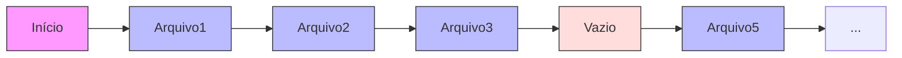
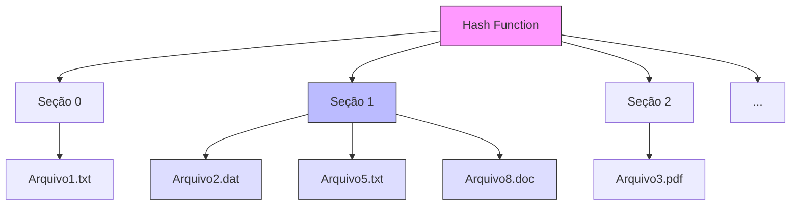
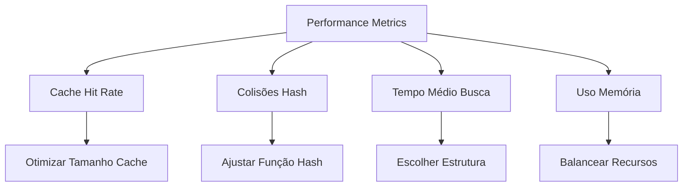

# 8.3 Implementação do Diretório: O Grande Catálogo

## Analogia Principal: A Biblioteca Universal

Imagine um sistema de diretórios como uma biblioteca gigante. A forma como organizamos os livros (arquivos) afeta drasticamente a velocidade com que os encontramos.

## 8.3.1 Lista Linear: A Estante Básica

### Analogia: Biblioteca com Uma Única Estante
Imagine uma biblioteca onde todos os livros estão em uma única estante longa, um após o outro.

#### Características Detalhadas
- **Organização**: 
  - Como livros em sequência
  - Cada livro tem uma "ficha catalográfica" (entrada de diretório)
  - A ordem pode ser aleatória ou alfabética
- **Busca**: 
  - Precisa olhar livro por livro
  - Em média, examina metade da coleção
  - Tempo de busca cresce linearmente (O(n))
- **Inserção**: 
  - Adiciona no final da estante
  - Precisa verificar duplicatas primeiro
  - Tempo constante se não ordenado (O(1))
- **Deleção**: 
  - Remove o livro e reorganiza
  - Pode deixar "espaços vazios" marcados
  - Ou compactar a estante movendo livros



### Implementação Detalhada em Java
```java
public class ListaLinearDiretorio {
    private List<ArquivoEntry> entradas = new ArrayList<>();
    private int espacosVazios = 0;
    
    public class ArquivoEntry {
        String nome;
        long ponteiro;
        boolean usado;
        long tamanho;
        long dataCriacao;
        long ultimoAcesso;
        
        public ArquivoEntry(String nome, long ponteiro) {
            this.nome = nome;
            this.ponteiro = ponteiro;
            this.usado = true;
            this.dataCriacao = System.currentTimeMillis();
            this.ultimoAcesso = this.dataCriacao;
        }
    }
    
    public void adicionarArquivo(String nome, long ponteiro) {
        // Como colocar um novo livro na estante
        if (buscarArquivo(nome) != null) {
            throw new RuntimeException("Arquivo já existe");
        }
        
        // Tenta reutilizar espaço vazio primeiro
        for (int i = 0; i < entradas.size(); i++) {
            if (!entradas.get(i).usado) {
                entradas.set(i, new ArquivoEntry(nome, ponteiro));
                espacosVazios--;
                return;
            }
        }
        
        // Se não encontrou espaço vazio, adiciona no final
        entradas.add(new ArquivoEntry(nome, ponteiro));
    }
    
    public ArquivoEntry buscarArquivo(String nome) {
        // Como procurar um livro olhando um por um
        for (ArquivoEntry entrada : entradas) {
            if (entrada.usado && entrada.nome.equals(nome)) {
                entrada.ultimoAcesso = System.currentTimeMillis();
                return entrada;
            }
        }
        return null;
    }
    
    public void deletarArquivo(String nome) {
        for (int i = 0; i < entradas.size(); i++) {
            ArquivoEntry entrada = entradas.get(i);
            if (entrada.usado && entrada.nome.equals(nome)) {
                // Opção 1: Marcar como não usado
                entrada.usado = false;
                espacosVazios++;
                
                // Opção 2: Compactar se muitos espaços vazios
                if (espacosVazios > entradas.size() / 3) {
                    compactarLista();
                }
                return;
            }
        }
        throw new RuntimeException("Arquivo não encontrado");
    }
    
    private void compactarLista() {
        List<ArquivoEntry> novaLista = new ArrayList<>();
        for (ArquivoEntry entrada : entradas) {
            if (entrada.usado) {
                novaLista.add(entrada);
            }
        }
        entradas = novaLista;
        espacosVazios = 0;
    }
}
```

## 8.3.2 Tabela Hash: O Catálogo Inteligente

### Analogia Detalhada: Biblioteca com Sistema de Códigos
Como uma biblioteca moderna onde cada livro tem um código baseado em suas características:
- Primeira letra do título determina a seção principal
- Comprimento do nome influencia a subseção
- Sistema similar ao ISBN dos livros

#### Características Detalhadas {id="caracter-sticas-detalhadas_1"}
- **Organização**: 
  - Sistema de códigos de localização
  - Divisão em seções predefinidas
  - Cada seção pode ter múltiplos livros
- **Busca**: 
  - Consulta direta pelo código
  - Tempo constante em média (O(1))
  - Pode degradar com muitas colisões
- **Colisões**: 
  - Como quando dois livros deveriam ocupar o mesmo espaço
  - Resolvido por encadeamento ou endereçamento aberto
  - Pode criar "listas secundárias"



### Implementação Detalhada em Java {id="implementa-o-detalhada-em-java_1"}
```java
public class HashDiretorio {
    private static final int TAMANHO_INICIAL = 64;
    private static final double FATOR_CARGA_MAXIMO = 0.75;
    private ArquivoEntry[] tabela;
    private int numeroEntradas;
    
    public class ArquivoEntry {
        String nome;
        long ponteiro;
        ArquivoEntry proximo; // Para encadeamento
        
        public ArquivoEntry(String nome, long ponteiro) {
            this.nome = nome;
            this.ponteiro = ponteiro;
        }
    }
    
    public HashDiretorio() {
        tabela = new ArquivoEntry[TAMANHO_INICIAL];
        numeroEntradas = 0;
    }
    
    private int calcularHash(String nome) {
        // Função hash mais sofisticada
        int hash = 0;
        for (char c : nome.toCharArray()) {
            hash = 31 * hash + c;
        }
        return Math.abs(hash % tabela.length);
    }
    
    public void adicionarArquivo(String nome, long ponteiro) {
        // Verifica necessidade de redimensionar
        if ((double)numeroEntradas / tabela.length >= FATOR_CARGA_MAXIMO) {
            redimensionarTabela();
        }
        
        int hash = calcularHash(nome);
        ArquivoEntry novaEntrada = new ArquivoEntry(nome, ponteiro);
        
        // Tratamento de colisão por encadeamento
        if (tabela[hash] == null) {
            tabela[hash] = novaEntrada;
        } else {
            // Adiciona no início da lista encadeada
            novaEntrada.proximo = tabela[hash];
            tabela[hash] = novaEntrada;
        }
        
        numeroEntradas++;
    }
    
    private void redimensionarTabela() {
        ArquivoEntry[] antigaTabela = tabela;
        tabela = new ArquivoEntry[antigaTabela.length * 2];
        numeroEntradas = 0;
        
        // Reinsere todas as entradas
        for (ArquivoEntry entrada : antigaTabela) {
            while (entrada != null) {
                adicionarArquivo(entrada.nome, entrada.ponteiro);
                entrada = entrada.proximo;
            }
        }
    }
    
    public ArquivoEntry buscarArquivo(String nome) {
        int hash = calcularHash(nome);
        ArquivoEntry entrada = tabela[hash];
        
        // Percorre a lista encadeada
        while (entrada != null) {
            if (entrada.nome.equals(nome)) {
                return entrada;
            }
            entrada = entrada.proximo;
        }
        
        return null;
    }
}
```

## Sistema Híbrido Avançado

### Implementação com Cache e Estatísticas
```java
public class SistemaHibridoDiretorio {
    private HashDiretorio hashPrincipal;
    private ListaLinearDiretorio overflow;
    private Map<String, ArquivoEntry> cache;
    private int cacheHits = 0;
    private int cacheMisses = 0;
    
    public class ArquivoEntry {
        String nome;
        long ponteiro;
        long ultimoAcesso;
        int acessos;
        
        public ArquivoEntry(String nome, long ponteiro) {
            this.nome = nome;
            this.ponteiro = ponteiro;
            this.ultimoAcesso = System.currentTimeMillis();
            this.acessos = 0;
        }
    }
    
    public SistemaHibridoDiretorio() {
        hashPrincipal = new HashDiretorio();
        overflow = new ListaLinearDiretorio();
        cache = new LinkedHashMap<String, ArquivoEntry>(16, 0.75f, true) {
            @Override
            protected boolean removeEldestEntry(Map.Entry eldest) {
                return size() > 100; // Limite do cache
            }
        };
    }
    
    public ArquivoEntry buscarArquivo(String nome) {
        // Tenta primeiro no cache
        ArquivoEntry entrada = cache.get(nome);
        if (entrada != null) {
            cacheHits++;
            entrada.acessos++;
            entrada.ultimoAcesso = System.currentTimeMillis();
            return entrada;
        }
        
        cacheMisses++;
        
        // Tenta na tabela hash
        entrada = hashPrincipal.buscarArquivo(nome);
        if (entrada == null) {
            // Tenta na área de overflow
            entrada = overflow.buscarArquivo(nome);
        }
        
        if (entrada != null) {
            cache.put(nome, entrada);
        }
        
        return entrada;
    }
    
    public void imprimirEstatisticas() {
        double hitRate = (double)cacheHits / (cacheHits + cacheMisses);
        System.out.printf("Cache Hit Rate: %.2f%%\n", hitRate * 100);
    }
}
```

## Considerações Avançadas de Performance

### 1. Otimização de Cache
- **Política LRU (Least Recently Used)**
  - Remove entradas menos usadas quando cache está cheio
  - Mantém arquivos populares sempre disponíveis
  - Implementado com LinkedHashMap

### 2. Estruturas Balanceadas
- **Árvore B para Diretórios Grandes**
  - Mantém profundidade balanceada
  - Ideal para milhões de arquivos
  - Combina busca rápida com inserção eficiente

### 3. Monitoramento de Performance


### 4. Considerações de Escala
- **Pequena Escala** (< 100 arquivos)
  - Lista Linear é suficiente
  - Simples e eficiente em memória
  - Fácil de manter e debugar

- **Média Escala** (100-10000 arquivos)
  - Tabela Hash com encadeamento
  - Cache LRU
  - Monitoramento básico

- **Grande Escala** (> 10000 arquivos)
  - Sistema Híbrido
  - Cache multinível
  - Árvores B ou similares
  - Monitoramento avançado
