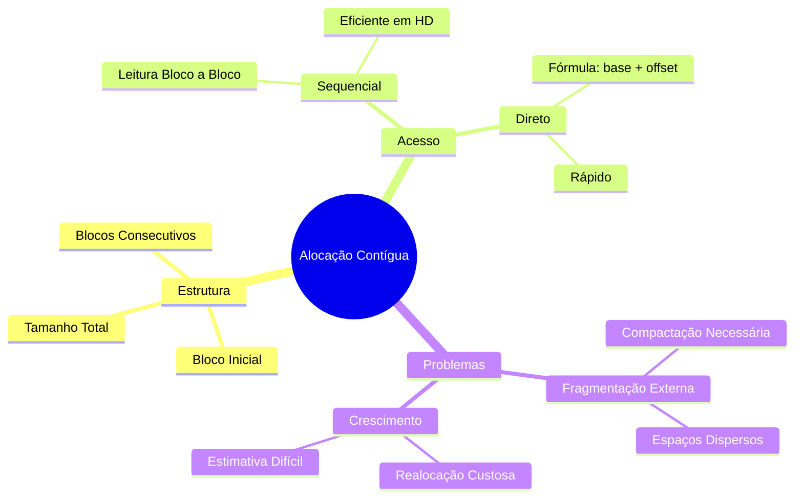
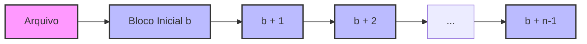
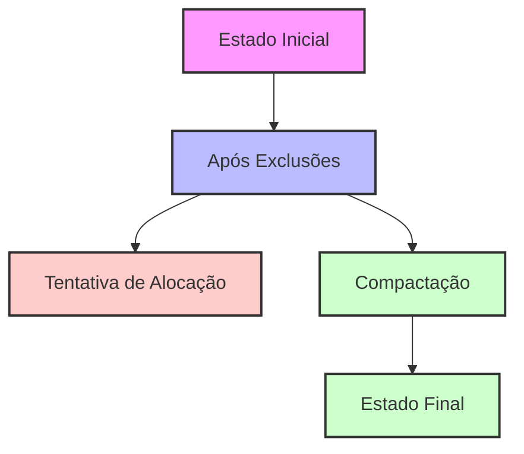
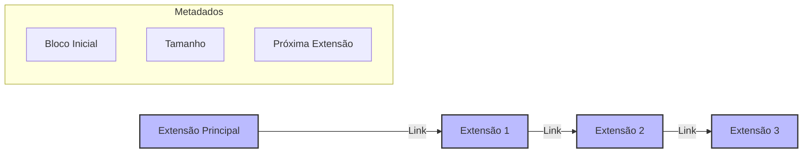
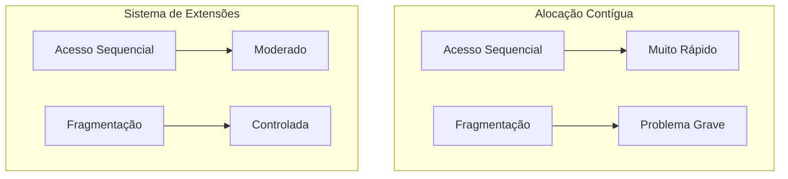
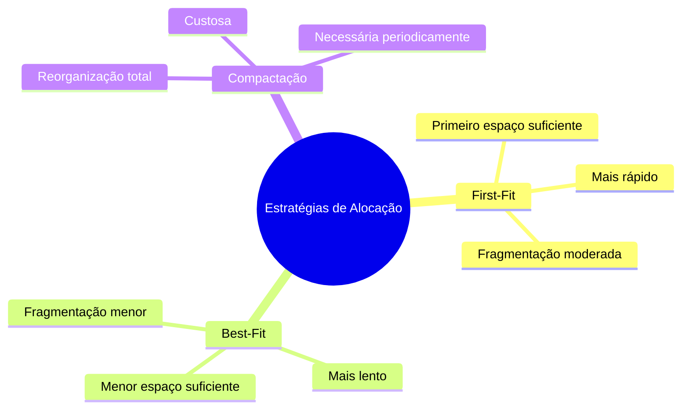

# 8.4.1 Alocação Contígua

## Conceito Básico
A alocação contígua requer que cada arquivo ocupe um conjunto de blocos contíguos no disco. O arquivo é definido por:
- Endereço do primeiro bloco
- Tamanho do arquivo (em blocos)

### Representação Visual

```ascii
+-------------+-------------+-------------+-------------+
|  Arquivo A  |  Arquivo B  |    Livre   |  Arquivo C  |
| (5 blocos)  | (3 blocos)  | (2 blocos) | (4 blocos)  |
+-------------+-------------+-------------+-------------+
      ↑
Bloco Inicial
```



## Funcionamento
- Se um arquivo tem `n` blocos e começa no bloco `b`, ocupará:
  - Blocos `b, b+1, b+2, ..., b+n-1`

### Exemplo de Alocação

```ascii
Diretório:
+-----------+-------------+----------+
| Arquivo   | Bloco Início| Tamanho  |
+-----------+-------------+----------+
| dados.txt |     2      |    3     |
| prog.exe  |     5      |    4     |
| temp.log  |     9      |    2     |
+-----------+-------------+----------+

Disco:
+---+---+---+---+---+---+---+---+---+---+---+
| 0 | 1 | D | D | D | P | P | P | P | T | T |
+---+---+---+---+---+---+---+---+---+---+---+
      ↑   dados.txt  ↑   prog.exe   ↑ temp.log
```



## Vantagens

### 1. Desempenho de Acesso
- Minimiza movimentação da cabeça de leitura/escrita
- Acesso sequencial muito eficiente
- Acesso direto simplificado
  - Para acessar bloco i: localização = bloco_inicial + i

### 2. Implementação Simples
- Requer apenas dois valores: início e tamanho
- Usado no VM/CMS da IBM por seu bom desempenho

## Desvantagens

### 1. Fragmentação Externa
- Espaço livre dividido em pequenos pedaços
- Solução: Compactação
  - Copiar sistema de arquivos para outro dispositivo
  - Realocar arquivos de volta contiguamente
  - Desvantagem: Processo demorado

### 2. Determinação de Tamanho
- Necessário conhecer tamanho final do arquivo na criação
- Problemas:
  - Subestimação: arquivo não pode crescer
  - Superestimação: desperdício de espaço (fragmentação interna)

### 3. Crescimento de Arquivo
Quando espaço é insuficiente:
1. Terminar programa com erro
2. Encontrar novo espaço maior e copiar arquivo
   - Processo pode ser lento
   - Transparente para usuário

## Problemas de Fragmentação

### Fragmentação Externa

```ascii
Antes da exclusão:
+-----+-----+-----+-----+
| A   | B   | C   | D   |
| 4KB | 8KB | 2KB | 6KB |
+-----+-----+-----+-----+

Após excluir B e C:
+-----+------+-----+
| A   | Livre| D   |
| 4KB | 10KB | 6KB |
+-----+------+-----+

Tentando alocar 12KB:
+-----+------+-----+
| A   | Livre| D   | ❌ Falha! Espaço existe,
| 4KB | 10KB | 6KB |    mas não contíguo
+-----+------+-----+
```



## Solução Moderna: Extensões

### Estrutura de Extensões

```ascii
Arquivo com Extensões:
+--------+     +--------+     +--------+
| Ext 1  | --> | Ext 2  | --> | Ext 3  |
| 4 KB   |     | 4 KB   |     | 4 KB   |
+--------+     +--------+     +--------+
```



### Comparação de Desempenho



## Estratégias de Gerenciamento

### First-Fit vs Best-Fit



### Processo de Compactação

```ascii
Antes:
+----+------+----+------+----+
| A  |Livre | B  |Livre | C  |
+----+------+----+------+----+

Durante:
+----+----+----+-------------+
| A  | B  | C  |    Livre    |
+----+----+----+-------------+
```

## Implementação Prática em Java

### Simulação de Alocação Contígua

```java
public class AlocacaoContigua {
    private static final int TAMANHO_DISCO = 1024;  // Tamanho total do disco em blocos
    private byte[] disco;                           // Simulação do disco
    private Map<String, ArquivoInfo> diretorio;    // Diretório de arquivos

    public class ArquivoInfo {
        String nome;
        int blocoInicial;
        int tamanho;

        public ArquivoInfo(String nome, int blocoInicial, int tamanho) {
            this.nome = nome;
            this.blocoInicial = blocoInicial;
            this.tamanho = tamanho;
        }
    }

    public AlocacaoContigua() {
        this.disco = new byte[TAMANHO_DISCO];
        this.diretorio = new HashMap<>();
    }

    public boolean criarArquivo(String nome, int tamanho) {
        // Encontrar espaço livre contíguo
        int blocoInicial = encontrarEspacoLivre(tamanho);
        if (blocoInicial == -1) {
            System.out.println("Erro: Não há espaço contíguo suficiente");
            return false;
        }

        // Alocar espaço
        for (int i = blocoInicial; i < blocoInicial + tamanho; i++) {
            disco[i] = 1; // Marca como ocupado
        }

        // Registrar no diretório
        diretorio.put(nome, new ArquivoInfo(nome, blocoInicial, tamanho));
        return true;
    }

    private int encontrarEspacoLivre(int tamanhoNecessario) {
        int contadorLivre = 0;
        int inicioAtual = 0;

        for (int i = 0; i < TAMANHO_DISCO; i++) {
            if (disco[i] == 0) { // Bloco livre
                if (contadorLivre == 0) {
                    inicioAtual = i;
                }
                contadorLivre++;
                if (contadorLivre == tamanhoNecessario) {
                    return inicioAtual;
                }
            } else {
                contadorLivre = 0;
            }
        }
        return -1;
    }

    public byte[] lerArquivo(String nome) {
        ArquivoInfo info = diretorio.get(nome);
        if (info == null) {
            return null;
        }

        byte[] dados = new byte[info.tamanho];
        System.arraycopy(disco, info.blocoInicial, dados, 0, info.tamanho);
        return dados;
    }

    public boolean deletarArquivo(String nome) {
        ArquivoInfo info = diretorio.get(nome);
        if (info == null) {
            return false;
        }

        // Liberar espaço
        for (int i = info.blocoInicial; i < info.blocoInicial + info.tamanho; i++) {
            disco[i] = 0; // Marca como livre
        }

        diretorio.remove(nome);
        return true;
    }

    public void mostrarFragmentacao() {
        int espacosLivres = 0;
        int fragmentosLivres = 0;
        boolean contandoEspaco = false;

        for (int i = 0; i < TAMANHO_DISCO; i++) {
            if (disco[i] == 0) {
                espacosLivres++;
                if (!contandoEspaco) {
                    fragmentosLivres++;
                    contandoEspaco = true;
                }
            } else {
                contandoEspaco = false;
            }
        }

        System.out.println("Espaços livres totais: " + espacosLivres);
        System.out.println("Número de fragmentos: " + fragmentosLivres);
    }

    public static void main(String[] args) {
        AlocacaoContigua sistema = new AlocacaoContigua();

        // Exemplo de uso
        sistema.criarArquivo("documento.txt", 100);
        sistema.criarArquivo("imagem.jpg", 200);
        sistema.mostrarFragmentacao();

        sistema.deletarArquivo("documento.txt");
        sistema.mostrarFragmentacao();

        // Tentar criar um arquivo grande
        boolean sucesso = sistema.criarArquivo("grande.dat", 300);
        System.out.println("Criação do arquivo grande: " + 
            (sucesso ? "Sucesso" : "Falha"));
    }
}
```

Este exemplo demonstra:
1. **Gerenciamento de Espaço**: Simula um disco com blocos e mantém registro de espaço livre
2. **Alocação Contígua**: Garante que os blocos sejam alocados sequencialmente
3. **Fragmentação**: Monitora e exibe informações sobre fragmentação
4. **Operações Básicas**: Criar, ler e deletar arquivos

### Exemplo de Uso:
```java
AlocacaoContigua sistema = new AlocacaoContigua();

// Criar alguns arquivos
sistema.criarArquivo("doc1.txt", 50);
sistema.criarArquivo("doc2.txt", 30);

// Verificar fragmentação
sistema.mostrarFragmentacao();

// Deletar um arquivo
sistema.deletarArquivo("doc1.txt");

// Tentar criar novo arquivo
sistema.criarArquivo("doc3.txt", 40);
```