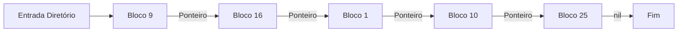
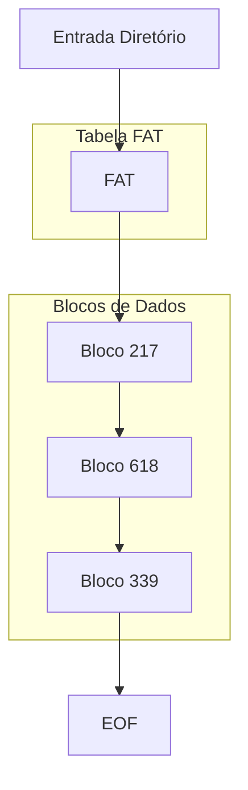
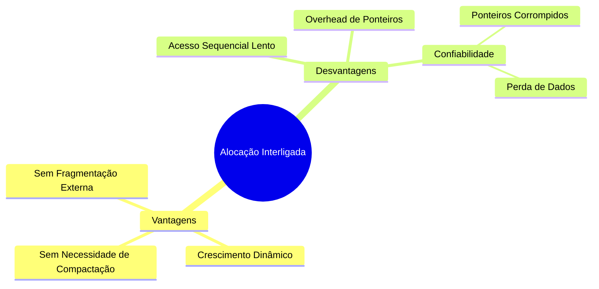
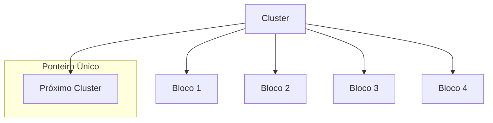
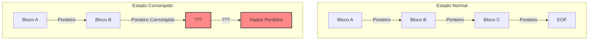
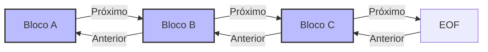

# 8.4.2 Alocação Interligada

## Conceito Básico
A alocação interligada resolve os problemas da alocação contígua usando uma lista encadeada de blocos que podem estar dispersos pelo disco.

### Estrutura Básica

```ascii
Diretório:
+-------------+--------------+--------------+
| Nome        | Primeiro     | Último       |
| Arquivo     | Bloco        | Bloco        |
+-------------+--------------+--------------+
| arquivo.txt |     9        |     25       |
+-------------+--------------+--------------+

Blocos no Disco:
+-----+     +-----+     +-----+     +-----+     +-----+
| B9  | --> | B16 | --> | B1  | --> | B10 | --> | B25 |
+-----+     +-----+     +-----+     +-----+     +-----+
```



## Estrutura do Bloco

```ascii
Bloco de 512 bytes:
+------------------+------------------------+
| Ponteiro (4B)    | Dados (508B)          |
+------------------+------------------------+
```

## Sistema FAT (File Allocation Table)

```ascii
Tabela FAT:
+-------+----------+
| Bloco | Próximo  |
+-------+----------+
| 217   |   618    |
| 618   |   339    |
| 339   |   EOF    |
+-------+----------+
```



## Vantagens e Desvantagens



## Clusters para Otimização

```ascii
Cluster (4 blocos):
+------+------+------+------+
|Bloco |Bloco |Bloco |Bloco | Ponteiro único
|  1   |  2   |  3   |  4   | para o cluster
+------+------+------+------+
```



## Problemas de Confiabilidade

```ascii
Cenário de Corrupção:
Normal:    A -> B -> C -> D -> EOF
Corrompido: A -> B -> X -> ? -> ?
                  ↓
              Lista Livre
```



## Solução: Lista Duplamente Encadeada

```ascii
+--------+        +--------+        +--------+
|   A    | <---> |   B    | <---> |   C    |
+--------+        +--------+        +--------+
```



## Implementação Prática em Java

### Simulação de Alocação Interligada

```java
public class AlocacaoInterligada {
    private static final int TAMANHO_DISCO = 1024;
    private Bloco[] disco;
    private Map<String, Integer> diretorio; // Nome do arquivo -> Primeiro bloco
    private List<Integer> blocosLivres;

    public class Bloco {
        byte[] dados;
        int proximoBloco;
        boolean ocupado;

        public Bloco() {
            this.dados = new byte[508]; // 512 - 4 bytes para ponteiro
            this.proximoBloco = -1;
            this.ocupado = false;
        }
    }

    public AlocacaoInterligada() {
        this.disco = new Bloco[TAMANHO_DISCO];
        this.diretorio = new HashMap<>();
        this.blocosLivres = new ArrayList<>();

        // Inicializar disco
        for (int i = 0; i < TAMANHO_DISCO; i++) {
            disco[i] = new Bloco();
            blocosLivres.add(i);
        }
    }

    public boolean criarArquivo(String nome, byte[] dados) {
        if (diretorio.containsKey(nome)) {
            return false;
        }

        int numBlocosNecessarios = (int) Math.ceil(dados.length / 508.0);
        if (blocosLivres.size() < numBlocosNecessarios) {
            return false;
        }

        int primeiroBloco = alocarBlocos(dados);
        if (primeiroBloco != -1) {
            diretorio.put(nome, primeiroBloco);
            return true;
        }
        return false;
    }

    private int alocarBlocos(byte[] dados) {
        if (blocosLivres.isEmpty()) {
            return -1;
        }

        int primeiroBloco = blocosLivres.remove(0);
        int blocoAtual = primeiroBloco;
        int posicaoDados = 0;

        while (posicaoDados < dados.length) {
            Bloco bloco = disco[blocoAtual];
            bloco.ocupado = true;

            // Copiar dados para o bloco
            int copiarQuantidade = Math.min(508, dados.length - posicaoDados);
            System.arraycopy(dados, posicaoDados, bloco.dados, 0, copiarQuantidade);
            posicaoDados += copiarQuantidade;

            // Se ainda há dados, alocar próximo bloco
            if (posicaoDados < dados.length) {
                if (blocosLivres.isEmpty()) {
                    // Falha: liberar blocos alocados
                    liberarBlocos(primeiroBloco);
                    return -1;
                }
                int proximoBloco = blocosLivres.remove(0);
                bloco.proximoBloco = proximoBloco;
                blocoAtual = proximoBloco;
            }
        }

        return primeiroBloco;
    }

    public byte[] lerArquivo(String nome) {
        Integer primeiroBloco = diretorio.get(nome);
        if (primeiroBloco == null) {
            return null;
        }

        ByteArrayOutputStream dados = new ByteArrayOutputStream();
        int blocoAtual = primeiroBloco;

        while (blocoAtual != -1) {
            Bloco bloco = disco[blocoAtual];
            dados.write(bloco.dados, 0, 508);
            blocoAtual = bloco.proximoBloco;
        }

        return dados.toByteArray();
    }

    public boolean deletarArquivo(String nome) {
        Integer primeiroBloco = diretorio.remove(nome);
        if (primeiroBloco == null) {
            return false;
        }

        liberarBlocos(primeiroBloco);
        return true;
    }

    private void liberarBlocos(int primeiroBloco) {
        int blocoAtual = primeiroBloco;
        while (blocoAtual != -1) {
            Bloco bloco = disco[blocoAtual];
            int proximoBloco = bloco.proximoBloco;
            
            // Limpar bloco
            bloco.ocupado = false;
            bloco.proximoBloco = -1;
            Arrays.fill(bloco.dados, (byte) 0);
            
            // Adicionar à lista de blocos livres
            blocosLivres.add(blocoAtual);
            
            blocoAtual = proximoBloco;
        }
    }

    public void mostrarEstatisticas() {
        int blocosOcupados = TAMANHO_DISCO - blocosLivres.size();
        System.out.println("Estatísticas do Disco:");
        System.out.println("Blocos Totais: " + TAMANHO_DISCO);
        System.out.println("Blocos Ocupados: " + blocosOcupados);
        System.out.println("Blocos Livres: " + blocosLivres.size());
    }

    public static void main(String[] args) {
        AlocacaoInterligada sistema = new AlocacaoInterligada();

        // Exemplo de uso
        byte[] dados1 = "Este é um arquivo de teste".getBytes();
        byte[] dados2 = "Outro arquivo para testar a alocação interligada".getBytes();

        sistema.criarArquivo("teste1.txt", dados1);
        sistema.criarArquivo("teste2.txt", dados2);
        sistema.mostrarEstatisticas();

        // Ler arquivo
        byte[] dadosLidos = sistema.lerArquivo("teste1.txt");
        System.out.println("Conteúdo lido: " + new String(dadosLidos));

        // Deletar arquivo
        sistema.deletarArquivo("teste1.txt");
        sistema.mostrarEstatisticas();
    }
}
```

Este exemplo demonstra:
1. **Lista Encadeada**: Implementação de blocos interligados
2. **Gerenciamento de Espaço**: Lista de blocos livres
3. **Operações de Arquivo**: Criar, ler e deletar
4. **Fragmentação**: Não há fragmentação externa

### Exemplo de Uso:
```java
AlocacaoInterligada sistema = new AlocacaoInterligada();

// Criar arquivo
byte[] dados = "Conteúdo do arquivo".getBytes();
sistema.criarArquivo("documento.txt", dados);

// Ler arquivo
byte[] dadosLidos = sistema.lerArquivo("documento.txt");
System.out.println(new String(dadosLidos));

// Deletar arquivo
sistema.deletarArquivo("documento.txt");
```


