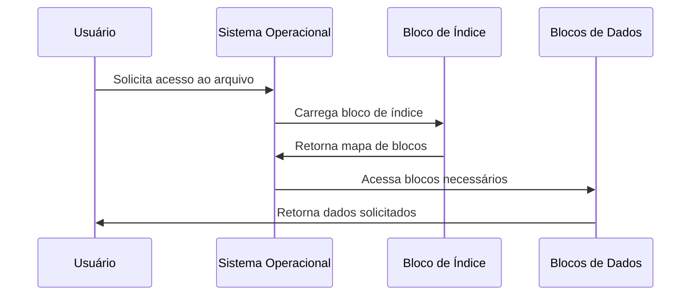
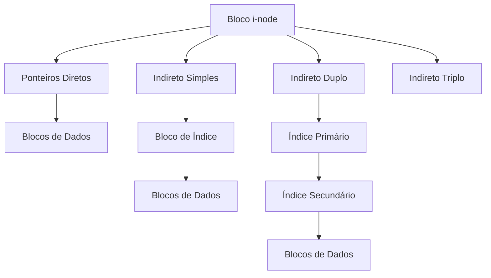

# 8.4.3 Alocação Indexada

A alocação indexada é um método sofisticado de gerenciamento de arquivos que resolve várias limitações encontradas nas alocações contígua e encadeada. Imagine um índice de um livro: assim como você pode encontrar rapidamente um capítulo específico consultando o índice, a alocação indexada permite localizar rapidamente qualquer parte de um arquivo através de uma tabela de índices.

## Funcionamento Básico

### Estrutura Principal
Cada arquivo possui um bloco especial chamado "bloco de índice" que contém:
- Ponteiros para todos os blocos de dados do arquivo
- Informações sobre a ordem dos blocos
- Metadados sobre a alocação

```ascii
Estrutura do Sistema:
+----------------+     +-----------------+     +-----------------+
| Entrada        | →   | Bloco de        | →   | Blocos de       |
| Diretório      |     | Índice          |     | Dados           |
+----------------+     +-----------------+     +-----------------+
| nome: doc.txt  |     | [0] → Bloco 7   |     | Conteúdo Real   |
| índice: 12     |     | [1] → Bloco 3   |     | do Arquivo      |
+----------------+     | [2] → Bloco 9   |     | Distribuído     |
                       +-----------------+     | em Blocos       |
                                               +-----------------+
```

### Processo de Acesso
1. O sistema localiza a entrada do diretório do arquivo
2. Obtém o número do bloco de índice
3. Carrega o bloco de índice na memória
4. Usa os ponteiros para acessar os blocos de dados



## Variações de Implementação

### 1. Índice de Nível Único
- **Descrição**: Um único bloco de índice com ponteiros diretos
- **Limitação**: Tamanho máximo do arquivo limitado pelo tamanho do bloco de índice
- **Exemplo**:
  ```ascii
  Bloco de Índice (1KB, ponteiros de 4 bytes):
  +-------------------+
  | 256 ponteiros     | → Máximo de 256KB (com blocos de 1KB)
  +-------------------+
  ```

### 2. Índice Multinível
- **Descrição**: Hierarquia de blocos de índice
- **Vantagem**: Suporta arquivos muito maiores
- **Estrutura**:
  ```ascii
  Índice Principal
  +---------------+
  | P1 | P2 | P3  |
  +---------------+
        ↓
  Índices Secundários
  +---------------+
  | B1 | B2 | B3  |
  +---------------+
        ↓
  Blocos de Dados
  ```

### 3. Esquema Combinado (como no Unix)
- **Descrição**: Mistura diferentes técnicas de endereçamento
- **Componentes**:
  - Ponteiros diretos para blocos pequenos
  - Ponteiros indiretos simples
  - Ponteiros indiretos duplos
  - Ponteiros indiretos triplos



## Análise Detalhada

### Vantagens
1. **Acesso Direto Eficiente**
   - Localização rápida de qualquer bloco
   - Tempo constante para acesso aleatório

2. **Sem Fragmentação Externa**
   - Blocos podem estar em qualquer lugar
   - Melhor utilização do espaço em disco

3. **Flexibilidade**
   - Fácil expansão de arquivos
   - Suporte a arquivos esparsos

### Desvantagens
1. **Overhead de Espaço**
   - Necessidade de blocos extras para índices
   - Maior consumo para arquivos pequenos

2. **Complexidade de Implementação**
   - Gerenciamento de múltiplos níveis
   - Necessidade de cache de índices

3. **Overhead de Desempenho**
   - Múltiplos acessos ao disco
   - Manutenção de estruturas complexas

## Considerações Práticas

### Otimizações Comuns
1. **Cache de Índices**
   ```java
   class IndexCache {
       private Map<Integer, IndexBlock> cache;
       private int maxSize;
       
       public byte[] readBlock(int fileId, int blockNumber) {
           IndexBlock index = cache.get(fileId);
           if (index == null) {
               index = loadIndexFromDisk(fileId);
               cache.put(fileId, index);
           }
           return readDataBlock(index.getBlockPointer(blockNumber));
       }
   }
   ```

2. **Pré-alocação de Índices**
   - Reserva de espaço para crescimento
   - Redução de fragmentação

3. **Compressão de Índices**
   - Técnicas de compressão para índices
   - Otimização para arquivos pequenos

### Recuperação de Falhas
1. **Checkpoints**
   - Salvamento periódico do estado
   - Pontos de recuperação consistentes

2. **Journaling**
   - Registro de alterações
   - Recuperação consistente

3. **Redundância**
   - Cópias de segurança de índices
   - Verificação de integridade

## Implementação em Java

### Estrutura Básica do Sistema de Arquivos Indexado

```java
public class SistemaArquivosIndexado {
    private static final int TAMANHO_BLOCO = 1024;
    private static final int PONTEIROS_POR_INDICE = TAMANHO_BLOCO / 4; // 4 bytes por ponteiro

    private class BlocoIndice {
        int[] ponteiros;
        
        public BlocoIndice() {
            ponteiros = new int[PONTEIROS_POR_INDICE];
        }
    }

    private class Arquivo {
        String nome;
        int blocoIndice;
        int tamanho;

        public Arquivo(String nome, int blocoIndice) {
            this.nome = nome;
            this.blocoIndice = blocoIndice;
            this.tamanho = 0;
        }
    }

    private Map<String, Arquivo> diretorio;
    private byte[][] disco;
    private List<Integer> blocosLivres;

    public SistemaArquivosIndexado(int numBlocos) {
        diretorio = new HashMap<>();
        disco = new byte[numBlocos][TAMANHO_BLOCO];
        blocosLivres = new ArrayList<>();
        for (int i = 0; i < numBlocos; i++) {
            blocosLivres.add(i);
        }
    }

    public boolean criarArquivo(String nome) {
        if (diretorio.containsKey(nome) || blocosLivres.isEmpty()) {
            return false;
        }

        int blocoIndice = alocarBloco();
        if (blocoIndice != -1) {
            diretorio.put(nome, new Arquivo(nome, blocoIndice));
            return true;
        }
        return false;
    }

    public boolean escreverArquivo(String nome, byte[] dados) {
        Arquivo arquivo = diretorio.get(nome);
        if (arquivo == null) {
            return false;
        }

        int numBlocosNecessarios = (int) Math.ceil(dados.length / (double) TAMANHO_BLOCO);
        if (blocosLivres.size() < numBlocosNecessarios) {
            return false;
        }

        BlocoIndice indice = new BlocoIndice();
        int offset = 0;
        
        for (int i = 0; i < numBlocosNecessarios; i++) {
            int novoBloco = alocarBloco();
            indice.ponteiros[i] = novoBloco;
            
            int tamanhoBloco = Math.min(TAMANHO_BLOCO, dados.length - offset);
            System.arraycopy(dados, offset, disco[novoBloco], 0, tamanhoBloco);
            offset += tamanhoBloco;
        }

        // Salvar bloco de índice
        byte[] indiceBytes = converterIndiceParaBytes(indice);
        System.arraycopy(indiceBytes, 0, disco[arquivo.blocoIndice], 0, indiceBytes.length);
        arquivo.tamanho = dados.length;
        
        return true;
    }

    private int alocarBloco() {
        if (blocosLivres.isEmpty()) {
            return -1;
        }
        return blocosLivres.remove(0);
    }

    private byte[] converterIndiceParaBytes(BlocoIndice indice) {
        ByteBuffer buffer = ByteBuffer.allocate(TAMANHO_BLOCO);
        for (int ponteiro : indice.ponteiros) {
            buffer.putInt(ponteiro);
        }
        return buffer.array();
    }
}
```

### Exemplo de Uso

```java
public static void main(String[] args) {
    SistemaArquivosIndexado sistema = new SistemaArquivosIndexado(1000);
    
    // Criar e escrever em um arquivo
    sistema.criarArquivo("documento.txt");
    String conteudo = "Este é um exemplo de conteúdo para testar o sistema de arquivos indexado.";
    sistema.escreverArquivo("documento.txt", conteudo.getBytes());
    
    // Demonstrar acesso direto
    byte[] dadosLidos = sistema.lerBlocoEspecifico("documento.txt", 2);
    System.out.println("Conteúdo do bloco 2: " + new String(dadosLidos));
}
```

## Considerações de Desempenho

### Análise de Complexidade
1. **Acesso Direto**: O(1) para localizar qualquer bloco
2. **Criação de Arquivo**: O(1) para alocação inicial
3. **Expansão**: O(1) para adicionar novos blocos
4. **Overhead de Espaço**: 
   - 1 bloco de índice por arquivo
   - Adicional para índices multinível

### Otimizações de Cache
1. **Cache de Blocos de Índice**
2. **Prefetching de Blocos**
3. **Buffer de Escrita**

## Conclusão
A alocação indexada oferece um equilíbrio entre:
- Eficiência de acesso
- Flexibilidade de crescimento
- Complexidade gerenciável
- Recuperação de falhas

É especialmente adequada para:
- Sistemas de arquivos modernos
- Acesso aleatório frequente
- Arquivos de tamanho variável
