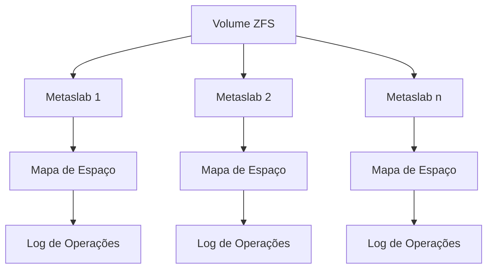

# 8.5.5 Mapas de Espaço

## Conceito Básico

O ZFS (Zettabyte File System) implementa uma abordagem sofisticada para gerenciamento de espaço livre, combinando várias técnicas para otimizar o desempenho em grandes escalas.

## Componentes Principais

### 1. Metaslabs
- Divisões do espaço em disco em unidades gerenciáveis
- Cada volume pode conter centenas de metaslabs
- Cada metaslab possui seu próprio mapa de espaço

### 2. Mapas de Espaço
- Implementados como logs de atividade de blocos
- Registram operações de alocação e liberação
- Utilizam formato de contagem
- Armazenados em estrutura orientada a log



## Funcionamento

### Processo de Alocação/Liberação
1. Carregamento do mapa de espaço na memória
2. Conversão para estrutura de árvore balanceada
3. Reprodução do log na estrutura
4. Condensação de blocos contíguos
5. Atualização transacional no disco

```java
public class MetaSlab {
    private static class MapaEspaco {
        private TreeMap<Long, Long> arvoreBalanceada; // offset -> tamanho
        private List<Operacao> log;
        
        public MapaEspaco() {
            this.arvoreBalanceada = new TreeMap<>();
            this.log = new ArrayList<>();
        }
        
        public void registrarOperacao(TipoOperacao tipo, long offset, long tamanho) {
            Operacao op = new Operacao(tipo, offset, tamanho);
            log.add(op);
            
            // Atualiza árvore balanceada em memória
            if (tipo == TipoOperacao.LIBERACAO) {
                adicionarEspacoLivre(offset, tamanho);
            } else {
                removerEspacoLivre(offset, tamanho);
            }
        }
        
        private void adicionarEspacoLivre(long offset, long tamanho) {
            // Tenta mesclar com blocos adjacentes
            Map.Entry<Long, Long> anterior = arvoreBalanceada.floorEntry(offset);
            Map.Entry<Long, Long> proximo = arvoreBalanceada.ceilingEntry(offset + tamanho);
            
            long novoOffset = offset;
            long novoTamanho = tamanho;
            
            if (anterior != null && anterior.getKey() + anterior.getValue() == offset) {
                novoOffset = anterior.getKey();
                novoTamanho += anterior.getValue();
                arvoreBalanceada.remove(anterior.getKey());
            }
            
            if (proximo != null && offset + tamanho == proximo.getKey()) {
                novoTamanho += proximo.getValue();
                arvoreBalanceada.remove(proximo.getKey());
            }
            
            arvoreBalanceada.put(novoOffset, novoTamanho);
        }
        
        private void removerEspacoLivre(long offset, long tamanho) {
            // Implementação da remoção de espaço livre
            Map.Entry<Long, Long> bloco = arvoreBalanceada.floorEntry(offset);
            if (bloco != null) {
                long blocoOffset = bloco.getKey();
                long blocoTamanho = bloco.getValue();
                
                arvoreBalanceada.remove(blocoOffset);
                
                // Adiciona blocos remanescentes, se houver
                if (blocoOffset < offset) {
                    arvoreBalanceada.put(blocoOffset, offset - blocoOffset);
                }
                if (offset + tamanho < blocoOffset + blocoTamanho) {
                    arvoreBalanceada.put(offset + tamanho, 
                        (blocoOffset + blocoTamanho) - (offset + tamanho));
                }
            }
        }
    }
    
    private static class Operacao {
        TipoOperacao tipo;
        long offset;
        long tamanho;
        
        Operacao(TipoOperacao tipo, long offset, long tamanho) {
            this.tipo = tipo;
            this.offset = offset;
            this.tamanho = tamanho;
        }
    }
    
    private enum TipoOperacao {
        ALOCACAO,
        LIBERACAO
    }
}
```

## Vantagens

1. **Eficiência em Grande Escala**
   - Gerencia eficientemente grandes volumes de dados
   - Minimiza E/S de metadados

2. **Consistência**
   - Operações transacionais garantem integridade
   - Log mantém histórico de operações

3. **Otimização de Desempenho**
   - Estrutura em árvore balanceada para operações rápidas
   - Condensação automática de blocos contíguos

4. **Escalabilidade**
   - Divisão em metaslabs facilita gerenciamento
   - Estrutura hierárquica eficiente

## Considerações de Implementação

1. **Gestão de Memória**
   - Carregamento seletivo de metaslabs
   - Cache eficiente de mapas ativos

2. **Consistência de Dados**
   - Logging transacional
   - Recuperação após falhas

3. **Otimização de E/S**
   - Minimização de escritas de metadados
   - Agrupamento de operações relacionadas