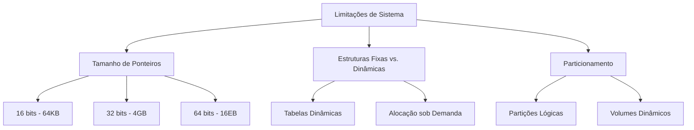

# 8.6 Eficiência e Desempenho

## Visão Geral

O desempenho do sistema de arquivos é crucial, pois os discos frequentemente representam um gargalo significativo no sistema. Esta seção explora técnicas para otimização de eficiência e desempenho.

## 8.6.1 Eficiência

### Considerações de Design

1. **Alocação de Estruturas**
   - Pré-alocação vs. Alocação Dinâmica
   - Trade-off entre espaço e desempenho
   - Exemplo: inodes do UNIX

2. **Tamanho de Clusters**
   ```java
   public class ClusterManager {
       private static final int MIN_CLUSTER_SIZE = 4096;  // 4KB
       private static final int MAX_CLUSTER_SIZE = 65536; // 64KB
       
       public int calcularTamanhoCluster(long tamanhoArquivo) {
           if (tamanhoArquivo < MIN_CLUSTER_SIZE) {
               return MIN_CLUSTER_SIZE;
           } else if (tamanhoArquivo < MAX_CLUSTER_SIZE) {
               // Aumenta gradualmente o tamanho do cluster
               return Math.min(
                   nextPowerOfTwo(tamanhoArquivo),
                   MAX_CLUSTER_SIZE
               );
           }
           return MAX_CLUSTER_SIZE;
       }
       
       private int nextPowerOfTwo(long n) {
           int power = MIN_CLUSTER_SIZE;
           while (power < n && power < MAX_CLUSTER_SIZE) {
               power *= 2;
           }
           return power;
       }
   }
   ```

3. **Metadados**
   - Timestamps (último acesso, modificação)
   - Impacto na performance de I/O
   - Estruturas de ponteiros

### Limitações e Escalabilidade



## 8.6.2 Desempenho

### Técnicas de Cache

1. **Cache Unificado**
   ```java
   public class UnifiedCache {
       private static final int PAGE_SIZE = 4096;
       private Map<Long, byte[]> pageCache;
       private int maxPages;
       
       public UnifiedCache(int memoriaMaxima) {
           this.maxPages = memoriaMaxima / PAGE_SIZE;
           this.pageCache = new LinkedHashMap<Long, byte[]>(maxPages, 0.75f, true) {
               @Override
               protected boolean removeEldestEntry(Map.Entry<Long, byte[]> eldest) {
                   return size() > maxPages;
               }
           };
       }
       
       public synchronized void cachePage(long pageNumber, byte[] data) {
           pageCache.put(pageNumber, data.clone());
       }
       
       public synchronized byte[] getPage(long pageNumber) {
           byte[] data = pageCache.get(pageNumber);
           return data != null ? data.clone() : null;
       }
   }
   ```

2. **Otimizações de Leitura/Escrita**
   ```java
   public class IOOptimizer {
       private static final int READ_AHEAD_PAGES = 4;
       private Queue<byte[]> readAheadBuffer;
       private boolean enableReadAhead;
       
       public void configureReadAhead(boolean enable) {
           this.enableReadAhead = enable;
           if (enable && readAheadBuffer == null) {
               readAheadBuffer = new LinkedList<>();
           }
       }
       
       public void readWithOptimization(File file, long offset) throws IOException {
           if (enableReadAhead) {
               // Implementa read-ahead
               for (int i = 0; i < READ_AHEAD_PAGES; i++) {
                   byte[] page = readPage(file, offset + (i * PAGE_SIZE));
                   readAheadBuffer.offer(page);
               }
           }
           // Implementa free-behind
           while (readAheadBuffer.size() > READ_AHEAD_PAGES) {
               readAheadBuffer.poll();
           }
       }
   }
   ```

### Estratégias de Otimização

1. **Cache de Disco**
   - Cache local no controlador
   - Cache de trilhas completas
   - Redução de latência

2. **Cache de Memória**
   - Buffer cache vs. Page cache
   - Memória virtual unificada
   - Algoritmos de substituição

3. **E/S Assíncrona**
   ```java
   public class AsyncIO {
       private ExecutorService ioExecutor;
       private boolean syncWrites;
       
       public AsyncIO(boolean syncWrites) {
           this.syncWrites = syncWrites;
           this.ioExecutor = Executors.newFixedThreadPool(
               Runtime.getRuntime().availableProcessors()
           );
       }
       
       public Future<Integer> write(byte[] data, long position) {
           if (syncWrites) {
               return CompletableFuture.completedFuture(
                   writeSync(data, position)
               );
           }
           
           return ioExecutor.submit(() -> writeAsync(data, position));
       }
       
       private int writeSync(byte[] data, long position) {
           // Implementação de escrita síncrona
           return 0;
       }
       
       private int writeAsync(byte[] data, long position) {
           // Implementação de escrita assíncrona
           return 0;
       }
   }
   ```

## Considerações de Implementação

1. **Balanceamento de Recursos**
   - Memória vs. I/O
   - Cache vs. Throughput
   - Latência vs. Consistência

2. **Monitoramento**
   - Métricas de desempenho
   - Ajuste dinâmico
   - Detecção de gargalos

3. **Recuperação**
   - Consistência de dados
   - Journaling
   - Checkpoints