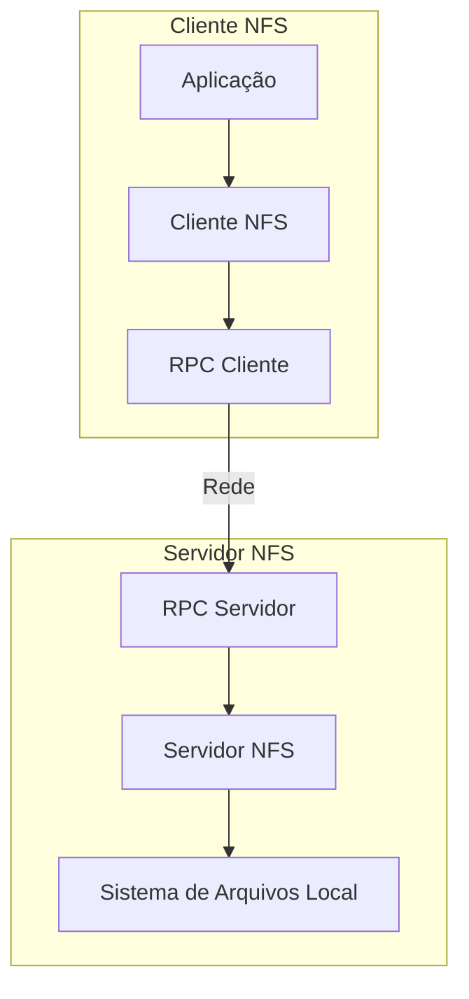
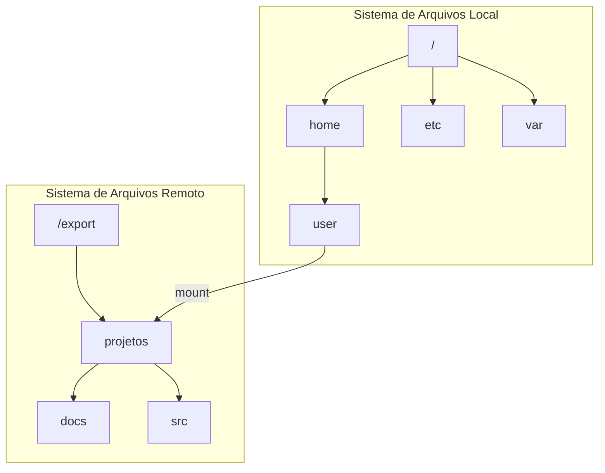
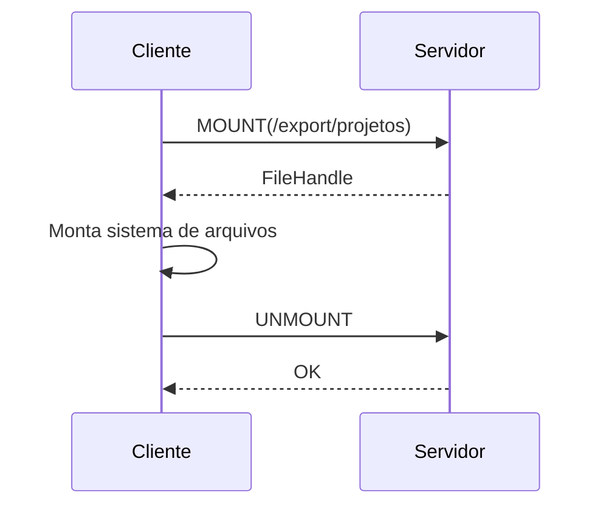
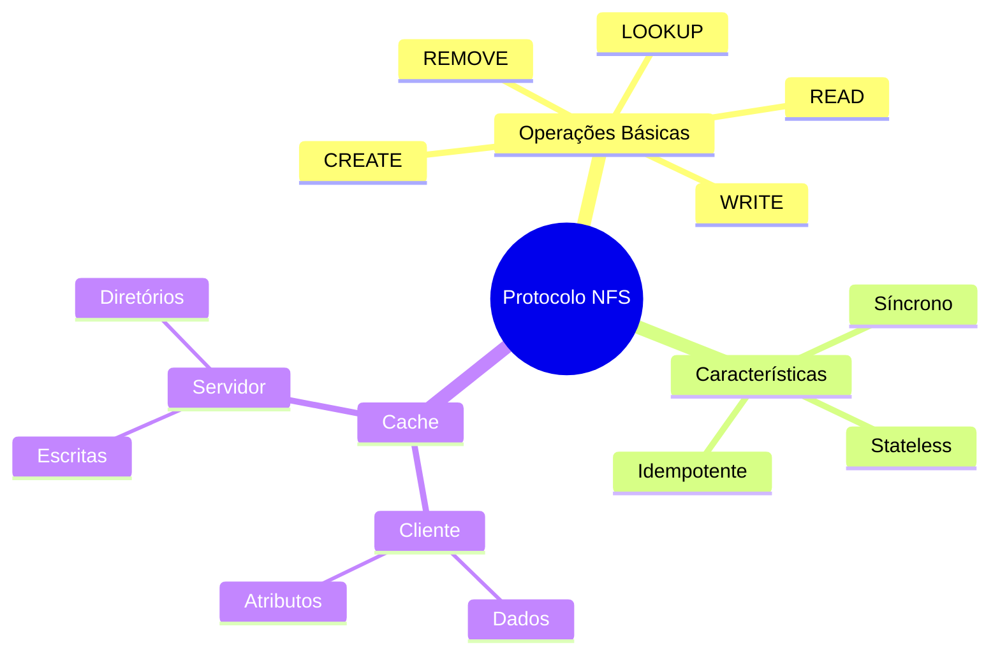
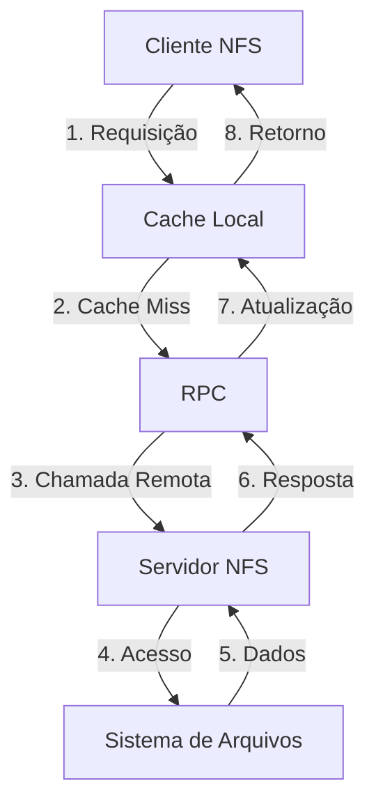
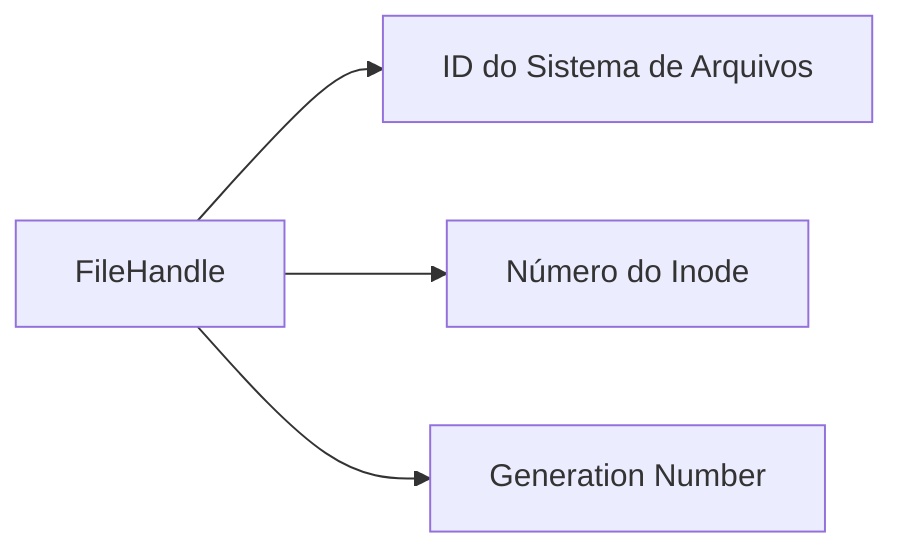
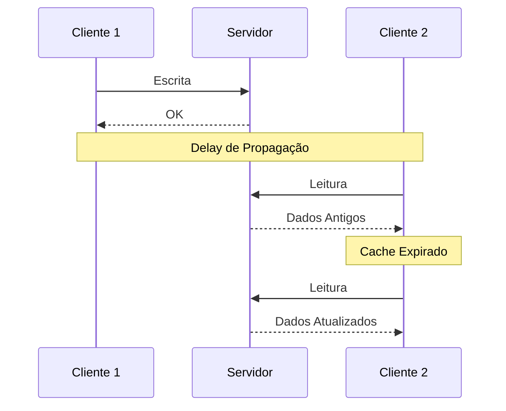
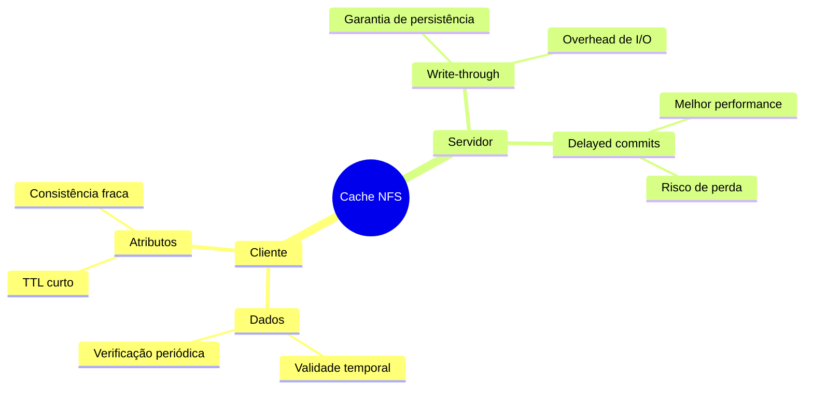
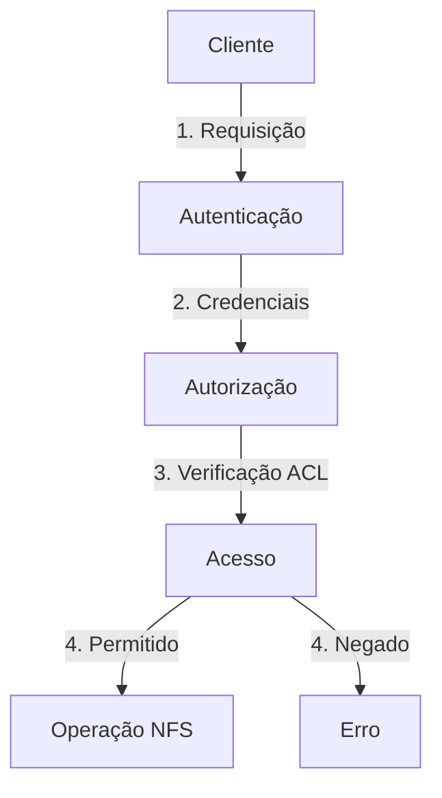

# 8.8 NFS (Network File System)

## 1. Visão Geral
- Sistema cliente-servidor para acesso a arquivos remotos via LAN/WAN
- Parte do ONC+ com suporte em UNIX e alguns sistemas PC
- Versão 3 é a mais utilizada (texto descreve esta versão)
- Permite compartilhamento transparente entre máquinas independentes



## 2. Características Principais

### 2.1 Montagem
- Cliente precisa executar operação de montagem para acessar diretório remoto
- Diretório remoto aparece como subárvore do sistema local
- Suporta montagens em cascata (montar sobre outro sistema já montado)
- Independente de implementação através de RPC e XDR



### 2.2 Protocolos

#### 2.2.1 Protocolo de Montagem
- Estabelece conexão inicial cliente-servidor
- Gerencia lista de exportação (/etc/dfs/dfstab)
- Mantém controle de montagens ativas



#### 2.2.2 Protocolo NFS
- Operações com arquivos remotos
- Servidor é stateless (sem estado)
- Operações síncronas para garantir consistência



## 3. Implementação

### 3.1 Operações Principais
```java
public interface NFSOperations {
    FileHandle lookup(String path);
    DirectoryEntry[] readDirectory(FileHandle dir);
    void manipulateLinks(FileHandle link);
    FileAttributes getAttributes(FileHandle file);
    byte[] readFile(FileHandle file, long offset, int length);
    void writeFile(FileHandle file, long offset, byte[] data);
}
```

### 3.2 Características de Implementação



### 3.3 Estrutura de FileHandle



## 4. Considerações de Consistência

### 4.1 Modelo de Consistência
- Novos arquivos podem demorar até 30s para serem visíveis
- Não garante semântica UNIX estrita
- Escritas podem não ser imediatamente visíveis em outras máquinas
- Recomenda-se uso de mecanismos externos para controle de concorrência



### 4.2 Estratégias de Cache



## 5. Segurança e Autenticação

### 5.1 Mecanismos de Segurança
- Autenticação UNIX (UID/GID)
- Kerberos opcional
- Lista de controle de acesso
- Exportação seletiva

