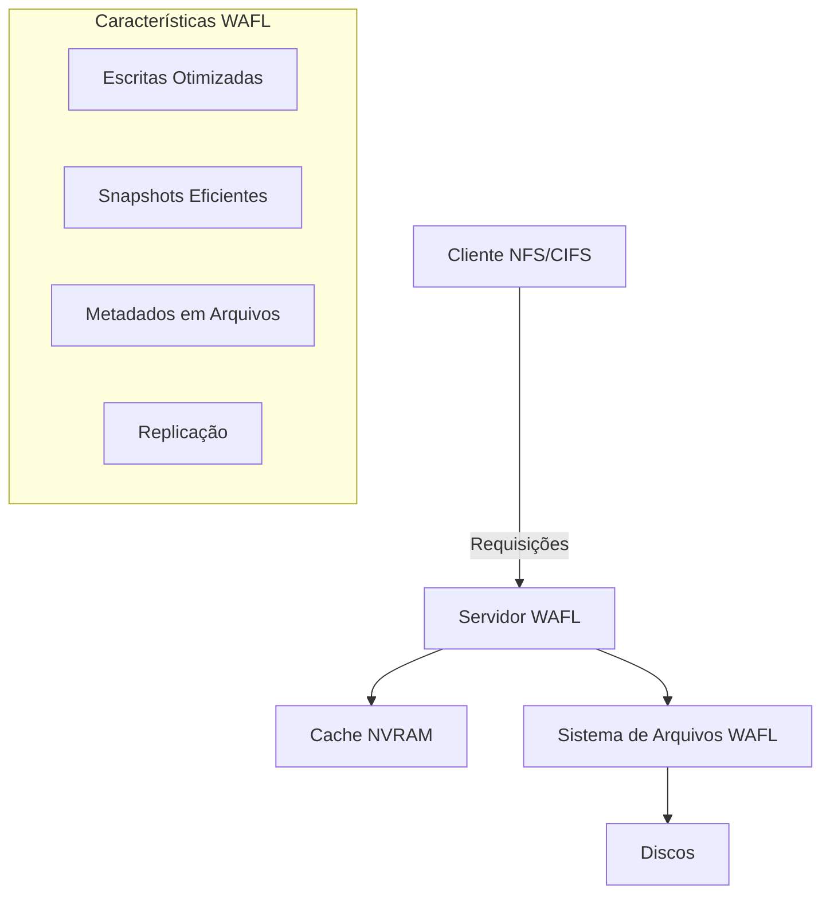
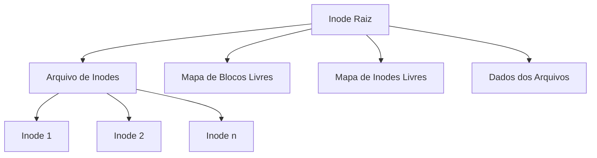
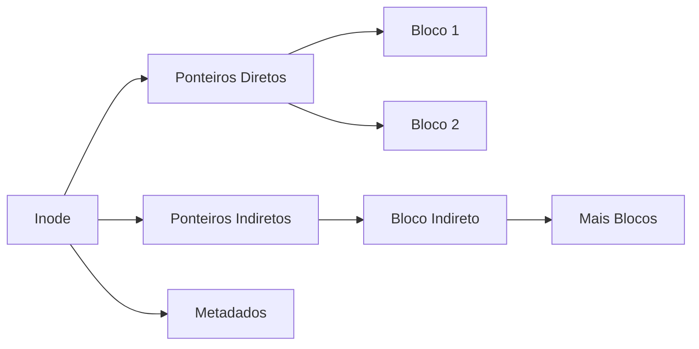
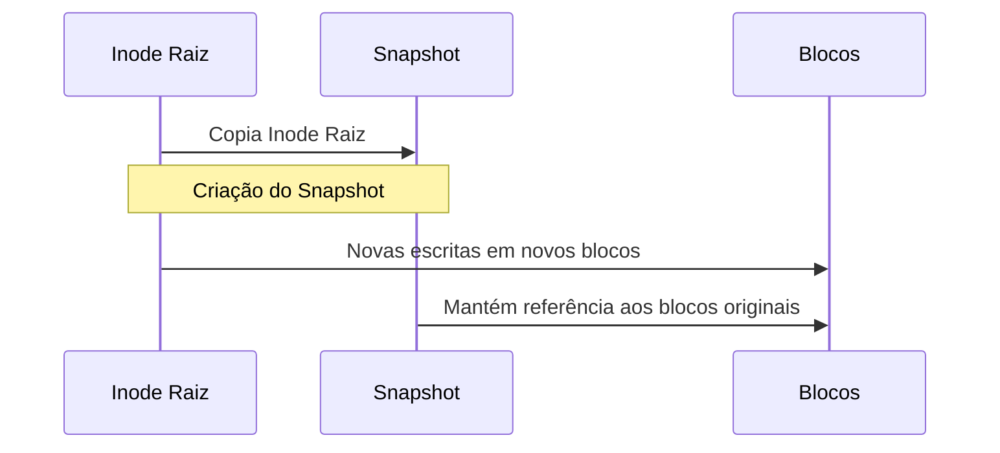
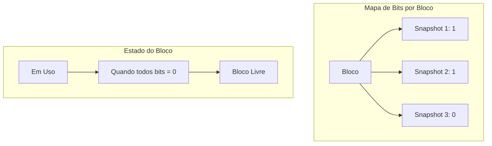
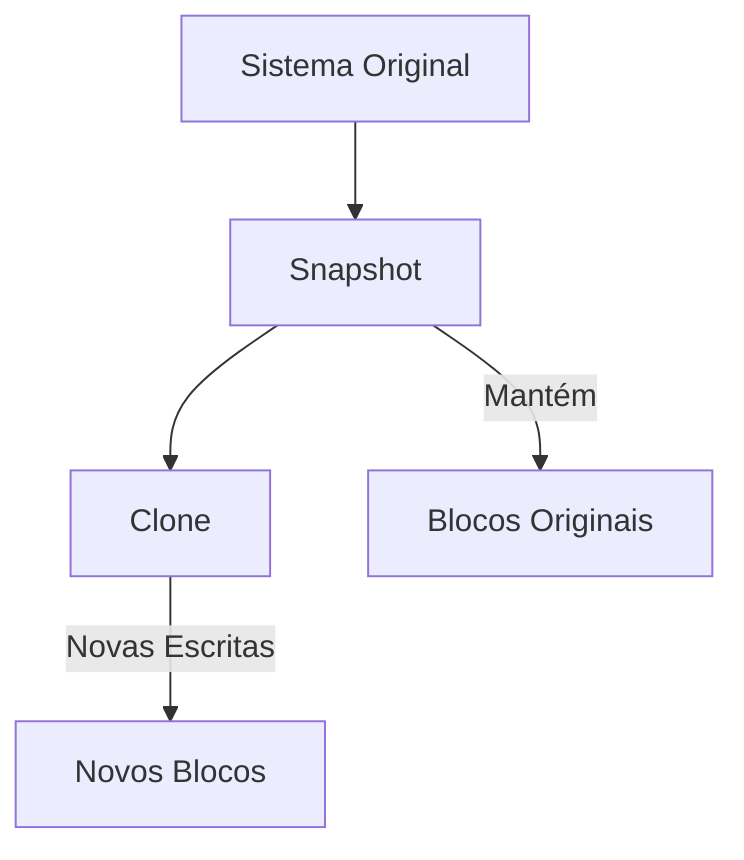
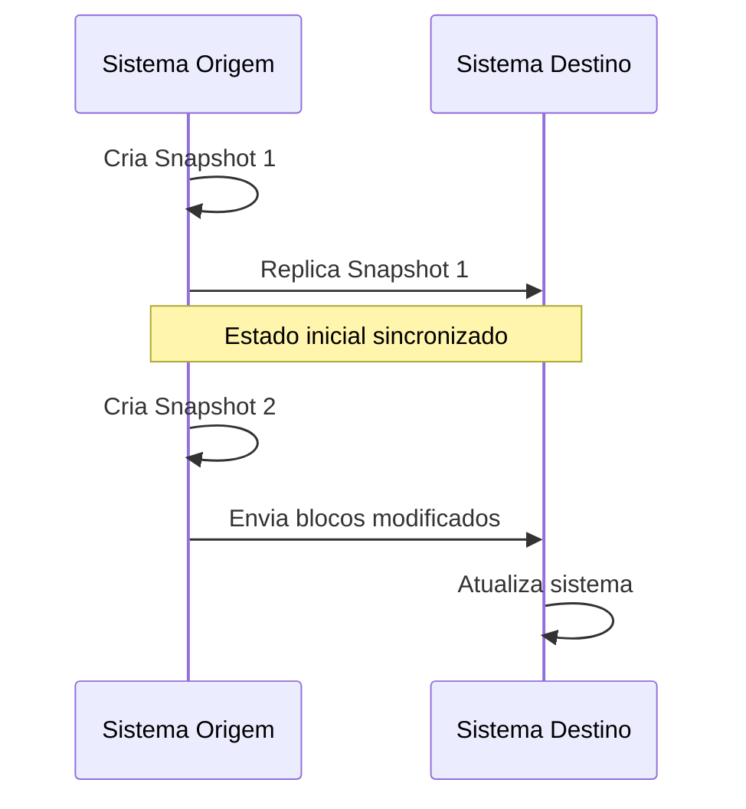
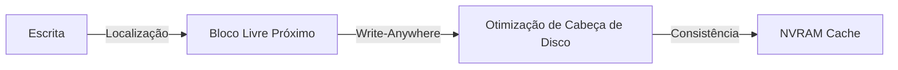
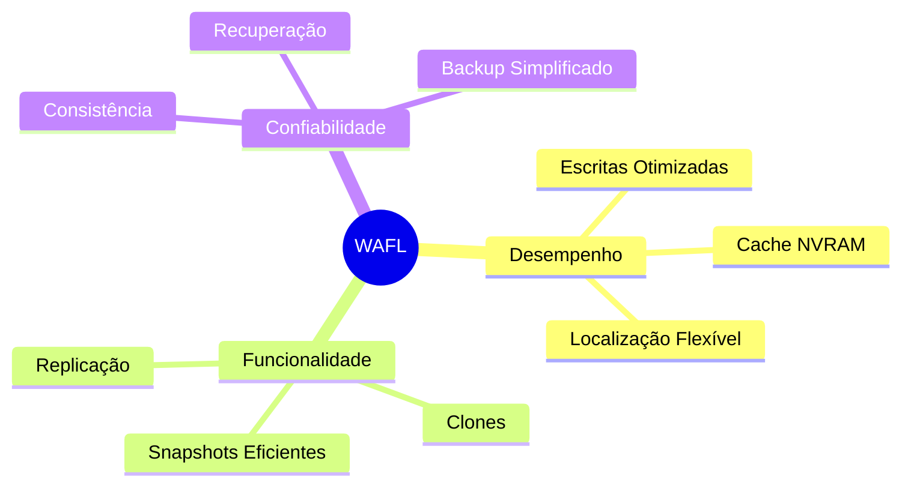
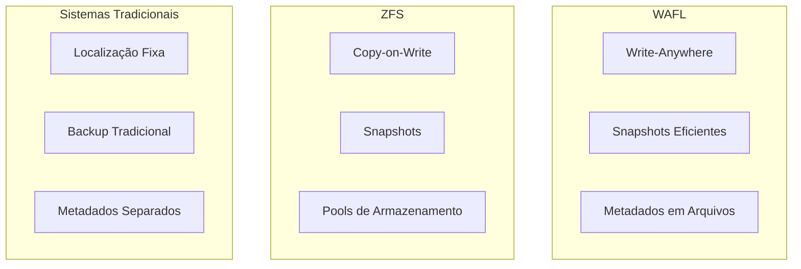

# 8.9 Sistema de Arquivos WAFL (Write-Anywhere File Layout)

## 1. Visão Geral

O WAFL é um sistema de arquivos otimizado para escritas aleatórias, desenvolvido pela Network Appliance para uso em servidores de arquivos de rede. Suas principais características incluem:

- Otimização para operações NFS e CIFS
- Suporte a snapshots eficientes
- Design baseado em blocos com inodes
- Cache NVRAM para escritas

## 2. Estrutura do Sistema de Arquivos

### 2.1 Organização dos Metadados

O WAFL armazena todos os metadados em arquivos regulares:

### 2.2 Estrutura de Inode

Cada inode contém:
- 16 ponteiros para blocos ou blocos indiretos
- Informações de metadados do arquivo
- Ponteiros flexíveis para acomodar snapshots

## 3. Mecanismo de Snapshots

### 3.1 Funcionamento

### 3.2 Gerenciamento de Blocos

## 4. Clones e Replicação

### 4.1 Clones de Leitura/Escrita

### 4.2 Processo de Replicação

## 5. Otimizações de Desempenho

### 5.1 Estratégias de Escrita

### 5.2 Vantagens do Design

## 6. Comparação com Outros Sistemas

