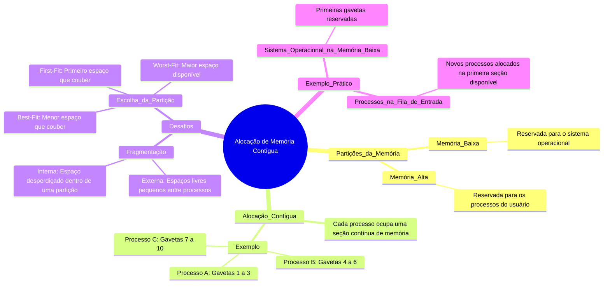

# 6.4 Alocação de memória contígua 

Imagine que a memória do computador é como um grande armário com gavetas. Cada gaveta precisa ser usada de forma eficiente para guardar coisas (processos). A **alocação de memória contígua** é como organizar as gavetas de modo que cada processo ocupe uma seção contínua do armário, sem espaços vazios no meio.

## Como Funciona?
1. **Partições da Memória**:
   - **Memória Baixa**: Reservada para o sistema operacional.
   - **Memória Alta**: Reservada para os processos do usuário.
2. **Alocação Contígua**: Cada processo ocupa uma única seção contínua de memória. Por exemplo:
   - Processo A: Ocupa as gavetas 1 a 3.
   - Processo B: Ocupa as gavetas 4 a 6.
   - Processo C: Ocupa as gavetas 7 a 10.

## Desafios
1. **Fragmentação**:
   - **Fragmentação Externa**: Espaços livres entre processos alocados, que são pequenos demais para serem usados.
   - **Fragmentação Interna**: Espaço desperdiçado dentro de uma partição alocada, porque o processo não usa toda a memória reservada.
2. **Escolha da Partição**:
   - **First-Fit**: Aloca o primeiro espaço livre que couber o processo.
   - **Best-Fit**: Aloca o menor espaço livre que couber o processo.
   - **Worst-Fit**: Aloca o maior espaço livre disponível.

## Exemplo Prático
- **Sistema Operacional na Memória Baixa**: O sistema operacional fica nas primeiras gavetas (memória baixa), e os processos do usuário ocupam o restante (memória alta).
- **Processos na Fila de Entrada**: Se um novo processo chega, ele é colocado na primeira seção contígua de memória disponível que couber.

---

---

### Resumo
- **Alocação Contígua**: Cada processo ocupa uma seção contínua de memória.
- **Desafios**: Fragmentação (externa e interna) e escolha da partição (first-fit, best-fit, worst-fit).
- **Objetivo**: Usar a memória de forma eficiente, minimizando espaços desperdiçados.