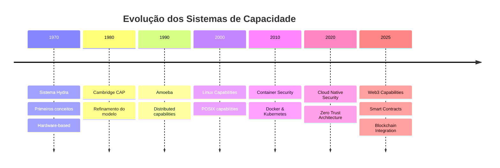
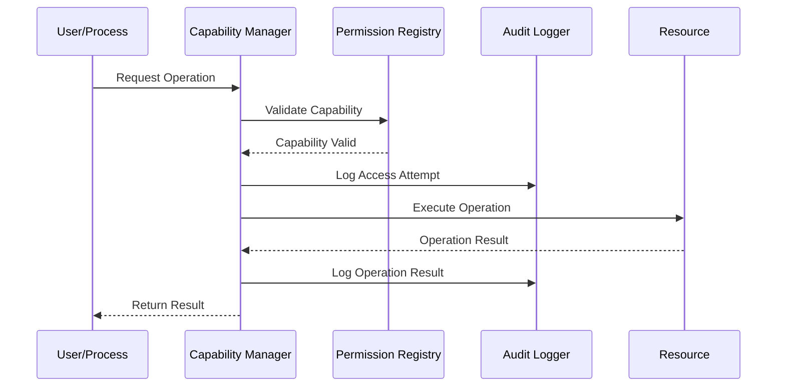

# Sistemas Baseados em Capacidade

## Fundamentos e Evolução

### Estrutura Básica de Capacidades

```ascii
Traditional Capability Structure
┌─────────────────────────────────────────┐
│              CAPABILITY                 │
├───────────────┬─────────────┬──────────┤
│   Object ID   │   Rights    │  Flags   │
│ (Non-forgeable│ (Permission │(Metadata)│
│  Reference)   │   Matrix)   │          │
└───────────────┴─────────────┴──────────┘
```

### Evolução dos Sistemas de Capacidade



## Arquitetura Moderna Detalhada

### Componentes Principais

```ascii
Modern Capability System Architecture
┌─────────────────────────────────────────────────────┐
│                   Applications                       │
├─────────────────────────────────────────────────────┤
│              Capability Manager                      │
├──────────────┬────────────────────┬────────────────┤
│ Identity &   │    Permission      │   Audit &      │
│ Access Mgmt  │    Registry        │   Logging      │
├──────────────┴────────────────────┴────────────────┤
│              Security Enforcement Layer             │
├─────────────────────────────────────────────────────┤
│                Operating System                      │
└─────────────────────────────────────────────────────┘
```

### Fluxo de Operações Detalhado



## Implementações Avançadas

### Sistema de Permissões Granular

```java
public class CapabilityToken {
    private UUID objectId;
    private Set<Permission> permissions;
    private Map<String, String> metadata;
    private Instant expiration;
    
    public boolean isValid() {
        return !Instant.now().isAfter(expiration);
    }
    
    public boolean hasPermission(Permission required) {
        return permissions.contains(required);
    }
    
    public Optional<String> getMetadata(String key) {
        return Optional.ofNullable(metadata.get(key));
    }
}
```

### Integração com Blockchain

```solidity
contract CapabilityToken {
    struct Capability {
        address owner;
        uint256 resourceId;
        uint256 permissions;
        uint256 expiration;
    }
    
    mapping(bytes32 => Capability) public capabilities;
    
    function grantCapability(
        address to,
        uint256 resourceId,
        uint256 permissions,
        uint256 duration
    ) external {
        bytes32 capId = keccak256(
            abi.encodePacked(to, resourceId)
        );
        capabilities[capId] = Capability(
            to,
            resourceId,
            permissions,
            block.timestamp + duration
        );
    }
}
```

## Padrões de Design Avançados

### Padrão de Delegação em Cadeia

```typescript
interface DelegationChain {
    readonly source: Principal;
    readonly intermediaries: Principal[];
    readonly target: Principal;
    readonly capabilities: Capability[];
    readonly constraints: ConstraintSet;
}

class CapabilityDelegator {
    delegate(chain: DelegationChain): Result<void, Error> {
        if (!this.validateChain(chain)) {
            return Err(new InvalidChainError());
        }
        
        const attenuatedCaps = this.attenuateCapabilities(
            chain.capabilities,
            chain.constraints
        );
        
        return this.transferCapabilities(
            chain.target,
            attenuatedCaps
        );
    }
}
```

### Sistema de Auditoria Avançado

```python
class AuditLogger:
    def __init__(self):
        self.blockchain_client = BlockchainClient()
        self.local_store = LocalStore()
    
    async def log_capability_use(
        self,
        capability: Capability,
        context: ExecutionContext
    ):
        # Log locally
        await self.local_store.append(
            self.create_audit_entry(capability, context)
        )
        
        # Create blockchain proof
        proof = self.create_merkle_proof(capability, context)
        await self.blockchain_client.submit_proof(proof)
```

## Segurança Quântica

### Estruturas Resistentes a Quantum

```python
from cryptography.hazmat.primitives import hashes
from cryptography.hazmat.primitives.asymmetric import dilithium

class QuantumSafeCapability:
    def __init__(self):
        self.signing_key = dilithium.generate_private_key()
    
    def create_capability(self, resource_id: bytes, permissions: int) -> bytes:
        message = resource_id + permissions.to_bytes(8, 'big')
        signature = self.signing_key.sign(message)
        return message + signature
```

### Protocolo de Verificação Pós-Quântico

```rust
struct QuantumVerifier {
    pub_key: DilithiumPublicKey,
    lattice_params: LatticeParameters,
}

impl QuantumVerifier {
    pub fn verify_capability(&self, cap: &Capability) -> Result<(), Error> {
        let signature = cap.extract_signature();
        let message = cap.extract_message();
        
        self.pub_key.verify(
            message,
            signature,
            &self.lattice_params
        )
    }
}
```

## Integração com Sistemas Modernos

### Kubernetes Operator Personalizado

```yaml
apiVersion: security.k8s.io/v1alpha1
kind: CapabilityPolicy
metadata:
  name: secure-workload-policy
spec:
  selector:
    matchLabels:
      app: secure-workload
  capabilities:
    required:
      - CAP_NET_BIND_SERVICE
    forbidden:
      - CAP_SYS_ADMIN
      - CAP_NET_RAW
  attestation:
    provider: spiffe
    identity: "spiffe://cluster.local/ns/{{.Namespace}}/sa/{{.ServiceAccount}}"
```

### Integração com Service Mesh

```yaml
apiVersion: security.istio.io/v1beta1
kind: AuthorizationPolicy
metadata:
  name: capability-based-auth
spec:
  selector:
    matchLabels:
      app: secure-service
  rules:
  - from:
    - source:
        principals: ["cluster.local/ns/default/sa/secure-client"]
    to:
    - operation:
        methods: ["GET"]
        paths: ["/api/secure/*"]
    when:
    - key: request.auth.claims[capabilities]
      values: ["secure-api-access"]
```

## Ferramentas e Utilitários

### CLI para Gerenciamento de Capacidades

```python
@click.group()
def cli():
    """Capability Management CLI"""
    pass

@cli.command()
@click.option('--resource', required=True)
@click.option('--permissions', required=True)
@click.option('--duration', default='1h')
def grant(resource: str, permissions: str, duration: str):
    """Grant new capability"""
    capability = CapabilityManager.create(
        resource=resource,
        permissions=permissions.split(','),
        duration=parse_duration(duration)
    )
    click.echo(f"Created capability: {capability.id}")

@cli.command()
@click.argument('capability_id')
def revoke(capability_id: str):
    """Revoke existing capability"""
    CapabilityManager.revoke(capability_id)
    click.echo(f"Revoked capability: {capability_id}")
```

### API REST para Gerenciamento

```typescript
interface CapabilityAPI {
    readonly baseUrl: string;
    
    async createCapability(
        request: CreateCapabilityRequest
    ): Promise<Capability>;
    
    async listCapabilities(
        filter?: CapabilityFilter
    ): Promise<Capability[]>;
    
    async revokeCapability(
        id: string,
        reason: RevocationReason
    ): Promise<void>;
}

class CapabilityService implements CapabilityAPI {
    constructor(
        private readonly client: HttpClient,
        private readonly baseUrl: string
    ) {}
    
    async createCapability(
        request: CreateCapabilityRequest
    ): Promise<Capability> {
        const response = await this.client.post(
            `${this.baseUrl}/capabilities`,
            request
        );
        return response.data;
    }
}
```

## Monitoramento e Observabilidade

### Métricas Prometheus

```yaml
# prometheus.yml
scrape_configs:
  - job_name: 'capability-metrics'
    static_configs:
      - targets: ['capability-service:9090']
    metrics_path: '/metrics'
    scheme: 'https'
    tls_config:
      ca_file: /etc/prometheus/certs/ca.pem
    basic_auth:
      username: 'prometheus'
      password_file: /etc/prometheus/auth/password
```

### Dashboards Grafana

```json
{
  "annotations": {
    "list": []
  },
  "panels": [
    {
      "title": "Capability Usage",
      "type": "graph",
      "datasource": "Prometheus",
      "targets": [
        {
          "expr": "sum(rate(capability_usage_total[5m])) by (resource)",
          "legendFormat": "{{resource}}"
        }
      ]
    },
    {
      "title": "Revocations",
      "type": "stat",
      "datasource": "Prometheus",
      "targets": [
        {
          "expr": "sum(increase(capability_revocations_total[24h]))"
        }
      ]
    }
  ]
}
```

## Referências e Recursos Adicionais

### Documentação Técnica
- NIST Special Publication 800-190: Application Container Security Guide
- CIS Kubernetes Benchmark v1.6.0
- Docker Security Guidelines
- Cloud Native Security Whitepaper
- Zero Trust Architecture Design Principles

### Ferramentas e Frameworks
- Open Policy Agent (OPA)
- Kubernetes RBAC
- SELinux
- AppArmor
- Docker Security Scanner
- SPIFFE/SPIRE
- HashiCorp Vault
- AWS IAM
- Azure AD

### Comunidade e Suporte
- CNCF Security TAG
- Cloud Native Security Working Group
- Docker Security Team
- Kubernetes Security Special Interest Group

```ascii
Resource Organization
┌─────────────────┐
│ Documentation   │
├─────────────────┤
│ Tools           │
├─────────────────┤
│ Best Practices  │
├─────────────────┤
│ Examples        │
└─────────────────┘
```