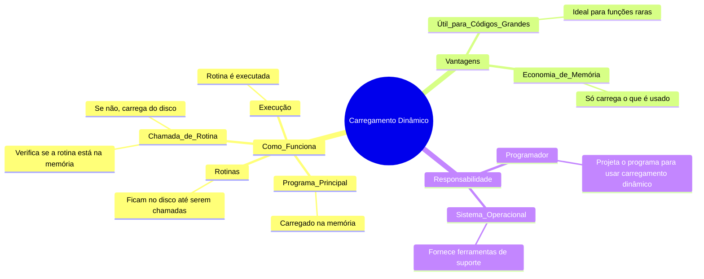

# Carregamento dinâmico

Imagine que você está jogando um jogo de mundo aberto, mas o jogo só carrega as partes do mapa que você está explorando no momento. Se você não entra em uma floresta, ela não é carregada na memória. Isso é o **carregamento dinâmico**: só carregar o que é necessário, quando é necessário.

## Como Funciona
1. **Programa Principal**: O jogo principal (ou programa) é carregado na memória e começa a rodar.
2. **Rotinas (Funções)**: As partes do jogo (ou funções do programa) ficam no disco, prontas para serem carregadas.
3. **Chamada de Rotina**: Quando o jogo precisa de uma função específica (ex: abrir um baú), ele verifica se essa função já está na memória.
   - Se não estiver, o **loader** (carregador) busca a função no disco e a coloca na memória.
   - Atualiza as "tabelas de endereços" para saber onde a função foi carregada.
4. **Execução**: A função é executada, e o jogo continua.

## Vantagens
- **Economia de Memória**: Só carrega o que é usado. Se uma função nunca é chamada, ela nunca ocupa espaço na memória.
- **Útil para Códigos Grandes**: Ideal para programas com muitas funções, mas que usam apenas algumas delas na maior parte do tempo (ex: rotinas de erro que só rodam em situações raras).

## Quem Faz Isso?
- **Programador**: Projeta o programa para usar carregamento dinâmico.
- **Sistema Operacional**: Pode ajudar fornecendo ferramentas (bibliotecas) para facilitar o carregamento dinâmico.

---

---

## Resumo
- **Carregamento Dinâmico**: Só carrega na memória o que é necessário, quando é necessário.
- **Vantagens**: Economia de memória e eficiência para programas grandes.
- **Responsabilidade**: Programador projeta, sistema operacional pode ajudar.