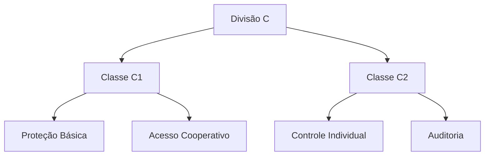
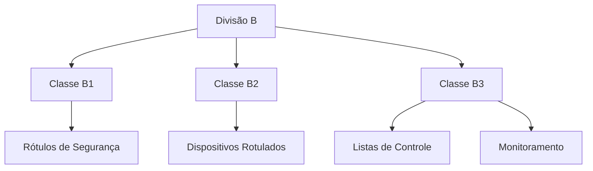
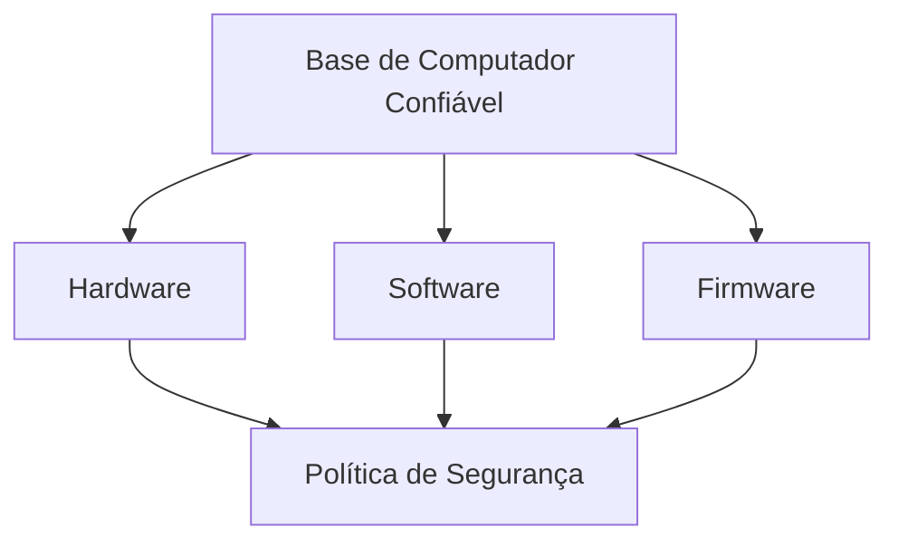

# Classificações de Segurança de Computador

## Visão Geral

```ascii
Níveis de Segurança:
┌─────────────────────────┐
│     Divisão A (A1)      │ → Mais Alto
├─────────────────────────┤
│  Divisão B (B1,B2,B3)   │
├─────────────────────────┤
│   Divisão C (C1,C2)     │
├─────────────────────────┤
│      Divisão D          │ → Mais Baixo
└─────────────────────────┘
```

O Departamento de Defesa dos Estados Unidos estabelece quatro divisões principais de segurança computacional, organizadas hierarquicamente da menos segura (D) para a mais segura (A).

## Divisões de Segurança

### Divisão D - Proteção Mínima
- Nível mais básico de segurança
- Sistemas que não atendem requisitos superiores
- Exemplo: MS-DOS e Windows 3.1

### Divisão C - Proteção Discricionária



#### Classe C1
- Controle básico de acesso
- Proteção de informações privadas
- Prevenção contra destruição acidental
- Comum em sistemas UNIX padrão

#### Classe C2
- Controle de acesso individual
- Auditoria seletiva
- Proteção contra reutilização de objetos
- Autoproteção do TCB

### Divisão B - Proteção Obrigatória

```ascii
Estrutura da Divisão B:
    B1 ──────┐
             │
    B2 ──────┼── Proteção
             │    Obrigatória
    B3 ──────┘

Características:
    ┌──────────────────┐
    │ Rótulos          │
    │ Sensibilidade    │
    │ Auditoria        │
    │ Isolamento       │
    └──────────────────┘
```



#### Classe B1
- Mantém rótulos de segurança
- Controle de acesso obrigatório
- Múltiplos níveis de segurança
- Isolamento de processos

#### Classe B2
- Rótulos em todos recursos
- Níveis de segurança para dispositivos
- Controle de canais secretos
- Auditoria avançada

#### Classe B3
- Listas de controle de acesso
- Monitoramento de violações
- Notificação administrativa
- Recuperação segura

### Divisão A - Proteção Verificada

```ascii
Certificação A1:
    ┌─────────────────────┐
    │ Verificação Formal  │
    ├─────────────────────┤
    │ Design Rigoroso    │
    ├─────────────────────┤
    │ Documentação       │
    ├─────────────────────┤
    │ Análise Matemática │
    └─────────────────────┘
```

#### Classe A1
- Equivalente funcional ao B3
- Especificações formais
- Verificação matemática
- Desenvolvimento em ambiente controlado

## Base de Computador Confiável (TCB)



### Características do TCB
- Impõe política de segurança
- Controla acesso entre usuários
- Protege dados de autenticação
- Mantém integridade do sistema

## Certificações Adicionais

### TEMPEST
- Proteção contra espionagem eletrônica
- Blindagem de terminais
- Contenção de campos eletromagnéticos
- Prevenção de vazamento de dados

```ascii
Proteção TEMPEST:
    Terminal      Barreira      Ambiente
    Blindado   →  TEMPEST   →  Externo
    [█████]       ═══════      [     ]
```

## Considerações de Implementação

1. Política de Segurança
2. Certificação por agências
3. Proteção física
4. Monitoramento contínuo