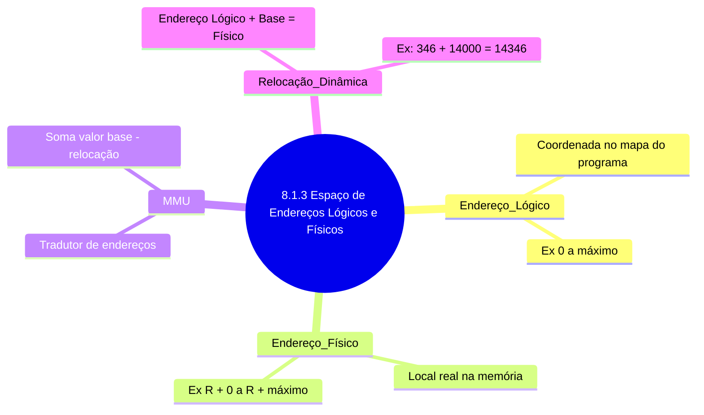

# Espaço de Endereços Lógicos e Físicos

Imagine que você está jogando um jogo de RPG onde o mapa do jogo é dividido em duas partes: o **mapa lógico** (que você vê na tela) e o **mapa físico** (que está armazenado no console). O **endereço lógico** é como a posição que você vê no mapa do jogo (ex: "Floresta das Sombras, coordenada X:10, Y:20"). Já o **endereço físico** é onde essa informação realmente está guardada no hardware do console (ex: "Bloco de memória 1024, setor 512").

- **Endereço Lógico**: É a "coordenada" que o jogo (ou programa) usa para acessar algo. No jogo, você só enxerga isso.
- **Endereço Físico**: É onde essa informação realmente está armazenada no hardware. Você nunca vê isso diretamente.

## Mapeamento de Endereços
O **hardware** (MMU - Unidade de Gerenciamento de Memória) faz a tradução entre o endereço lógico e o físico, como um "tradutor" que converte as coordenadas do jogo para o local real no console.

- **Exemplo**: Se o jogo diz "vá para X:10", o MMU traduz isso para "Bloco de memória 1024". Isso é feito em tempo real, enquanto o jogo roda.

## Relocação Dinâmica
Pense em um jogo onde você pode mover seu personagem para qualquer lugar do mapa. O MMU faz algo parecido: ele "reloca" os endereços lógicos para os físicos dinamicamente, somando um valor base (registrador de relocação). Por exemplo:
- Se o valor base for 14000, o endereço lógico "346" vira o físico "14346".

## Espaços de Endereços
- **Espaço Lógico**: Todas as "coordenadas" que o jogo (programa) pode usar.
- **Espaço Físico**: Todos os locais reais onde os dados são armazenados.

---

---

## Resumo
- **Endereço Lógico**: O que o programa vê (como coordenadas no jogo).
- **Endereço Físico**: Onde os dados realmente estão (como o local no hardware).
- **MMU**: Faz a tradução entre os dois, em tempo real.
- **Relocação Dinâmica**: Ajusta os endereços lógicos para físicos somando um valor base.