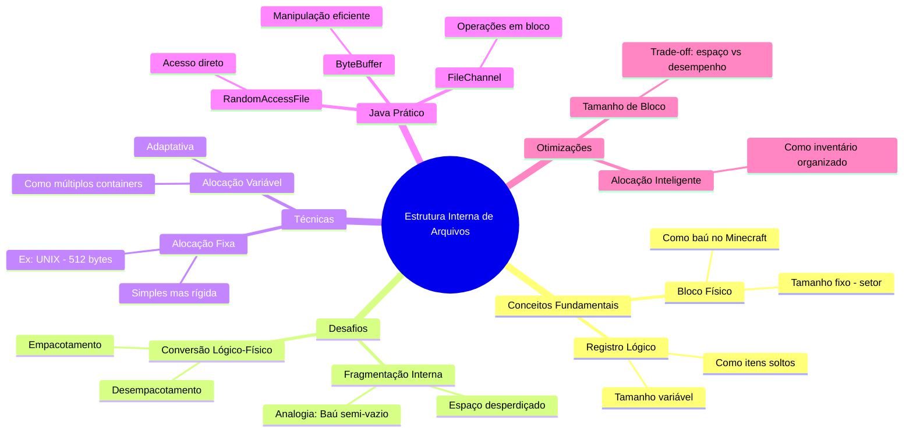

# Estrutura Interna 

## **1. Conceitos Fundamentais com Analogias**

### **1.1 Blocos Físicos vs Lógicos**
Pense em um arquivo como um **inventário do Minecraft**:
- **Bloco Físico (Disco)**: Como um baú - capacidade fixa (ex: 27 slots)
- **Registro Lógico (Arquivo)**: Itens soltos - tamanhos variáveis (ex: espada, bloco, poção)

**Problema**: Como guardar 35 itens (lógicos) em baús de 27 slots (físicos)?

### **1.2 Fragmentação Interna**
Imagine encher baús no Minecraft:
- Cada baú tem 27 slots
- Você tem:
  - 10 diamantes (1 slot cada)
  - 5 picaretas (1 slot cada)
  - 20 blocos de terra (64 por slot)
- **Fragmentação**: 1 baú ficará semi-vazio (espaço desperdiçado)

## **2. Implementação Prática em Java**

### **2.1 Simulador de Alocação em Blocos**
```java
import java.util.*;

public class SimuladorDisco {
    // == COMO RODAR ==
    // 1. javac SimuladorDisco.java
    // 2. java SimuladorDisco
    
    static final int TAMANHO_BLOCO = 512; // Bytes
    
    public static void main(String[] args) {
        int[] tamanhosArquivos = {150, 600, 200, 950}; // Tamanhos em bytes
        
        for (int tamanho : tamanhosArquivos) {
            int blocosNecessarios = (int) Math.ceil((double) tamanho / TAMANHO_BLOCO);
            int espacoDesperdicado = (blocosNecessarios * TAMANHO_BLOCO) - tamanho;
            
            System.out.printf("Arquivo: %4d bytes | Blocos: %d | Desperdício: %3d bytes (%.1f%%)\n",
                tamanho, blocosNecessarios, espacoDesperdicado,
                (espacoDesperdicado * 100.0 / (blocosNecessarios * TAMANHO_BLOCO)));
        }
    }
}
```

**Saída**:
```
Arquivo:  150 bytes | Blocos: 1 | Desperdício: 362 bytes (70.7%)
Arquivo:  600 bytes | Blocos: 2 | Desperdício: 424 bytes (41.4%)
Arquivo:  200 bytes | Blocos: 1 | Desperdício: 312 bytes (60.9%)
Arquivo:  950 bytes | Blocos: 2 | Desperdício:  74 bytes (7.2%)
```

### **2.2 Leitor de Arquivo por Blocos**
```java
import java.io.*;
import java.nio.ByteBuffer;
import java.nio.channels.FileChannel;

public class LeitorPorBlocos {
    // == COMO RODAR ==
    // 1. Crie um arquivo 'dados.bin' com qualquer conteúdo
    // 2. javac LeitorPorBlocos.java
    // 3. java LeitorPorBlocos dados.bin
    
    static final int TAMANHO_BLOCO = 512;
    
    public static void main(String[] args) throws IOException {
        try (RandomAccessFile file = new RandomAccessFile(args[0], "r");
             FileChannel channel = file.getChannel()) {
            
            ByteBuffer buffer = ByteBuffer.allocate(TAMANHO_BLOCO);
            int blocoAtual = 0;
            
            while (channel.read(buffer) > 0) {
                System.out.printf("\nBloco %d:\n", blocoAtual++);
                hexDump(buffer.array());
                buffer.clear();
            }
        }
    }
    
    private static void hexDump(byte[] bloco) {
        for (int i = 0; i < bloco.length; i++) {
            if (i % 16 == 0) System.out.printf("%04X: ", i);
            System.out.printf("%02X ", bloco[i]);
            if (i % 16 == 15) System.out.println();
        }
    }
}
```

## **3. Técnicas Avançadas**

### **3.1 Otimização de Espaço (Como Stacking no Minecraft)**
```java
public class OtimizadorBlocos {
    // Analogia: Empilhar itens iguais no Minecraft
    static final int MAX_ITENS_POR_SLOT = 64;
    
    public static int calculaSlotsNecessarios(int[] itens) {
        int slots = 0;
        for (int qtd : itens) {
            slots += Math.ceil((double) qtd / MAX_ITENS_POR_SLOT);
        }
        return slots;
    }
    
    public static void main(String[] args) {
        int[] blocosDeTerra = {120, 65, 30}; // Quantidades
        System.out.println("Baús necessários: " + 
            calculaSlotsNecessarios(blocosDeTerra));
    }
}
```

### **3.2 Alocação com Blocos de Tamanho Variável**
```java
import java.util.*;

public class AlocacaoAdaptativa {
    // Analogia: Usar baús, barris e estojos conforme necessidade
    static final int[] TAMANHOS_BLOCOS = {128, 256, 512, 1024};
    
    public static List<Integer> alocaBlocos(int tamanhoArquivo) {
        List<Integer> blocos = new ArrayList<>();
        int restante = tamanhoArquivo;
        
        // Ordena do maior para o menor
        Arrays.sort(TAMANHOS_BLOCOS);
        for (int i = TAMANHOS_BLOCOS.length - 1; i >= 0; i--) {
            while (restante >= TAMANHOS_BLOCOS[i]) {
                blocos.add(TAMANHOS_BLOCOS[i]);
                restante -= TAMANHOS_BLOCOS[i];
            }
        }
        if (restante > 0) {
            blocos.add(TAMANHOS_BLOCOS[0]); // Usa o menor bloco
        }
        return blocos;
    }
    
    public static void main(String[] args) {
        System.out.println("Alocação para 2000 bytes: " + 
            alocaBlocos(2000));
    }
}
```

## **4. Mindmap**



## **5. Exercícios Práticos**

### **Missão 1: Calculadora de Fragmentação**
```java
// Crie um programa que:
// 1. Recebe tamanhos de arquivos
// 2. Calcula fragmentação para diferentes tamanhos de bloco
// 3. Identifica o tamanho ideal de bloco
```

### **Missão 2: Sistema de Arquivos em Memória**
```java
// Implemente um simulador que:
// 1. Gerencia "blocos" em um array de bytes
// 2. Permite criar/ler arquivos virtuais
// 3. Mostra fragmentação em tempo real
```

### **Missão 3: Compactador de Blocos**
```java
// Desenvolva um algoritmo que:
// 1. Combina pequenos arquivos em blocos compartilhados
// 2. Mantém um índice de localização
// 3. Reduz fragmentação (como shulker boxes)
```

## **6. Referências Críticas**

**Problemas Comuns**:
1. **Tamanho de bloco inadequado**
   - Muito grande → Muita fragmentação
   - Muito pequeno → Muitas operações de I/O

2. **Algoritmos ingênuos de alocação**
   ```java
   // ❌ Alocação sequencial simples
   int blocosNecessarios = tamanhoArquivo / TAMANHO_BLOCO;
   if (tamanhoArquivo % TAMANHO_BLOCO != 0) blocosNecessarios++;
   ```

**Soluções Profissionais**:
1. **Alocação por Extents**
   ```java
   class Extent {
       long blocoInicial;
       int quantidade;
   }
   ```
2. **Block Suballocation**
   - Compartilhar blocos entre pequenos arquivos
   - Como vários itens em um mesmo slot no Minecraft
