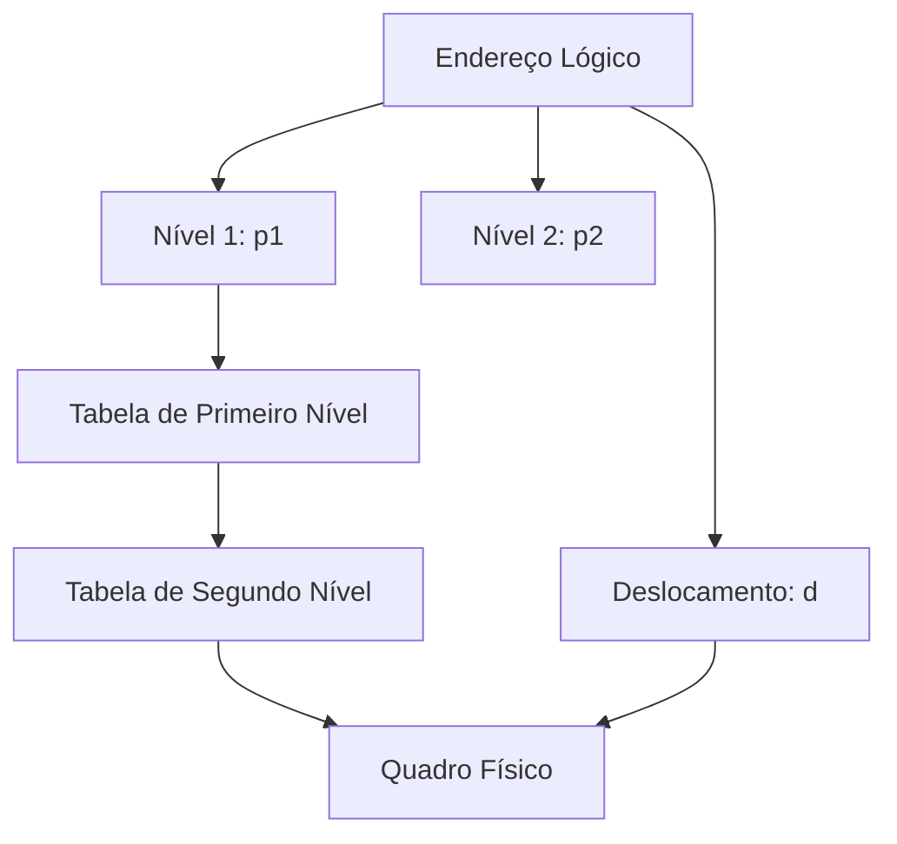
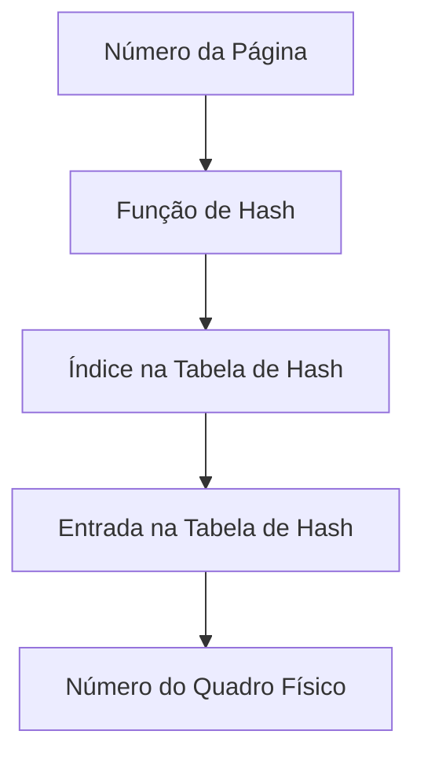
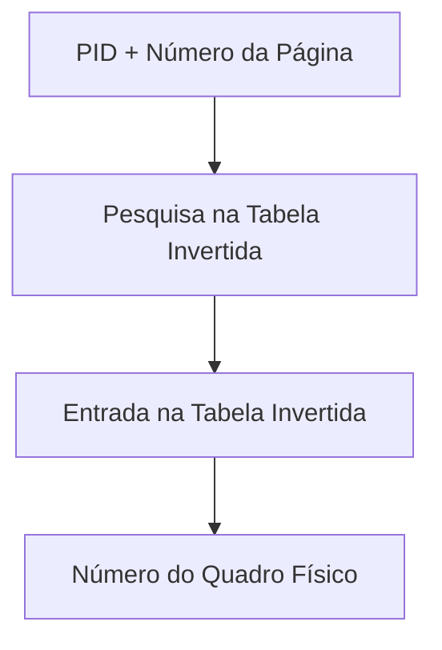

# 6.6 Estrutura da Tabela de Página

A **tabela de páginas** é uma estrutura essencial para a implementação da paginação. No entanto, dependendo do tamanho do espaço de endereçamento e da quantidade de memória disponível, diferentes técnicas são usadas para organizar e gerenciar a tabela de páginas. Vamos explorar três abordagens comuns:

1. **Paginação Hierárquica**.
2. **Tabelas de Página com Hash**.
3. **Tabelas de Página Invertidas**.

---

## 1. Paginação Hierárquica

### O que é? {id="o-que_1"}
- A **paginação hierárquica** divide a tabela de páginas em **níveis** (ou camadas), criando uma estrutura em árvore.
- Cada nível da hierarquia mapeia uma parte do endereço lógico.

### Como Funciona? {id="como-funciona_1"}
- O endereço lógico é dividido em várias partes, cada uma correspondendo a um nível da tabela de páginas.
- O primeiro nível aponta para uma tabela de segundo nível, que pode apontar para uma tabela de terceiro nível, e assim por diante.
- Apenas as tabelas de páginas necessárias são carregadas na memória, economizando espaço.

### Exemplo: Paginação de Dois Níveis
- O endereço lógico é dividido em:
  - **Número da Página de Primeiro Nível (p1)**.
  - **Número da Página de Segundo Nível (p2)**.
  - **Deslocamento (d)**.
- A tabela de primeiro nível contém ponteiros para tabelas de segundo nível.
- A tabela de segundo nível contém os números dos quadros físicos.

### Vantagens {id="vantagens_1"}
- Reduz o espaço ocupado pela tabela de páginas, pois apenas as partes necessárias são carregadas.
- Adequado para sistemas com espaços de endereçamento grandes.

### Desvantagens {id="desvantagens_1"}
- Aumenta o tempo de acesso à memória, pois múltiplos níveis precisam ser consultados.

---

## 2. Tabelas de Página com Hash

### O que é? {id="o-que_2"}
- A **tabela de páginas com hash** usa uma **função de hash** para mapear números de páginas lógicas em entradas da tabela de páginas.
- É útil para sistemas com espaços de endereçamento muito grandes, onde a tabela de páginas tradicional seria inviável.

### Como Funciona? {id="como-funciona_2"}
- O número da página lógica é passado para uma função de hash, que retorna um índice na tabela de páginas.
- Cada entrada na tabela de hash contém:
  - **Número da Página**.
  - **Número do Quadro Físico**.
- Em caso de colisões (quando dois números de página são mapeados para o mesmo índice), uma lista encadeada ou outra técnica de resolução de colisões é usada.

### Vantagens {id="vantagens_2"}
- Reduz o tamanho da tabela de páginas, especialmente em sistemas com espaços de endereçamento grandes.
- Eficiente em termos de espaço.

### Desvantagens {id="desvantagens_2"}
- Pode haver colisões, aumentando o tempo de acesso.
- Complexidade adicional para lidar com colisões.

---

## 3. Tabelas de Página Invertidas

### O que é?
- Na **tabela de páginas invertida**, há apenas **uma tabela de páginas para todo o sistema**, em vez de uma tabela por processo.
- Cada entrada na tabela contém:
  - **Número do Quadro Físico**.
  - **Identificador do Processo (PID)**.
  - **Número da Página Lógica**.

### Como Funciona?
- Quando um processo acessa uma página, o sistema usa o **PID** e o **número da página lógica** para encontrar a entrada correspondente na tabela invertida.
- A entrada contém o número do quadro físico, que é combinado com o deslocamento para formar o endereço físico.

### Vantagens
- Reduz drasticamente o espaço ocupado pela tabela de páginas, pois há apenas uma tabela para todo o sistema.
- Adequado para sistemas com muitos processos e grandes espaços de endereçamento.

### Desvantagens
- Acesso mais lento, pois a tabela invertida precisa ser pesquisada para cada referência à memória.
- Complexidade adicional para gerenciar a tabela.

---

## Comparação das Técnicas

| Técnica                     | Vantagens                                                                 | Desvantagens                                                      |
|-----------------------------|---------------------------------------------------------------------------|-------------------------------------------------------------------|
| **Paginação Hierárquica**   | Economiza espaço; adequada para grandes espaços de endereçamento.         | Aumenta o tempo de acesso devido a múltiplos níveis.              |
| **Tabelas de Página com Hash** | Eficiente em termos de espaço; útil para espaços de endereçamento muito grandes. | Colisões podem aumentar o tempo de acesso.                       |
| **Tabelas de Página Invertidas** | Reduz o espaço da tabela; uma única tabela para todo o sistema.           | Acesso mais lento; complexidade de gerenciamento.                 |

---

## Diagramas

### Diagrama 1: Paginação Hierárquica

### Diagrama 2: Tabela de Página com Hash

### Diagrama 3: Tabela de Página Invertida

---

A escolha da estrutura da tabela de páginas depende das necessidades do sistema:
- **Paginação Hierárquica** é ideal para sistemas com grandes espaços de endereçamento.
- **Tabelas de Página com Hash** são eficientes em termos de espaço, mas podem sofrer com colisões.
- **Tabelas de Página Invertidas** reduzem o espaço da tabela, mas têm um custo maior em termos de tempo de acesso.