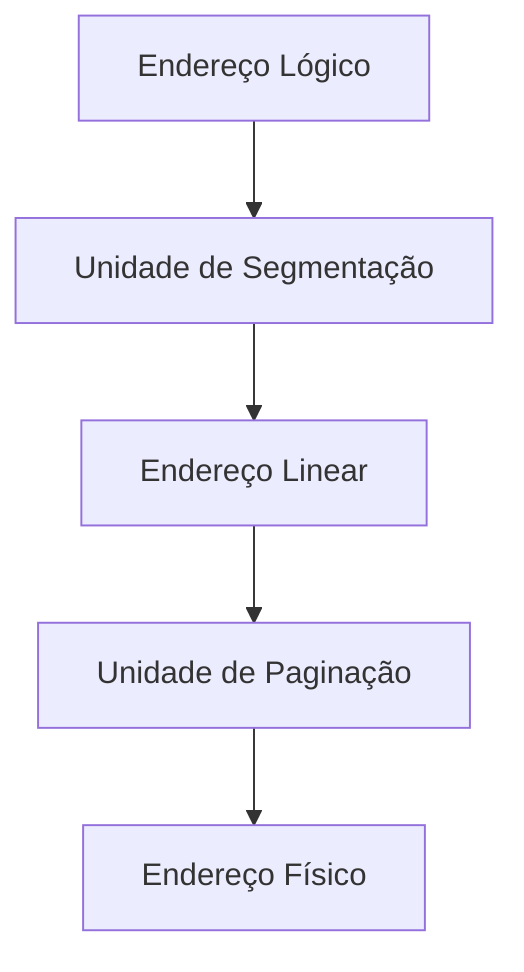
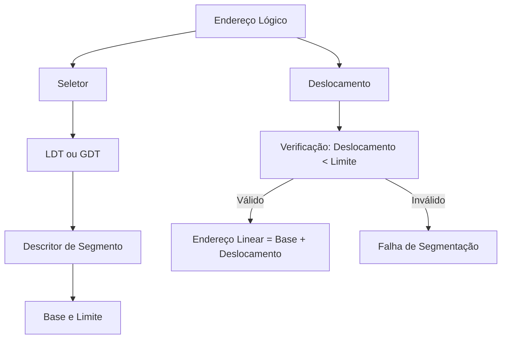
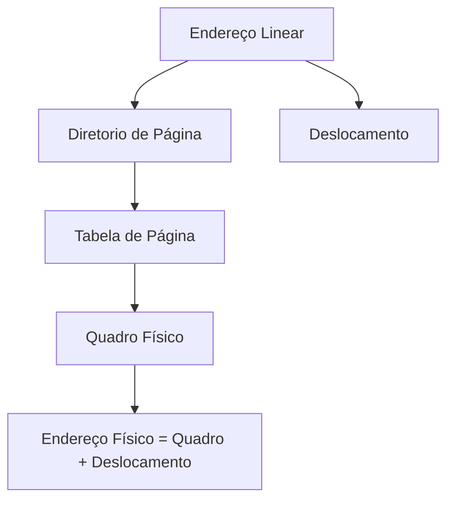

# 6.8 Visão Geral do Gerenciamento de Memória no Pentium

O Pentium usa uma abordagem híbrida, combinando **segmentação** e **paginação**, para gerenciar a memória. Isso permite que o sistema operacional e os programas tenham uma visão lógica da memória (segmentação) enquanto mantêm o controle eficiente da memória física (paginação). Vamos detalhar cada parte.

---

## 2. **Segmentação no Pentium: A Visão Lógica da Memória**

A segmentação é como o programador vê a memória: dividida em **segmentos** lógicos, como código, dados, pilha, etc. No Pentium, isso é implementado da seguinte forma:

### **Tabelas de Segmentos**
- **LDT (Local Descriptor Table)**: Armazena os descritores dos segmentos privados de um processo.
- **GDT (Global Descriptor Table)**: Armazena os descritores dos segmentos compartilhados entre processos.
- Cada **descritor de segmento** contém:
  - **Base**: O endereço físico inicial do segmento.
  - **Limite**: O tamanho do segmento.
  - **Permissões**: Proteção (leitura, escrita, execução) e tipo de acesso.

### **Endereço Lógico**
- Um endereço lógico no Pentium é um par:
  - **Seletor (16 bits)**:
    - **Número do Segmento (13 bits)**: Índice na LDT ou GDT.
    - **Indicador de GDT/LDT (1 bit)**: Define se o segmento está na GDT ou LDT.
    - **Nível de Proteção (2 bits)**: Define o nível de privilégio (kernel, usuário, etc.).
  - **Deslocamento (32 bits)**: A posição dentro do segmento.

### **Tradução de Endereço** {id="tradu-o-de-endere-o_1"}
1. O **seletor** é usado para indexar a **LDT** ou **GDT** e obter o descritor do segmento.
2. O **deslocamento** é verificado contra o **limite** do segmento.
   - Se o deslocamento for menor que o limite, o endereço linear é calculado como: **base + deslocamento**.
   - Caso contrário, ocorre uma **falha de segmentação** (erro de acesso à memória).

### **Exemplo Prático** {id="exemplo-pr-tico_1"}
- Suponha que o **segmento 2** tenha:
  - Base: 4300.
  - Limite: 400.
- Um endereço lógico `<s=2, d=53>` é traduzido para:
  - Endereço linear: \(4300 + 53 = 4353\).

---

## 3. **Paginação no Pentium: A Visão Física da Memória**

Após a segmentação, o endereço linear é convertido em um endereço físico usando a **paginação**. O Pentium suporta dois tamanhos de página: **4 KB** e **4 MB**.

### **Paginação de Dois Níveis**
- O endereço linear de 32 bits é dividido em:
  - **Diretório de Página (10 bits)**: Índice na tabela de diretório de páginas.
  - **Tabela de Página (10 bits)**: Índice na tabela de páginas.
  - **Deslocamento (12 bits)**: Posição dentro da página.

### **Tradução de Endereço**
1. O **diretório de página** é consultado para encontrar a tabela de páginas correspondente.
2. A **tabela de páginas** é consultada para encontrar o quadro físico.
3. O **deslocamento** é combinado com o quadro físico para formar o endereço físico.

### **Páginas de 4 MB**
- Se a flag **Page Size** estiver ativada, o diretório de página aponta diretamente para um quadro de 4 MB.
- Nesse caso, os **22 bits de baixa ordem** do endereço linear são usados como deslocamento.

### **Exemplo Prático**
- Endereço linear: `0x00402030`.
  - Diretório de Página: `0x004` (índice 1 no diretório de páginas).
  - Tabela de Página: `0x020` (índice 32 na tabela de páginas).
  - Deslocamento: `0x030` (48 bytes dentro da página).
- Suponha que a tabela de páginas aponte para o quadro físico `0x1000`.
- Endereço físico: \(0x1000 + 0x030 = 0x1030\).

---

## 4. **Linux no Pentium: Minimizando a Segmentação**

O **Linux** foi projetado para ser portável entre diferentes arquiteturas, muitas das quais não suportam segmentação. Por isso, o Linux usa a segmentação de forma mínima no Pentium.

### **Segmentação no Linux**
- O Linux usa apenas **6 segmentos**:
  1. **Código do Kernel**: Para executar o código do sistema operacional.
  2. **Dados do Kernel**: Para acessar dados do sistema operacional.
  3. **Código do Usuário**: Para executar código dos programas de usuário.
  4. **Dados do Usuário**: Para acessar dados dos programas de usuário.
  5. **TSS (Task State Segment)**: Armazena o contexto de hardware durante trocas de contexto.
  6. **LDT-padrão**: Não é usado, mas pode ser substituído por uma LDT personalizada.

### **Paginação no Linux**
- O Linux adota um modelo de **paginação de três níveis** para ser compatível com arquiteturas de 32 e 64 bits.
  - **Diretório Global**: Aponta para diretórios de páginas.
  - **Diretório do Meio**: Aponta para tabelas de páginas.
  - **Tabela de Página**: Aponta para quadros físicos.
- No Pentium, o **diretório do meio** é ignorado, efetivamente reduzindo o modelo para dois níveis.

### **Troca de Contexto**
- Durante uma troca de contexto, o valor do registrador **CR3** (que aponta para o diretório de páginas) é salvo e restaurado no **TSS** da tarefa.

---

## 5. **Por Que Isso Tudo Importa?**

### **Vantagens da Segmentação**
- **Visão Lógica**: Facilita o desenvolvimento, pois o programador vê a memória como segmentos (código, dados, pilha, etc.).
- **Proteção**: Cada segmento pode ter permissões diferentes (leitura, escrita, execução).

### **Vantagens da Paginação**
- **Gerenciamento Eficiente**: Permite alocar memória física em blocos de tamanho fixo (páginas).
- **Redução de Fragmentação**: A paginação evita a fragmentação externa.

### **Desafios**
- **Complexidade**: A combinação de segmentação e paginação aumenta a complexidade do hardware e do software.
- **Overhead**: A tradução de endereços envolve múltiplas consultas a tabelas, o que pode impactar o desempenho.

---

## 6. **Diagramas para Visualizar o Processo**

### **Diagrama 1: Tradução de Endereço no Pentium**

### **Diagrama 2: Segmentação no Pentium**

### **Diagrama 3: Paginação no Pentium**

---

A arquitetura **Intel Pentium** combina **segmentação** e **paginação** para oferecer uma solução poderosa e flexível para o gerenciamento de memória. A segmentação fornece uma visão lógica da memória, alinhada com a forma como os programadores pensam, enquanto a paginação gerencia a memória física de forma eficiente. O **Linux** utiliza essas funcionalidades de forma mínima, priorizando a portabilidade e a simplicidade. Essa combinação permite que sistemas modernos sejam robustos, seguros e eficientes, mesmo em cenários complexos.