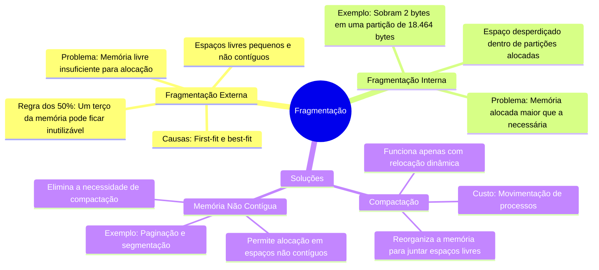

# Fragmentação

Imagine que a memória do computador é como um grande armário cheio de gavetas. Com o tempo, as gavetas vão sendo usadas e liberadas, mas de forma desorganizada, deixando pequenos espaços vazios entre elas. Esses espaços são a **fragmentação**, que pode ser de dois tipos: **externa** e **interna**.

## Fragmentação Externa
- **O que é**: Espaços livres pequenos e não contíguos na memória.
- **Problema**: Mesmo que haja memória livre suficiente, ela pode estar dividida em pedaços tão pequenos que não podem ser usados.
- **Exemplo**: Se você tem 10 MB de memória livre, mas dividida em 10 pedaços de 1 MB, não é possível alocar um processo de 2 MB.
- **Causas**: Alocação e liberação repetida de processos, especialmente com estratégias como **first-fit** e **best-fit**.
- **Regra dos 50%**: Em média, um terço da memória pode ficar inutilizável devido à fragmentação.

## Fragmentação Interna
- **O que é**: Espaço desperdiçado dentro de uma partição alocada.
- **Problema**: A memória alocada é maior que a necessária, deixando um pedaço inutilizado.
- **Exemplo**: Se um processo precisa de 18.462 bytes e a partição alocada tem 18.464 bytes, sobram 2 bytes que não são usados.
- **Causa**: Alocação em blocos de tamanho fixo, onde o processo não usa todo o espaço reservado.

## Soluções para Fragmentação
1. **Compactação**:
   - **O que é**: Reorganizar a memória para juntar todos os espaços livres em um único bloco.
   - **Desafio**: Só funciona se a relocação for dinâmica (feita em tempo de execução).
   - **Custo**: Pode ser caro em termos de tempo e processamento, pois todos os processos precisam ser movidos.

2. **Memória Não Contígua**:
   - **O que é**: Permitir que um processo use espaços de memória não contíguos.
   - **Vantagem**: Elimina a necessidade de compactação, pois os processos podem ser alocados em qualquer espaço livre.
   - **Exemplo**: Técnicas como **paginção** e **segmentação** (abordadas em seções posteriores).

---

### Diagrama Mermaid

---

### Resumo
- **Fragmentação Externa**: Espaços livres pequenos e não contíguos, causados por alocação e liberação repetida.
- **Fragmentação Interna**: Espaço desperdiçado dentro de partições alocadas, devido a blocos de tamanho fixo.
- **Soluções**: Compactação (reorganização da memória) e memória não contígua (paginção e segmentação).