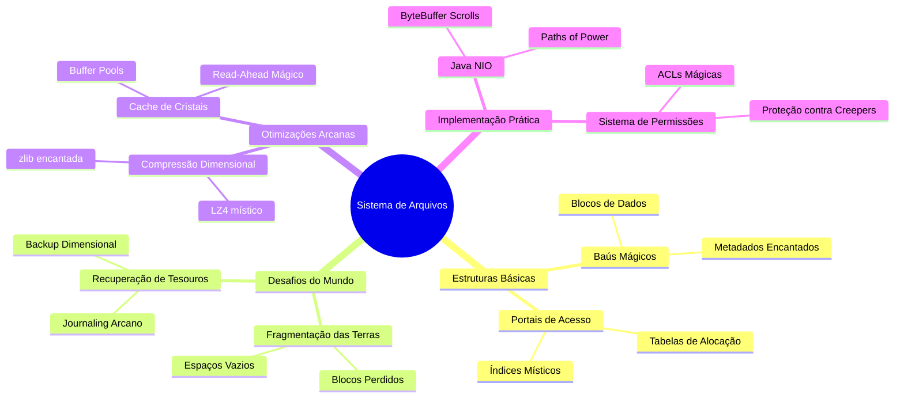

# Sistemas de Arquivos

Ah, caro leitor! Permita-me guiá-lo através desta curiosa aventura pelo reino dos sistemas de arquivos, onde cada bit e byte dança sua própria valsa misteriosa, como blocos flutuantes em um mundo cubicular.

## A Arte de Guardar Tesouros

Imagine, se puder, um mundo onde cada baú é uma história por contar. Não muito diferente de nosso querido Minecraft, onde organizamos minérios preciosos e ferramentas encantadas, os sistemas de arquivos são os guardiões silenciosos de nossos dados digitais.

## O Labirinto dos Dados

Como um redstone engineer experiente sabe, a organização é a chave para não perder seus diamantes no meio de pilhas de cobblestone. Da mesma forma, nossos sistemas de arquivos modernos precisam manter ordem no caos digital - uma tarefa que faria até mesmo um Creeper pensar duas vezes antes de explodir.

## A Dança dos Blocos

Os blocos de dados, ah! Como dançam elegantemente entre a memória e o disco, numa coreografia tão precisa quanto um autômato de redstone. Cada movimento, cada alocação, uma pequena obra de arte em si mesma.

## O Mistério da Fragmentação

E eis que surge o enigma da fragmentação - como peças de um quebra-cabeça espalhadas por um mundo infinito. Qual jogador nunca se deparou com um baú desorganizado? Assim são nossos discos, querido leitor, quando não cuidamos adequadamente de nossos arquivos.

## A Sabedoria dos Antigos

Como os ancient debris escondidos nas profundezas do Nether, a sabedoria da implementação de sistemas de arquivos jaz nas escolhas que fazemos: blocos contíguos ou dispersos? Alocação direta ou indireta? Decisões, decisões...

## Considerações Finais

E assim, caro aventureiro digital, terminamos nossa breve introdução a este fascinante mundo dos sistemas de arquivos. Como um mundo de Minecraft bem organizado, um sistema de arquivos bem implementado é a diferença entre uma aventura épica e um pesadelo de cobblestone.

<note>

Lembre-se: mesmo o mais experiente dos programadores já perdeu alguns dados na lava digital. O importante é aprender com os erros e sempre fazer backup de seus mundos... quer dizer, seus arquivos!

</note>
