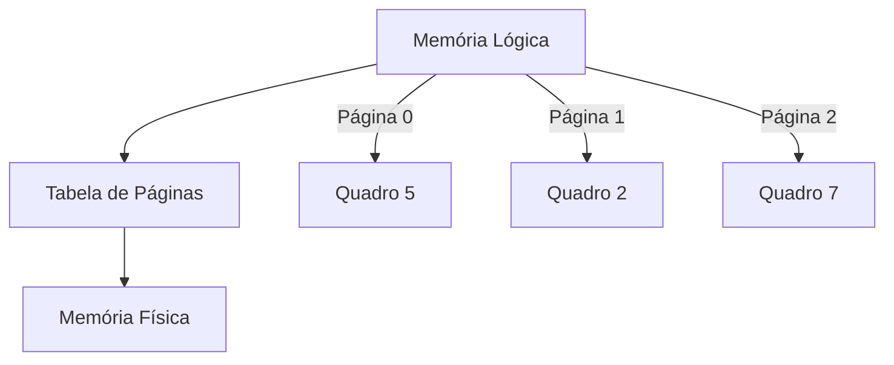
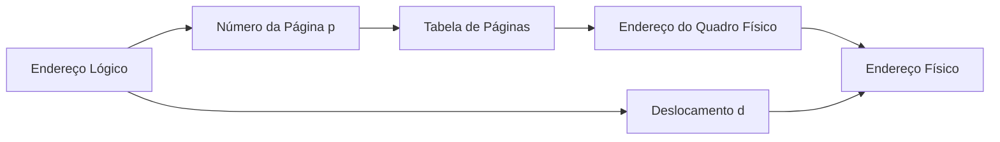
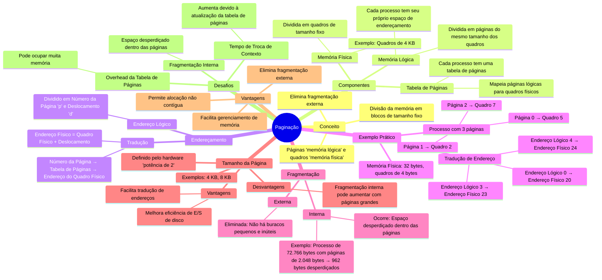

# Método Básico da Paginação

A **paginação** é uma técnica de gerenciamento de memória que divide a memória física e lógica em blocos de tamanho fixo, chamados **quadros** (na memória física) e **páginas** (na memória lógica). Esse método elimina a **fragmentação externa** e facilita o gerenciamento de memória, permitindo que um processo use páginas não contíguas na memória física.

---

## 1. Divisão da Memória

### Memória Física {id="mem-ria-f-sica_1"}
- Dividida em **quadros** de tamanho fixo.
- Exemplo: Se o tamanho do quadro for 4 KB, uma memória de 32 KB terá 8 quadros.

### Memória Lógica {id="mem-ria-l-gica_1"}
- Dividida em **páginas** do mesmo tamanho dos quadros.
- Cada processo tem seu próprio espaço de endereçamento lógico, dividido em páginas.

### Armazenamento de Apoio (Disco)
- Também dividido em blocos do mesmo tamanho das páginas/quadros.
- Usado para armazenar páginas que não cabem na memória física (swapping).

---

## 2. Tabela de Páginas

Cada processo possui uma **tabela de páginas**, que mapeia suas páginas lógicas para quadros físicos. A tabela de páginas é usada pelo hardware (MMU - Unidade de Gerenciamento de Memória) para traduzir endereços lógicos em endereços físicos.

### Estrutura da Tabela de Páginas
- **Número da Página (p)**: Índice na tabela de páginas.
- **Endereço do Quadro Físico**: Localização real da página na memória física.

---

## 3. Endereçamento

O endereço lógico gerado pela CPU é dividido em duas partes:
1. **Número da Página (p)**: Identifica a página no espaço lógico.
2. **Deslocamento (d)**: Indica a posição dentro da página.

### Tradução de Endereço
1. O hardware usa o número da página para consultar a tabela de páginas e obter o endereço do quadro físico.
2. O endereço físico é formado pela combinação do endereço do quadro físico e do deslocamento.

---

## 4. Exemplo Prático

### Memória Física
- Tamanho do quadro: 4 bytes.
- Memória física: 32 bytes (8 quadros).

### Memória Lógica
- Tamanho da página: 4 bytes.
- Processo com 3 páginas:
  - Página 0 → Quadro 5
  - Página 1 → Quadro 2
  - Página 2 → Quadro 7

### Tradução de Endereço {id="tradu-o-de-endere-o_1"}
- **Endereço Lógico 0**:
  - Página 0, Deslocamento 0.
  - Endereço Físico: (5 × 4) + 0 = 20.
- **Endereço Lógico 3**:
  - Página 0, Deslocamento 3.
  - Endereço Físico: (5 × 4) + 3 = 23.
- **Endereço Lógico 4**:
  - Página 1, Deslocamento 0.
  - Endereço Físico: (6 × 4) + 0 = 24.

---

## 5. Fragmentação

### Fragmentação Externa
- **Eliminada**: Como as páginas são de tamanho fixo, não há buracos pequenos e inúteis.

### Fragmentação Interna
- **Ocorre**: Se o processo não usar todo o espaço de uma página, o restante fica inutilizado.
- Exemplo: Um processo de 72.766 bytes com páginas de 2.048 bytes precisaria de 36 páginas, resultando em 962 bytes de fragmentação interna.

---

## 6. Tamanho da Página

- **Tamanho Fixo**: Definido pelo hardware, geralmente uma potência de 2 (ex: 4 KB, 8 KB).
- **Vantagens**:
  - Facilita a tradução de endereços.
  - Melhora a eficiência de E/S de disco.
- **Desvantagens**:
  - Fragmentação interna pode aumentar com páginas grandes.

---

## 7. Diagramas

### Diagrama 1: Paginação da Memória Lógica e Física

### Diagrama 2: Tradução de Endereço

---

## 8. Vantagens e Desafios

### Vantagens
- Elimina fragmentação externa.
- Facilita o gerenciamento de memória e o swapping.
- Permite alocação não contígua de memória.

### Desafios
- **Overhead da Tabela de Páginas**: Pode ocupar muita memória.
- **Fragmentação Interna**: Espaço desperdiçado dentro das páginas.
- **Tempo de Troca de Contexto**: Aumenta devido à necessidade de atualizar a tabela de páginas.

---

## Resumo
- **Paginação**: Divide a memória em páginas e quadros de tamanho fixo.
- **Tabela de Páginas**: Mapeia páginas lógicas para quadros físicos.
- **Endereçamento**: Número da página + Deslocamento → Endereço físico.
- **Vantagens**: Elimina fragmentação externa e facilita o gerenciamento de memória.
- **Desafios**: Fragmentação interna e overhead da tabela de páginas.

---

