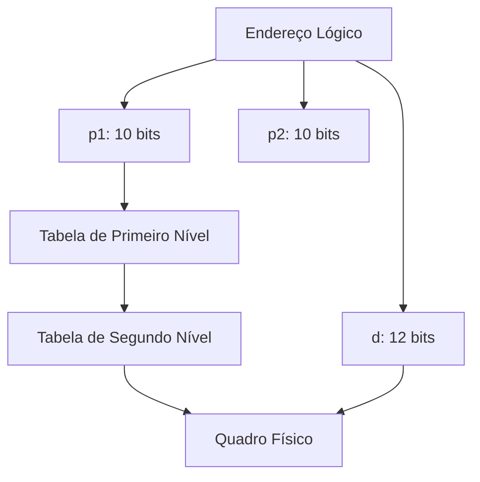
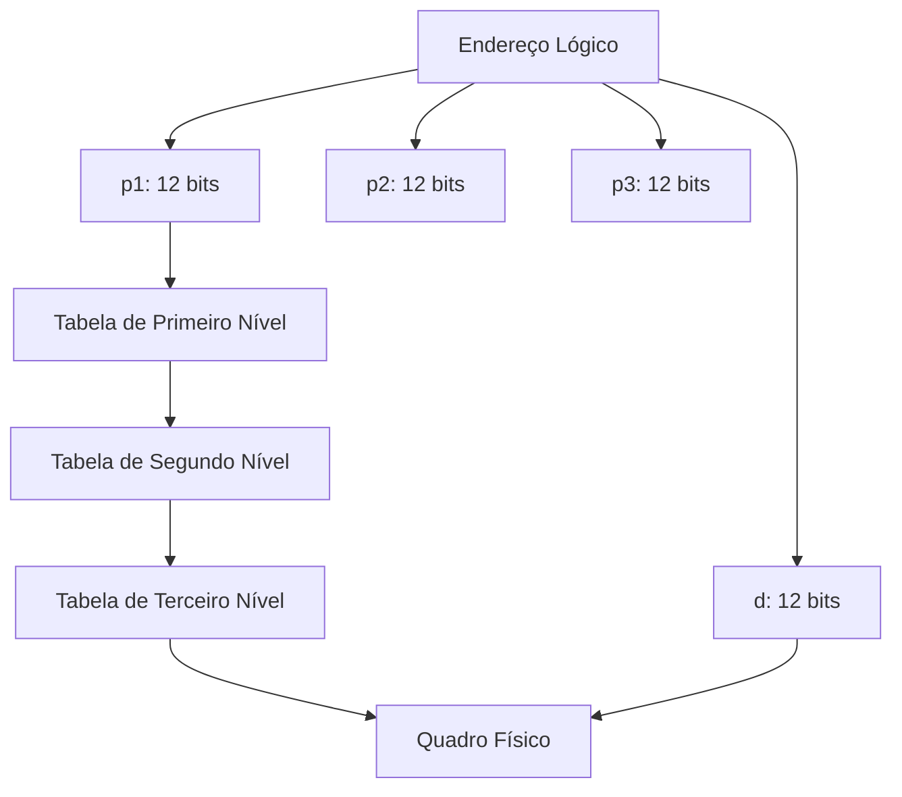

# Paginação Hierárquica

A **paginação hierárquica** é uma técnica usada para gerenciar tabelas de páginas em sistemas com **grandes espaços de endereçamento** (por exemplo, 32 bits ou 64 bits). Em vez de armazenar toda a tabela de páginas de forma contígua na memória, ela é dividida em **níveis** (ou camadas), criando uma estrutura em árvore. Isso reduz o espaço ocupado pela tabela de páginas e permite que apenas as partes necessárias sejam carregadas na memória.

---

### 1. Motivação

Em sistemas com espaços de endereçamento grandes, a tabela de páginas pode se tornar **excessivamente grande**. Por exemplo:

- **Espaço de endereçamento de 32 bits** com páginas de **4 KB**:
  - Número de páginas: $2^{32} / 2^{12} = 2^{20}$ (1 milhão de páginas).
  - Tamanho da tabela de páginas: $2^{20} \times 4 \text{ bytes} = 4 \text{ MB}$ por processo.

- **Espaço de endereçamento de 64 bits** com páginas de **4 KB**:
  - Número de páginas: $2^{64} / 2^{12} = 2^{52}$ (um número enorme de páginas).
  - Tamanho da tabela de páginas: $2^{52} \times 4 \text{ bytes}$ (impraticável).

A paginação hierárquica resolve esse problema dividindo a tabela de páginas em **níveis menores**.

---

### 2. Paginação de Dois Níveis

#### Como Funciona?
- O endereço lógico é dividido em três partes:
  1. **Número da Página de Primeiro Nível (p1)**: Índice na tabela de páginas de primeiro nível.
  2. **Número da Página de Segundo Nível (p2)**: Índice na tabela de páginas de segundo nível.
  3. **Deslocamento (d)**: Posição dentro da página.

#### Exemplo: Espaço de 32 bits com páginas de 4 KB
- **p1**: 10 bits (índice na tabela de primeiro nível).
- **p2**: 10 bits (índice na tabela de segundo nível).
- **d**: 12 bits (deslocamento dentro da página).

#### Tradução de Endereço {id="tradu-o-de-endere-o_1"}
1. O **p1** é usado para indexar a tabela de primeiro nível, que contém ponteiros para tabelas de segundo nível.
2. O **p2** é usado para indexar a tabela de segundo nível, que contém o número do quadro físico.
3. O **d** é combinado com o número do quadro físico para formar o endereço físico.

#### Vantagens {id="vantagens_1"}
- Reduz o espaço ocupado pela tabela de páginas, pois apenas as partes necessárias são carregadas.
- Adequado para sistemas com espaços de endereçamento grandes.

#### Desvantagens {id="desvantagens_1"}
- Aumenta o tempo de acesso à memória, pois múltiplos níveis precisam ser consultados.

---

### 3. Paginação de Três ou Mais Níveis

Para sistemas com espaços de endereçamento ainda maiores (por exemplo, 64 bits), a paginação de dois níveis pode não ser suficiente. Nesses casos, a tabela de páginas é dividida em **três ou mais níveis**.

#### Exemplo: Espaço de 64 bits com páginas de 4 KB
- **p1**: 12 bits (índice na tabela de primeiro nível).
- **p2**: 12 bits (índice na tabela de segundo nível).
- **p3**: 12 bits (índice na tabela de terceiro nível).
- **d**: 12 bits (deslocamento dentro da página).

#### Vantagens
- Permite gerenciar espaços de endereçamento extremamente grandes.
- Apenas as partes necessárias da tabela de páginas são carregadas na memória.

#### Desvantagens
- Aumenta ainda mais o tempo de acesso à memória, pois mais níveis precisam ser consultados.

---

### 4. Exemplo: Arquitetura VAX

A arquitetura **VAX** usa uma variação da paginação hierárquica:

- O espaço de endereçamento de 32 bits é dividido em **quatro seções**:
  - Cada seção tem $2^{30}$ bytes.
  - Os dois primeiros bits do endereço lógico indicam a seção.
  - Os 21 bits seguintes representam o número da página.
  - Os 9 bits finais representam o deslocamento.

#### Tradução de Endereço
1. O número da seção (**s**) é usado para selecionar a tabela de páginas correspondente.
2. O número da página (**p**) é usado para indexar a tabela de páginas.
3. O deslocamento (**d**) é combinado com o número do quadro físico para formar o endereço físico.

---

### 5. Comparação de Níveis de Paginação

| Níveis de Paginação | Espaço de Endereçamento | Tamanho da Tabela de Páginas | Tempo de Acesso |
|---------------------|-------------------------|------------------------------|-----------------|
| **Dois Níveis**     | 32 bits                 | 4 MB por processo            | 2 acessos à memória |
| **Três Níveis**     | 64 bits                 | Reduzido, mas ainda grande   | 3 acessos à memória |
| **Quatro Níveis**   | 64 bits                 | Reduzido ainda mais          | 4 acessos à memória |

---

### 6. Diagramas

#### Diagrama 1: Paginação de Dois Níveis

#### Diagrama 2: Paginação de Três Níveis

---

A **paginação hierárquica** é uma técnica essencial para gerenciar tabelas de páginas em sistemas com grandes espaços de endereçamento. Ela divide a tabela de páginas em **níveis**, reduzindo o espaço ocupado e permitindo que apenas as partes necessárias sejam carregadas na memória. No entanto, o aumento no número de níveis também aumenta o tempo de acesso à memória, o que pode ser um desafio em sistemas com espaços de endereçamento muito grandes (como 64 bits).