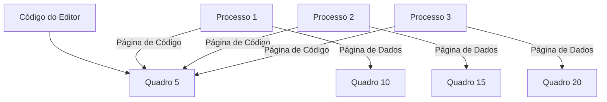
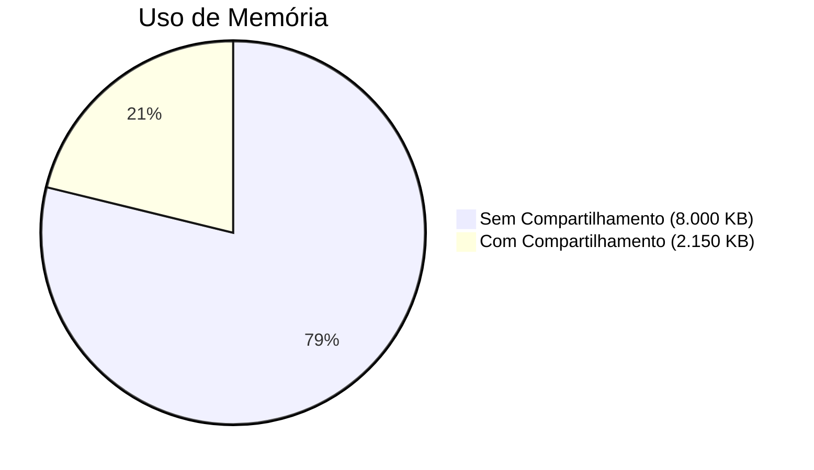

#  Páginas Compartilhadas

Uma das grandes vantagens da paginação é a capacidade de **compartilhar código comum** entre processos. Isso é especialmente útil em sistemas de **tempo compartilhado**, onde vários usuários executam os mesmos programas. Vamos explorar como isso funciona e os benefícios que traz.

---

## 1. Compartilhamento de Código Reentrante

### O que é Código Reentrante?
- **Código reentrante** (ou código puro) é um código que **não se modifica** durante a execução.
- Ele pode ser executado por vários processos simultaneamente, pois cada processo tem sua própria cópia dos **registradores** e **dados**, mas compartilha o mesmo código.

### Exemplo: Editor de Texto
- Suponha que um editor de texto tenha:
  - **150 KB de código** (reentrante).
  - **50 KB de dados** (específicos para cada usuário).
- Em um sistema com **40 usuários**:
  - Sem compartilhamento: Cada usuário precisaria de 200 KB (150 KB de código + 50 KB de dados), totalizando **8.000 KB**.
  - Com compartilhamento: Apenas **uma cópia do código** (150 KB) é necessária, mais **40 cópias dos dados** (50 KB cada), totalizando **2.150 KB**.

### Economia de Memória
- O compartilhamento de código reduz drasticamente o uso de memória.
- No exemplo acima, a economia foi de **8.000 KB** para **2.150 KB**.

---

## 2. Como Funciona o Compartilhamento de Páginas

### Tabelas de Páginas
- Cada processo tem sua própria **tabela de páginas**.
- As páginas de **código compartilhado** são mapeadas para o **mesmo quadro físico** na memória.
- As páginas de **dados** são mapeadas para **quadros diferentes**, pois cada processo tem seus próprios dados.

### Exemplo Visual
- **Processo 1**:
  - Página de Código 1 → Quadro 5 (compartilhado).
  - Página de Dados 1 → Quadro 10.
- **Processo 2**:
  - Página de Código 1 → Quadro 5 (compartilhado).
  - Página de Dados 1 → Quadro 15.
- **Processo 3**:
  - Página de Código 1 → Quadro 5 (compartilhado).
  - Página de Dados 1 → Quadro 20.

---

## 3. Benefícios do Compartilhamento de Páginas

1. **Economia de Memória**:
   - Reduz a quantidade de memória necessária para executar múltiplas instâncias do mesmo programa.

2. **Desempenho**:
   - Menos memória usada significa mais espaço para outros processos, melhorando a eficiência do sistema.

3. **Facilidade de Atualização**:
   - Se o código compartilhado precisar ser atualizado, apenas uma cópia precisa ser modificada.

---

## 4. Aplicações Comuns de Páginas Compartilhadas

- **Editores de Texto**: Como no exemplo anterior.
- **Compiladores**: Vários usuários podem compilar programas simultaneamente usando o mesmo código do compilador.
- **Bibliotecas de Tempo de Execução**: Funções comuns, como manipulação de strings ou operações matemáticas, podem ser compartilhadas.
- **Sistemas de Banco de Dados**: Múltiplas instâncias de um banco de dados podem compartilhar o código do sistema.

---

## 5. Diagramas

### Diagrama 1: Compartilhamento de Código

### Diagrama 2: Economia de Memória

---

## 6. Resumo

| Conceito                     | Descrição                                                                 |
|------------------------------|---------------------------------------------------------------------------|
| **Código Reentrante**        | Código que não se modifica e pode ser compartilhado entre processos.      |
| **Compartilhamento de Páginas** | Múltiplos processos usam a mesma cópia física do código.                 |
| **Economia de Memória**      | Reduz o uso de memória ao compartilhar código comum.                      |
| **Aplicações Comuns**        | Editores, compiladores, bibliotecas, sistemas de banco de dados.          |

---

O compartilhamento de páginas é uma técnica poderosa que permite a **reutilização de código** entre processos, reduzindo o uso de memória e melhorando a eficiência do sistema. Isso é especialmente útil em ambientes de tempo compartilhado, onde múltiplos usuários executam os mesmos programas.